# cs285 hw2

## lecture 4

### part1

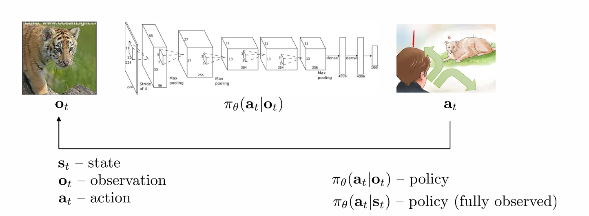

reward function:$r(\mathbf{s},\mathbf{a})$强调的是future reward，而不是right now

#### Markov chain

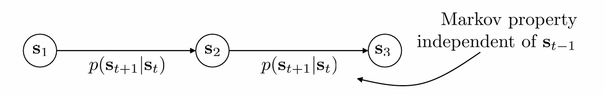

主要有两部分组件：
$$
\begin{aligned}&\mathcal{M}=\{\mathcal{S},\mathcal{T}\}\\&\mathcal{S}-\text{state space}\\&\mathcal{T}-\text{transition operator}\end{aligned}
$$
$\mathcal{T}$表示从当前state到下一个state的转移概率

令
$$
\begin{aligned}&\mu_{t,i}=p(s_t=i)\\&\mathcal{T}_{i,j}=p(s_{t+1}=i|s_t=j)\end{aligned}
$$
于是可以得到$\vec{\mu}_{t+1}=\mathcal{T}\vec{\mu}_t$

#### Markov decision process

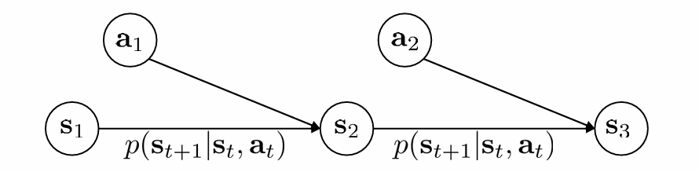

新增action和reward：$\mathcal{M}=\{\mathcal{S},\mathcal{A},\mathcal{T},r\}$

$S$ - state space states $s \in S$ (discrete or continuous)

$A$ - action space actions $a \in A$ (discrete or continuous)

$T$ - transition operator (now a tensor!)
$$
\begin{aligned}&r:\mathcal{S}\times\mathcal{A}\to\mathbb{R}\\&r(s_t,a_t)-\mathrm{reward}\end{aligned}
$$
**Transition Operator $T(s'|s,a)$** 是一个**三维映射**（状态 × 动作 × 下一个状态）

令
$$
\begin{aligned}&\mu_{t,j}=p(s_{t}=j)\\&\xi_{t,k}=p(a_t=k)\\&\begin{aligned}\mathcal{T}_{i,j,k}=p(s_{t+1}=i|s_t=j,a_t=k)\end{aligned}\end{aligned}
$$
得到$\mu_{t+1,i}=\sum\mathcal{T}_{i,j,k}\mu_{t,j}\xi_{t,k}$

#### partially observed Markov decision process

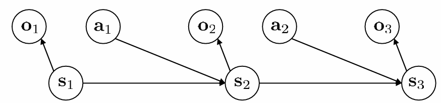

新增observation和$\mathcal{E}$:
$$
\mathcal{M}=\{\mathcal{S},\mathcal{A},\mathcal{O},\mathcal{T},\mathcal{E},r\}
$$
$$\mathcal{E}-\text{emission probability }p(o_t|s_t)$$指的是在state情况下observation的分布概率

#### the goal of RL

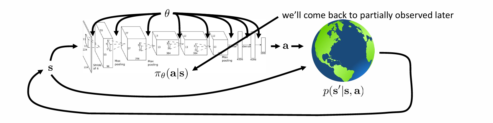

$\theta$指的是网络中的parameter

根据Markov只与上一个状态有关，我们可以得到任意一条trajectory的概率
$$
p_\theta(\mathbf{s}_1,\mathbf{a}_1,\ldots,\mathbf{s}_T,\mathbf{a}_T)=p(\mathbf{s}_1)\prod_{t=1}^T\pi_\theta(\mathbf{a}_t|\mathbf{s}_t)p(\mathbf{s}_{t+1}|\mathbf{s}_t,\mathbf{a}_t)p_\theta(\tau)
$$
我们的目标就是最大化获得的reward总和
$$
\theta^\star=\arg\max_\theta E_{\tau\sim p_\theta(\tau)}\left[\sum_tr(\mathbf{s}_t,\mathbf{a}_t)\right]
$$

#### useful rewrite in infinite

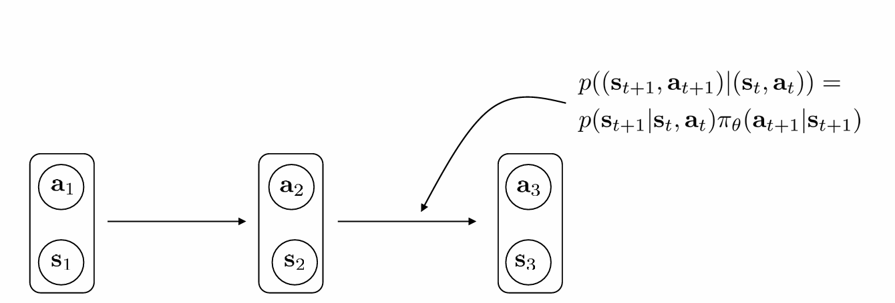

写成state-action pair的形式，目标函数改写成
$$
\begin{aligned}\theta^{\star}&=\arg\max_\theta E_{\tau\thicksim p_\theta(\tau)}\left[\sum_tr(\mathbf{s}_t,\mathbf{a}_t)\right]\\&=\arg\max_\theta\sum_{t=1}^TE_{(\mathbf{s}_t,\mathbf{a}_t)\sim p_\theta(\mathbf{s}_t,\mathbf{a}_t)}[r(\mathbf{s}_t,\mathbf{a}_t)]\end{aligned}
$$
对于infinite情况，如果reward都是positive的情况下，将会无穷无尽

于是我们考虑average reward
$$
\theta^\star=\arg\max_\theta\frac{1}{T}\sum_{t=1}^TE_{(\mathbf{s}_t,\mathbf{a}_t)\sim p_\theta(\mathbf{s}_t,\mathbf{a}_t)}[r(\mathbf{s}_t,\mathbf{a}_t)]\to E_{(\mathbf{s},\mathbf{a})\sim p_\theta(\mathbf{s},\mathbf{a})}[r(\mathbf{s},\mathbf{a})]
$$
在infinite的transition中，我们会出现回到同一个state-action pair的情况：$$\mu = \mathcal{T} \mu$$（称为stationary）

即$(\mathcal{T}-\mathbf{I})\mu=0$，这时候的$\mu$就是$\mathcal{T}$特征值为1的特征向量，在大部分情况下这个特征向量都会存在

在进入stationary后，reward就由稳态后的state决定，即stationary的reward

#### why choose expectation（期望）

对于期望函数本身是不连续的（分段），但是通过期望计算后就变得smooth，这样许多优化算法就都可以用了

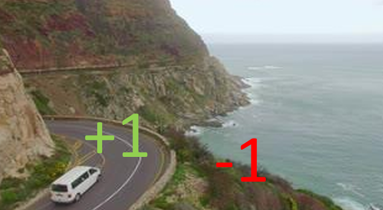
$$
\begin{aligned}&r(\mathbf{x})-not\mathrm{~smooth}\\&\pi_\theta(\mathbf{a}=\mathrm{fall})=\theta\\&\begin{aligned}E_{\pi_\theta}[r(\mathbf{x})]-smooth\mathrm{~in~}\theta!\end{aligned}\end{aligned}
$$

### part2

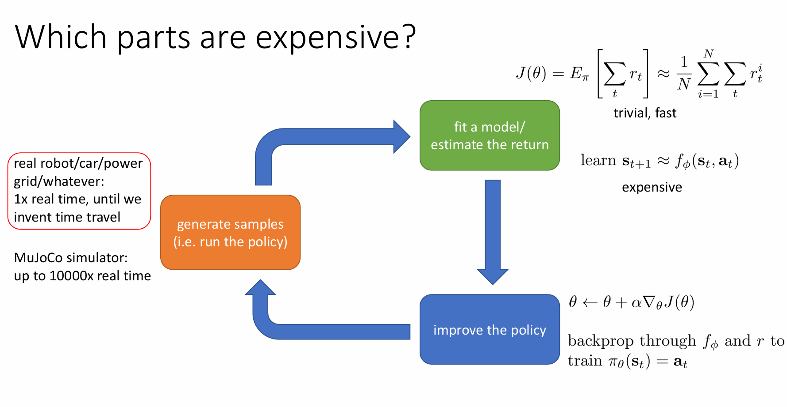

从真实世界的数据和backup的计算成本是expensive的

### part3

#### Q function

在前面，我们讨论给reward的function，即$E_{\tau \sim p_\theta(\tau)}\left[\sum_{t=1}^T r\left(\mathbf{s}_t, \mathbf{a}_t\right)\right]$

我们将其展开
$$
E_{\mathbf{s}_1 \sim p\left(\mathbf{s}_1\right)}\left[E_{\mathbf{a}_1 \sim \pi\left(\mathbf{a}_1 \mid \mathbf{s}_1\right)}\left[r\left(\mathbf{s}_1, \mathbf{a}_1\right)+E_{\mathbf{s}_2 \sim p\left(\mathbf{s}_2 \mid \mathbf{s}_1, \mathbf{a}_1\right)}\left[E_{\mathbf{a}_2 \sim \pi\left(\mathbf{a}_2 \mid \mathbf{s}_2\right)}\left[r\left(\mathbf{s}_2, \mathbf{a}_2\right)+\ldots \mid \mathbf{s}_2\right] \mid \mathbf{s}_1, \mathbf{a}_1\right] \mid \mathbf{s}_1\right]\right]
$$
我们将式子中关于a1的部分提取出来，令
$$
Q\left(\mathbf{s}_1, \mathbf{a}_1\right)=r\left(\mathbf{s}_1, \mathbf{a}_1\right)+E_{\mathbf{s}_2 \sim p\left(\mathbf{s}_2 \mid \mathbf{s}_1, \mathbf{a}_1\right)}\left[E_{\mathbf{a}_2 \sim \pi\left(\mathbf{a}_2 \mid \mathbf{s}_2\right)}\left[r\left(\mathbf{s}_2, \mathbf{a}_2\right)+\ldots \mid \mathbf{s}_2\right] \mid \mathbf{s}_1, \mathbf{a}_1\right]
$$
于是原式改写为
$$
E_{\tau \sim p_\theta(\tau)}\left[\sum_{t=1}^T r\left(\mathbf{s}_t, \mathbf{a}_t\right)\right]=E_{\mathbf{s}_1 \sim p\left(\mathbf{s}_1\right)}\left[E_{\mathbf{a}_1 \sim \pi\left(\mathbf{a}_1 \mid \mathbf{s}_1\right)}\left[Q\left(\mathbf{s}_1, \mathbf{a}_1\right) \mid \mathbf{s}_1\right]\right]
$$
在知道Q函数后，就很好去modify策略$\pi_\theta$

于是我们定义Q function
$$
Q^\pi\left(\mathbf{s}_t, \mathbf{a}_t\right)=\sum_{t^{\prime}=t}^T E_{\pi_\theta}\left[r\left(\mathbf{s}_{t^{\prime}}, \mathbf{a}_{t^{\prime}}\right) \mid \mathbf{s}_t, \mathbf{a}_t\right]: \text { total reward from taking } \mathbf{a}_t \text { in } \mathbf{s}_t
$$

#### value function

在状态 $s$ 下，按策略 $\pi$ 行动的预期总回报（不考虑具体动作）

于是有
$$
V^\pi\left(\mathbf{s}_t\right)=\sum_{t^{\prime}=t}^T E_{\pi_\theta}\left[r\left(\mathbf{s}_{t^{\prime}}, \mathbf{a}_{t^{\prime}}\right) \mid \mathbf{s}_t\right]: \text { total reward from } \mathbf{s}_t
$$
在定义Q function后，改写为Q函数的**期望**
$$
V^\pi\left(\mathbf{s}_t\right)=E_{\mathbf{a}_t \sim \pi\left(\mathbf{a}_t \mid \mathbf{s}_t\right)}\left[Q^\pi\left(\mathbf{s}_t, \mathbf{a}_t\right)\right]
$$

#### using Q function and value function

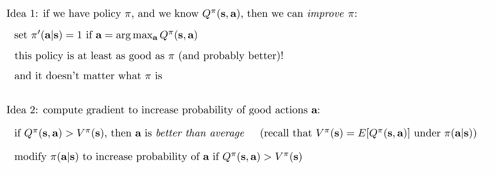

方法一：我们可以构造一个**新的策略 π′**，这个新策略在每个状态 s下：

- 找到能使得 $Q^π(s,a)$值**最大**的那个动作
- 将这个最优动作的概率设为 1，其他动作的概率设为 0

方法二：不是构造一个全新的确定性策略，而是**直接调整（优化）现有策略 π(a∣s) 的参数**（例如神经网络权重），使其能产生更高的期望回报

### part4

#### Model-based RL algorithms

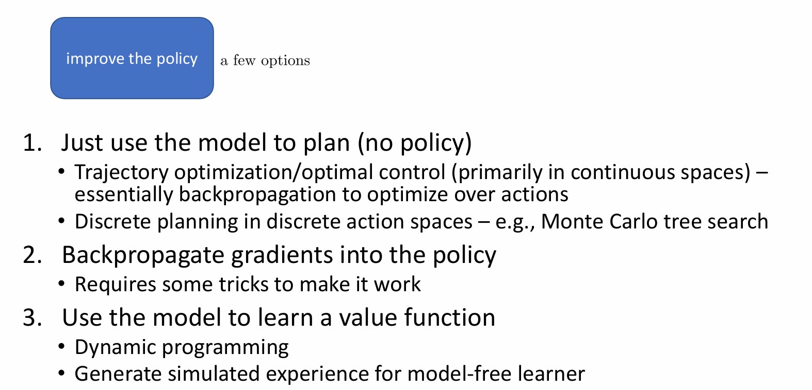

1. 这类方法**不使用显式策略网络（no policy）**，而是直接使用模型进行“推理”和“计划”

   - 使用**梯度下降 / 动态优化方法**直接优化一个动作序列 $a_0, a_1, ..., a_T$，使得回报最大。
   - 离散动作空间：枚举 + 搜索

2. 把环境模型当成可微函数 $s_{t+1} = f(s_t, a_t)$，通过它将损失梯度 **反向传播到策略网络**。

3. 通过模型来“造数据”，提高 model-free 的学习效率。

   - 在模型已知或准确学习之后，可以用 Bellman 方程递推值函数：
     $$
     V(s) = \max_a \left[ r(s,a) + \gamma V(f(s,a)) \right]
     $$

   - 不需要在真实环境交互，而是从模型中生成状态-动作-奖励序列：

     用这些“虚拟轨迹”来训练 Q 函数或策略网络。

#### value function based

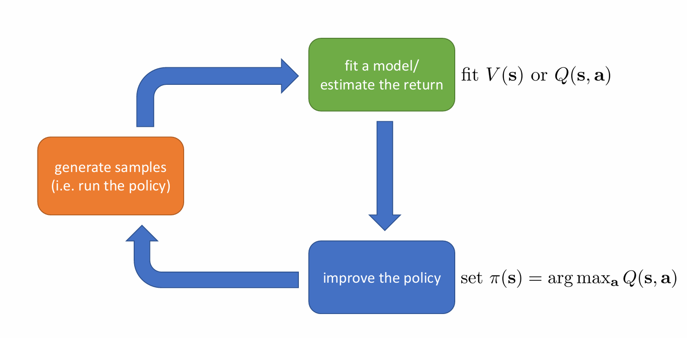

不直接优化策略而是从Q函数中选取动作

#### direct policy gradiens

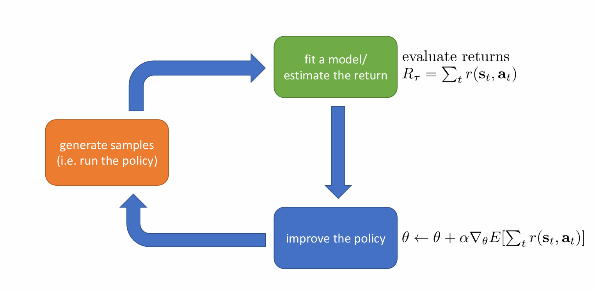

显示优化策略参数

#### Actor-critic

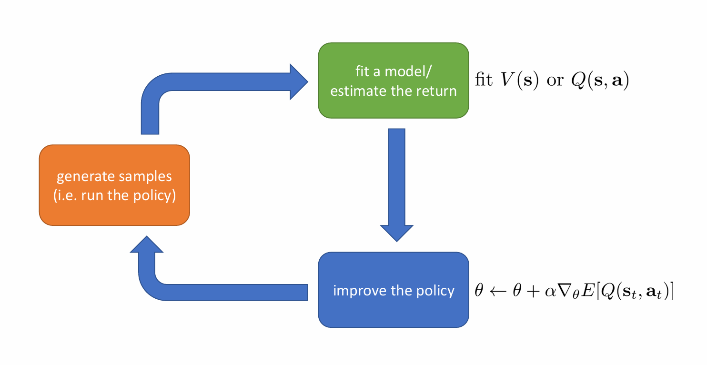

1. Actor 根据当前策略 π 选择动作 a。
2. 环境返回奖励 r 和下一个状态 s'。
3. Critic 用 TD 或 MC 方法估计当前策略的值函数 `V(s)` 或 `Q(s, a)`。
4. **Actor 根据 Critic 给出的优势函数 A(s,a)** 来更新策略。

其中：

- **优势函数** $A(s, a) = Q(s, a) - V(s)$，表示某动作相比平均水平的好坏。

- Actor 更新公式（策略梯度）：
  $$
  \nabla_\theta J(\theta) = \mathbb{E} \left[ \nabla_\theta \log \pi_\theta(a|s) \cdot A(s, a) \right]
  $$

### part5

#### tradeoffs between algorithms

##### sample efficiency

指的是how many samples do we need to get a good policy

有以下两种policy，它们的差异就在于**过去的样本是否可用**

###### off policy

able to improve the policy  without generating new samples from that  policy

###### on policy

each time the policy is changed,  even a little bit, we need to generate new  samples

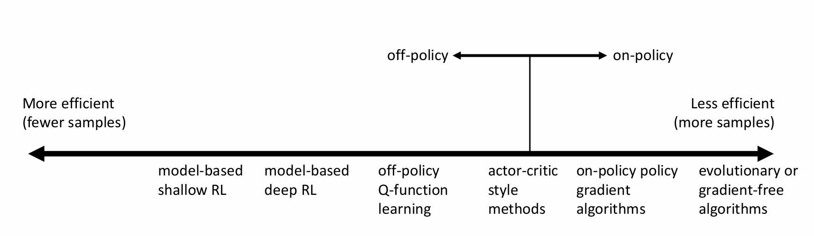

##### stability and ease of use

三个关键问题：

-  Does it converge?
- And if it converges, to what?
- And does it converge every time?

**通常不是梯度下降 (Reinforcement learning: often not gradient descent)”**：RL的终极目标是最大化累积奖励。然而，直接优化这个目标非常困难，因此衍生出多种不同的算法范式，它们**并非直接进行标准的梯度下降优化最终目标**

###### Q-learning

Q-learning的核心是求解Bellman最优方程。它通过迭代更新Q值（`Q(s, a) = r + γ * max_a' Q(s', a')`）来逼近最优Q函数。这本质上是一种**固定点迭代**过程，目标是找到Bellman算子的不动点。

- **收敛性问题**：理论上，在满足一定条件下（如无限探索、合适的步长衰减），表格型Q-learning可以收敛到最优Q函数。但在实践中，特别是使用函数逼近（如神经网络）时：
  - 收敛性保证变弱甚至消失。
  - 可能收敛缓慢。
  - 可能振荡或不稳定（例如，由于最大化操作`max`带来的高估偏差、函数逼近的误差传播、非平稳目标等）。

###### Model-based RL

**“模型并未针对期望奖励进行优化 (model is not optimized for expected reward)”**：这类方法首先学习环境动态模型（状态转移概率 `P(s'|s, a)` 和奖励函数 `R(s, a)`）。然而，**学习模型的目标通常是最大化预测准确性（如最小化预测状态/奖励的误差），而不是直接最大化期望累积奖励**。

- **收敛性问题**：
  - 即使模型学得很准，用这个模型做规划（如值迭代、策略迭代）也可能收敛到最优解。
  - **但是**，模型学习本身的目标（预测准确性）与最终目标（最大化奖励）**存在错位（misalignment）**。一个预测准确的模型在规划时不一定能产生高奖励策略（例如，模型在无关状态上准确，但在关键决策状态上不准）。如何学习一个对规划*有用*的模型是一个挑战。
  - 模型误差会在规划过程中被放大，导致策略表现不佳甚至不收敛。

##### assumptions

###### full observability

含义：智能体在每个时间步都能接收到完整、准确的环境状态信息 `s_t`。状态 `s_t` 包含了做出最优决策所需的所有历史信息（即满足马尔可夫性：`P(s_{t+1} | s_t, a_t) = P(s_{t+1} | history_t, a_t)`）

**缓解方法：**

**添加循环结构 (Adding Recurrence)：** 在神经网络架构中引入循环神经网络（RNN）、长短期记忆网络（LSTM）或门控循环单元（GRU）。这些循环结构允许网络维护一个**内部状态（或隐藏状态）`h_t`**，该状态通过时间步传播，聚合历史观察信息 `o_0, o_1, ..., o_t`。目标是让 `h_t` 成为一个对真实环境状态 `s_t` 的**充分统计量**，从而近似恢复马尔可夫性。这适用于部分可观测马尔可夫决策过程（POMDPs）。例如，DRQN 就是在 DQN 中用 LSTM 替代了全连接层。

###### episodic learning

- **纯策略梯度方法 (Pure Policy Gradient Methods)：** 最典型的例子是 **REINFORCE** 算法。REINFORCE 需要计算一个回合（或整个轨迹 `τ = (s_0, a_0, r_1, s_1, a_1, ..., s_T)`）结束后的**总回报 `G_t = Σ_{k=t}^{T} γ^{k-t} r_{k+1}`** 作为该回合内所有动作的（折扣）奖励信号。它利用这个总回报来估计梯度并更新策略。**如果任务没有明确的终止（持续任务），REINFORCE 无法直接应用**，因为它无法计算一个“最终”的总回报。
- **部分基于模型的 RL 方法 (Some Model-based RL Methods)：** 某些基于模型的方法在规划或学习模型时，也可能隐式或显式地假设任务具有回合结构。例如，它们可能在一个回合开始时进行规划，或者在每个回合结束时利用收集到的完整轨迹数据来更新模型。

###### continuity or smoothness

- **部分连续值函数学习方法 (Some Continuous Value Function Learning Methods)：** 当使用函数逼近器（尤其是基于梯度的优化器）来学习连续状态/动作空间中的值函数（如 `V_θ(s)` 或 `Q_θ(s, a)`）时，**算法的收敛性和性能常常依赖于值函数本身的平滑性**。如果真实的最优值函数在状态空间中变化剧烈（存在不连续或高曲率区域），函数逼近器（如神经网络）可能难以精确拟合，学习过程可能不稳定或收敛缓慢。像 DDPG、NAF 等连续控制算法也依赖于价值函数或策略的平滑性假设来进行有效的梯度优化。
- **部分基于模型的 RL 方法 (Some Model-based RL Methods)：** 当学习一个环境动态模型 `f_θ(s, a) ≈ s'`（或 `P_θ(s'|s, a)`）时，**模型学习的效果和利用模型进行规划的可靠性高度依赖于真实动态是平滑的**。如果真实动态在状态-动作空间中有剧烈的、非线性的变化或不连续性，学习一个准确且泛化能力好的模型会非常困难。基于局部模型（如线性模型）或依赖局部优化（如 iLQR）的规划方法尤其需要平滑性假设，因为它们通常在局部区域进行泰勒展开或线性近似。

## lecture 5

### part1

由之前得到的有限情况下的$\theta^*$：
$$
\theta^*=\arg\max_{\theta}E_{\tau\sim p_\theta(\tau)}\left[\sum_tr(s_t,a_t)\right]
$$
令期望为$J(\theta)$,并通过samples得到近似
$$
J(\theta)=E_{\tau\sim p_\theta(\tau)}\left\lfloor\sum_tr(\mathbf{s}_t,\mathbf{a}_t)\right\rfloor\approx\frac{1}{N}\sum_i\sum_tr(\mathbf{s}_{i,t},\mathbf{a}_{i,t})
$$
将$J(\theta)$写成积分形式，便于对其求梯度
$$
J(\theta)=E_{\tau\sim p_\theta(\tau)}[r(\tau)]=\int p_\theta(\tau)r(\tau)d\tau
$$

$$
\nabla_\theta J(\theta)=\int\nabla_\theta p_\theta(\tau)r(\tau)d\tau
$$

利用一个变形替换，改写$\nabla_\theta J(\theta)$
$$
p_\theta(\tau)\nabla_\theta\log p_\theta(\tau)=p_\theta(\tau)\frac{\nabla_\theta p_\theta(\tau)}{p_\theta(\tau)}=\nabla_\theta p_\theta(\tau)
$$

$$
\nabla_\theta J(\theta)=\int p_\theta(\tau)\nabla_\theta\log p_\theta(\tau)r(\tau)d\tau=E_{\tau\sim p_\theta(\tau)}[\nabla_\theta\log p_\theta(\tau)r(\tau)]
$$

其中
$$
\begin{aligned}&\quad p_\theta(\tau)=p_\theta(\mathbf{s}_1,\mathbf{a}_1,\ldots,\mathbf{s}_T,\mathbf{a}_T)=p(\mathbf{s}_1)\prod_{t=1}^T\pi_\theta(\mathbf{a}_t|\mathbf{s}_t)p(\mathbf{s}_{t+1}|\mathbf{s}_t,\mathbf{a}_t)\end{aligned}
$$

$$
\log p_\theta(\tau)=\log p(\mathbf{s}_1)+\sum_{t=1}^T\log\pi_\theta(\mathbf{a}_t|\mathbf{s}_t)+\log p(\mathbf{s}_{t+1}|\mathbf{s}_t,\mathbf{a}_t)
$$

其中只用中间一项与$\theta$有关系，于是得到
$$
\nabla_\theta J(\theta)=E_{\tau\sim p_\theta(\tau)}\left[\left(\sum_{t=1}^T\nabla_\theta\log\pi_\theta(\mathbf{a}_t|\mathbf{s}_t)\right)\left(\sum_{t=1}^Tr(\mathbf{s}_t,\mathbf{a}_t)\right)\right]
$$
式子中这个梯度指向参数空间中**增加在状态 st选择动作 at**的方向

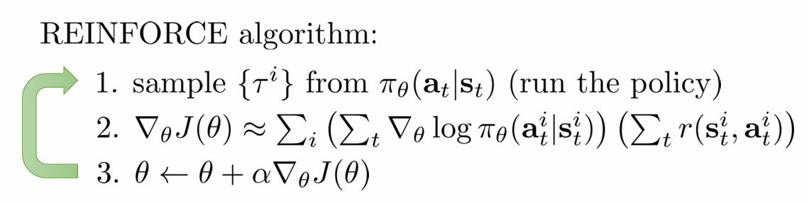

### part2

#### comparison to maximum likelihood

policy gradient: $ \nabla_\theta J(\theta) \approx \frac{1}{N} \sum_{i=1}^N \left( \sum_{t=1}^T \nabla_\theta \log \pi_\theta (\mathbf{a}_{i,t} | \mathbf{s}_{i,t}) \right) \left( \sum_{t=1}^T r(\mathbf{s}_{i,t}, \mathbf{a}_{i,t}) \right) $

maximum likelihood: $\nabla_\theta J_{\text{ML}}(\theta) \approx \frac{1}{N} \sum_{i=1}^N \left( \sum_{t=1}^T \nabla_\theta \log \pi_\theta (\mathbf{a}_{i,t} | \mathbf{s}_{i,t}) \right) $

policy gradient根据reward函数，可能increase可能decrease    $\pi_\theta (\mathbf{a}_{i,t} | \mathbf{s}_{i,t})$,而maximum likelihood只可能increase

#### example： Gaussian policies

高斯策略定义为
$$
\pi_\theta\left(\mathbf{a}_t \mid \mathbf{s}_t\right)=\mathcal{N}\left(f_{\text {neural network }}\left(\mathbf{s}_t\right) ; \Sigma\right)
$$
均值由神经网络根据状态$S_t$给出，协方差通常为对角矩阵或固定参数

高斯分布的概率密度函数为：
$$
\pi_\theta\left(\mathbf{a}_t \mid \mathbf{s}_t\right)=\frac{1}{(2 \pi)^{n / 2}|\Sigma|^{1 / 2}} \exp \left(-\frac{1}{2}\left(f_\theta\left(\mathbf{s}_t\right)-\mathbf{a}_t\right)^{\top} \Sigma^{-1}\left(f_\theta\left(\mathbf{s}_t\right)-\mathbf{a}_t\right)\right)
$$
取对数得
$$
\log \pi_\theta\left(\mathbf{a}_t \mid \mathbf{s}_t\right)=-\frac{1}{2}\left(f_\theta\left(\mathbf{s}_t\right)-\mathbf{a}_t\right)^{\top} \Sigma^{-1}\left(f_\theta\left(\mathbf{s}_t\right)-\mathbf{a}_t\right)-\frac{1}{2} \log \left((2 \pi)^n|\Sigma|\right)
$$

###### 马氏距离

同欧式距离，曼哈顿距离，汉明距离等一样被用作评定数据之间的相似度指标。但却可以应对高维线性分布的数据中各维度间非独立同分布的问题。

对于单个数据点
$$
D_M(x)=\sqrt{(x-\mu)^T \Sigma^{-1}(x-\mu)}
$$
数据点x，y之间的马氏距离
$$
D_M(x, y)=\sqrt{(x-y)^T \Sigma^{-1}(x-y)}
$$
核心操作：将变量`按照主成分进行旋转`，让维度间相互**独立**，然后进行`标准化`，让维度**同分布**

于是上述对数值可以简写为
$$
\log\pi_\theta(\mathbf{a}_t|\mathbf{s}_t)=-\frac{1}{2}\|f(\mathbf{s}_t)-\mathbf{a}_t\|_\Sigma^2+\mathrm{const}
$$
即马氏距离的平方，其中const部分与$\theta$无关

对其求导得（课件上有-1/2，但怀疑写错了）
$$
\nabla_\theta\log\pi_\theta(\mathbf{a}_t|\mathbf{s}_t)=-\Sigma^{-1}(f(\mathbf{s}_t)-\mathbf{a}_t)\frac{df}{d\theta}
$$

#### wrong with the policy gradient

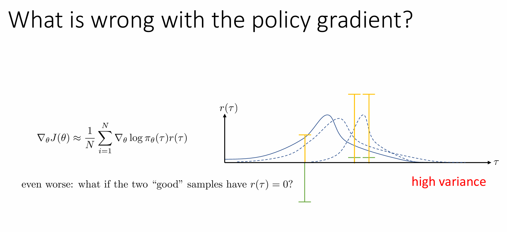

- **高方差（High Variance）**：梯度估计依赖于蒙特卡洛采样，不同批次的轨迹回报 r(τ)*r*(*τ*) 可能差异极大，导致参数更新不稳定。
- **稀疏奖励（Sparse Rewards）**：若大多数轨迹的回报 r(τ)*r*(*τ*) 为 0 或接近 0，梯度更新信号会非常微弱甚至消失。

### part3

#### reducing variance（用在作业中）

引入一个因果关系，$$Causality:\text{ policy at time }t^{\prime}\text{ cannot affect reward at time }t\mathrm{~when~}t<t^{\prime}$$

因此，梯度更新应仅依赖于当前及未来的奖励（即 **“reward-to-go”**），表示为**$\hat{Q}_{i,t}$**

于是有
$$
\nabla_\theta J(\theta)\approx\frac{1}{N}\sum_{i=1}^N\sum_{t=1}^T\nabla_\theta\log\pi_\theta(\mathbf{a}_{i,t}|\mathbf{s}_{i,t})\left(\sum_{t^{\prime}=t}^Tr(\mathbf{s}_{i,t^{\prime}},\mathbf{a}_{i,t^{\prime}})\right)
$$

#### baseline

由于reward本身并不是零均值的，会导致一部分数据存在不公平，所以采取baseline的方法使其零均值

即
$$
\nabla_\theta J(\theta)\approx\frac{1}{N}\sum_{i=1}^N\nabla_\theta\log p_\theta(\tau)[r(\tau)-b]
$$
证明一下这个操作不会影响梯度
$$
E[\nabla_\theta\log p_\theta(\tau)b]=\int p_\theta(\tau)\nabla_\theta\log p_\theta(\tau)bd\tau=\int\nabla_\theta p_\theta(\tau)bd\tau=b\nabla_\theta\int p_\theta(\tau)d\tau=b\nabla_\theta1=0
$$
其中可以令
$$
b=\frac{1}{N}\sum_{i=1}^{N}r(\tau)
$$
这是一个不错的取值，但并不是optimal，接下来我们通过分析这个操作对variance的影响来找出optimal b
$$
\begin{aligned}&\mathrm{Var}[x]=E[x^{2}]-E[x]^{2}\\&\begin{aligned}\nabla_\theta J(\theta)=E_{\tau\sim p_\theta(\tau)}[\nabla_\theta\log p_\theta(\tau)(r(\tau)-b)]\end{aligned}\end{aligned}
$$

$$
\mathrm{Var}=E_{\tau\thicksim p_\theta(\tau)}[(\nabla_\theta\log p_\theta(\tau)(r(\tau)-b))^2]-E_{\tau\thicksim p_\theta(\tau)}[\nabla_\theta\log p_\theta(\tau)(r(\tau)-b)]^2
$$

其中后半部分是期望的平方，前面我们证明了期望不会改变，故与b无关

将var对b求导
$$
\frac{d\mathrm{Var}}{db}=\frac{d}{db}E[g(\tau)^2(r(\tau)-b)^2]=\frac{d}{db}\left(E[g(\tau)^2r(\tau)^2]-2E[g(\tau)^2r(\tau)b]+b^2E[g(\tau)^2]\right)
$$
令其为0可得
$$
b=\frac{E[g(\tau)^2r(\tau)]}{E[g(\tau)^2]}
$$
这个可以被视作为一个reweighted的reward

### part4

#### off-policy 

##### important sampling

一个使用易采样的数据的样本估计难采样的样本的期望的方法
$$
\begin{aligned}E_{x\sim p(x)}[f(x)]&=\int p(x)f(x)dx\\&=\int\frac{q(x)}{q(x)}p(x)f(x)dx\\&=\int q(x)\frac{p(x)}{q(x)}f(x)dx\\&=E_{x\sim q(x)}\left[\frac{p(x)}{q(x)}f(x)\right]\end{aligned}
$$
于是我们可以得到
$$
J(\theta)=E_{\tau\sim\bar{p}(\tau)}\left[\frac{p_\theta(\tau)}{\bar{p}(\tau)}r(\tau)\right]
$$
其中
$$
p_\theta(\tau)=p(\mathbf{s}_1)\prod_{t=1}^T\pi_\theta(\mathbf{a}_t|\mathbf{s}_t)p(\mathbf{s}_{t+1}|\mathbf{s}_t,\mathbf{a}_t)
$$
而这个式子中只有$$\prod_{t=1}^T\pi_\theta(\mathbf{a}_t|\mathbf{s}_t)$$与策略有关系，故得
$$
\frac{p_\theta(\tau)}{\bar{p}(\tau)}=\frac{\prod_{t=1}^T\pi_\theta(a_t|s_t)}{\prod_{t=1}^T\bar{\pi}(a_t|s_t)}
$$
这个时候我们就不需要重新去sample，**不需要与环境交互**，而是通过所有时间步的 **动作概率比值的乘积**去得到$J(\theta)$

##### policy gradient

对$\theta^\prime$求导
$$
\begin{aligned}\nabla_{\theta^{\prime}}J(\theta^{\prime})&=E_{\tau\sim p_{\theta}(\tau)}\left\lfloor\frac{p_{\theta^{\prime}}(\tau)}{p_{\theta}(\tau)}\nabla_{\theta^{\prime}}\log\pi_{\theta^{\prime}}(\tau)r(\tau)\right\rfloor\quad\mathrm{when}\theta\neq\theta^{\prime}\\&=E_{\tau\sim p_{\theta}(\tau)}\left[\left(\prod_{t=1}^{T}\frac{\pi_{\theta^{\prime}}(\mathbf{a}_{t}|\mathbf{s}_{t})}{\pi_{\theta}(\mathbf{a}_{t}|\mathbf{s}_{t})}\right)\left(\sum_{t=1}^{T}\nabla_{\theta^{\prime}}\log\pi_{\theta^{\prime}}(\mathbf{a}_{t}|\mathbf{s}_{t})\right)\left(\sum_{t=1}^{T}r(\mathbf{s}_{t},\mathbf{a}_{t})\right)\right]\end{aligned}
$$
考虑到**causality**（reward-to-go），改写为
$$
\nabla_{\theta^{\prime}}J(\theta^{\prime})=E_{\tau\sim p_{\theta}(\tau)}\left[\sum_{t=1}^{T}\nabla_{\theta^{\prime}}\log\pi_{\theta^{\prime}}(a_{t}|s_{t})\cdot\underbrace{\left(\prod_{t^{\prime}=1}^{t}\frac{\pi_{\theta^{\prime}}(a_{t^{\prime}}|s_{t^{\prime}})}{\pi_{\theta}(a_{t^{\prime}}|s_{t^{\prime}})}\right)}_{\text{过去动作的重要性权重}}\cdot\underbrace{\left(\sum_{t^{\prime}=t}^{T}r(s_{t^{\prime}},a_{t^{\prime}})\prod_{t^{\prime\prime}=t}^{t^{\prime}}\frac{\pi_{\theta^{\prime}}(a_{t^{\prime\prime}}|s_{t^{\prime\prime}})}{\pi_{\theta}(a_{t^{\prime\prime}}|s_{t^{\prime\prime}})}\right)}_{\text{未来奖励的加权求和}}\right]
$$
为了简化，去掉对未来奖励的权值（在未来策略中不考虑causality），仍然可以得到一个good policy，即
$$
\nabla_{\theta^{\prime}}J(\theta^{\prime})=E_{\tau\sim p_{\theta}(\tau)}\left[\sum_{t=1}^{T}\nabla_{\theta^{\prime}}\log\pi_{\theta^{\prime}}(\mathbf{a}_{t}|\mathbf{s}_{t})\left(\prod_{t^{\prime}=1}^{t}\frac{\pi_{\theta^{\prime}}(\mathbf{a}_{t^{\prime}}|\mathbf{s}_{t^{\prime}})}{\pi_{\theta}(\mathbf{a}_{t^{\prime}}|\mathbf{s}_{t^{\prime}})}\right)\left(\sum_{t^{\prime}=t}^{T}r(\mathbf{s}_{t^{\prime}},\mathbf{a}_{t^{\prime}})\right)\right]
$$
但仍需注意的是，过去动作的重要性权重的计算是exponential in T，所以我们进行进一步改写，引入**单步重要性权重**,仅修正当前动作的概率偏差（而非整个轨迹）,这样子做可以**大幅度降低方差**（相较于累计权重）
$$
\nabla_{\theta^{\prime}}J(\theta^{\prime})\approx\frac{1}{N}\sum_{i=1}^{N}\sum_{t=1}^{T}\frac{\pi_{\theta^{\prime}}(\mathbf{s}_{i,t},\mathbf{a}_{i,t})}{\pi_{\theta}(\mathbf{s}_{i,t},\mathbf{a}_{i,t})}\nabla_{\theta^{\prime}}\log\pi_{\theta^{\prime}}(\mathbf{a}_{i,t}|\mathbf{s}_{i,t})\hat{Q}_{i,t}=\frac{1}{N}\sum_{i=1}^{N}\sum_{t=1}^{T}\frac{\pi_{\theta^{\prime}}(\mathbf{s}_{i,t})}{\pi_{\theta}(\mathbf{s}_{i,t})}\frac{\pi_{\theta^{\prime}}(\mathbf{a}_{i,t}|\mathbf{s}_{i,t})}{\pi_{\theta}(\mathbf{a}_{i,t}|\mathbf{s}_{i,t})}\nabla_{\theta^{\prime}}\log\pi_{\theta^{\prime}}(\mathbf{a}_{i,t}|\mathbf{s}_{i,t})\hat{Q}_{i,t}
$$
在这个式子中，状态分布的重要性权重对整体式子影响小，且难以估计，故一般忽略此项，得
$$
\nabla_{\theta^{\prime}}J(\theta^{\prime})\approx\frac{1}{N}\sum_{i=1}^N\sum_{t=1}^T\frac{\pi_{\theta^{\prime}}(\mathbf{a}_{i,t}|\mathbf{s}_{i,t})}{\pi_\theta(\mathbf{a}_{i,t}|\mathbf{s}_{i,t})}\nabla_{\theta^{\prime}}\log\pi_{\theta^{\prime}}(\mathbf{a}_{i,t}|\mathbf{s}_{i,t})\hat{Q}_{i,t}
$$

### part5

#### automatic differential（AD）

标准策略梯度公式：
$$
\nabla_\theta J(\theta)\approx\frac{1}{N}\sum_{i=1}^N\sum_{t=1}^T\nabla_\theta\log\pi_\theta(a_{i,t}|s_{i,t})\hat{Q}_{i,t}
$$

**计算效率低**：需要手动计算对数概率的梯度并加权求和，难以直接利用深度学习框架的自动微分功能。

利用深度学习框架（如 PyTorch/TensorFlow）的自动微分机制，通过构造一个**伪损失函数（Pseudo-Loss）**，使得其梯度等于策略梯度
$$
\nabla_\theta\tilde{J}(\theta)=\nabla_\theta J(\theta)
$$
即
$$
\tilde{J}(\theta)\approx\frac{1}{N}\sum_{i=1}^N\sum_{t=1}^T\log\pi_\theta(a_{i,t}|s_{i,t})\cdot\hat{Q}_{i,t}
$$
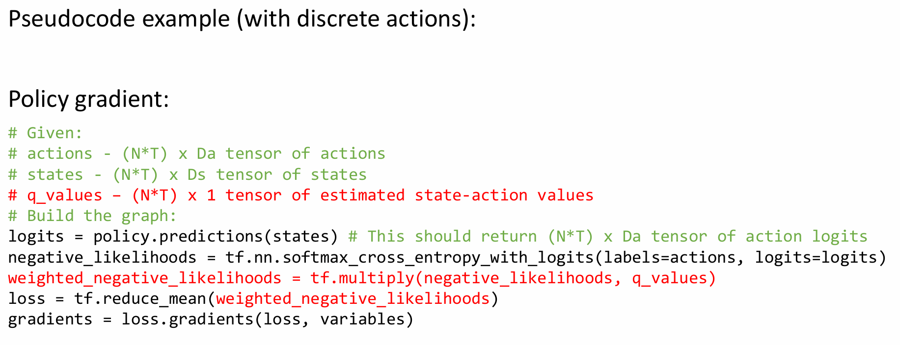

#### policy gradient in practice

1. 考虑使用更大的batch，方差与N成反比，但大的batch意味着计算量和内存增加
2. 谨慎调整学习率，可以考虑使用adam。对于**策略专用方法**，后续课程会介绍的技巧

### part6

#### policy gradient的不足

##### 高斯策略的局限性

高斯策略的对数概率
$$
\log \pi_\theta\left(\mathbf{a}_t \mid \mathbf{s}_t\right)=-\frac{1}{2 \sigma^2}\left(k \mathbf{s}_t-\mathbf{a}_t\right)^2+\mathrm{const} \quad \theta=(k, \sigma)
$$
线性策略使动作接近$k \mathbf{s}_t$,方差$\sigma$高会导致随机探索，低会策略几乎确定性执行

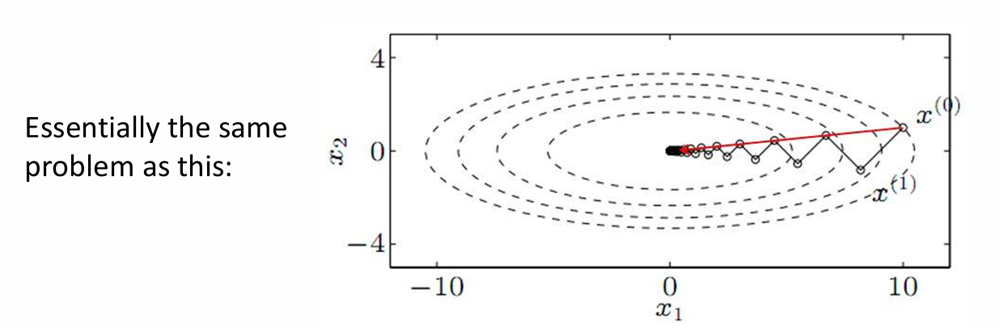

#### natural policy gradient

参数空间中的不同方向对策略概率的影响差异巨大。例如：

- 某些参数微调会显著改变动作概率（敏感方向）。
- 另一些参数即使大幅调整也影响甚微（平坦方向）。

首先我们先引入一个KL散度的概念，然后介绍它如何应用到pre-conditioner来解决这个问题

###### KL散度

KL散度（Kullback-Leibler divergence），可以以称作相对熵（relative entropy）或信息散度（information divergence）。KL散度的理论意义在于度量两个概率分布之间的差异程度。

我们假设有两个概率密度分布函数，我们用q(x)去近似p(x),则有
$$
K L(P \| Q)=\int p(x) \log \frac{p(x)}{q(x)} d x
$$
对于离散的情况则有
$$
K L(P \| Q)=\sum p(x) \log \frac{p(x)}{q(x)}
$$
将其展开得
$$
\sum p(x) \log \frac{p(x)}{q(x)}=-\sum p(x) \log (q(x))+\sum p(x) \log (p(x))=H(P, Q)-H(P)
$$
其中$H(P, Q)$是指交叉熵，$H(P)$指的是熵。

在信息论中，熵代表着信息量，H(P)代表着基于P分布自身的编码长度，也就是最优的编码长度（最小字节数）。而H(P,Q)则代表着用Q的分布去近似P分布的信息，自然需要更多的编码长度。并且两个分布差异越大，需要的编码长度越大。所以两个值相减是大于等于0的一个值，代表冗余的编码长度，也就是两个分布差异的程度。

##### natural policy核心思想

首先，我们可以想到约束参数更新的幅度，用最原始的欧氏距离
$$
\theta^{\prime}\leftarrow\arg\max_{\theta^{\prime}}(\theta^{\prime}-\theta)^{T}\nabla_{\theta}J(\theta)\quad\mathrm{s.t.}\quad\|\theta^{\prime}-\theta\|^{2}\leq\epsilon
$$
但是欧氏距离无法反映策略分布的实际变化，于是考虑用KL散度，于是有
$$
\theta^{\prime}\leftarrow\arg\max_{\theta^{\prime}}(\theta^{\prime}-\theta)^T\nabla_\theta J(\theta)\quad\mathrm{s.t.}\quad D_{KL}(\pi_{\theta^{\prime}}\|\pi_\theta)\leq\epsilon
$$
其中
$$
D_{\mathrm{KL}}(\pi_{\theta^{\prime}}\|\pi_\theta)=E_{\pi_{\theta^{\prime}}}[\log\pi_\theta-\log\pi_{\theta^{\prime}}]
$$
对其进行泰勒展开

对于零阶项
$$
D_{KL}(\pi_\theta\|\pi_\theta)=0
$$
一阶项
$$
\left.\nabla_{\theta^{\prime}}D_{KL}(\pi_{\theta^{\prime}}\|\pi_{\theta})\right|_{\theta^{\prime}=\theta}=\nabla_{\theta^{\prime}}E_{\pi_{\theta^{\prime}}}\left.\left[\log\pi_{\theta^{\prime}}-\log\pi_{\theta}\right]\right|_{\theta^{\prime}=\theta}
$$
其中第二项与$\pi_{\theta^\prime}$​无关，于是
$$
\nabla_{\theta^{\prime}}D_{KL}|_{\theta^{\prime}=\theta}=E_{\pi_\theta}\left[\nabla_{\theta^{\prime}}\log\pi_{\theta^{\prime}}|_{\theta^{\prime}=\theta}\right]=0
$$
因为$$E_{\pi_\theta}[\nabla_\theta\log\pi_\theta]=0$$，概率分布之和归一

于是我们将KL散度展开到泰勒二阶项，二阶导数为
$$
\mathbf{H}=\nabla_{\theta^{\prime}}^2D_{KL}(\pi_{\theta^{\prime}}\|\pi_\theta)|_{\theta^{\prime}=\theta}
$$

$$
D_{\mathrm{KL}}(\pi_{\theta^{\prime}}\|\pi_\theta)\approx(\theta^{\prime}-\theta)^T\mathbf{F}(\theta^{\prime}-\theta)
$$

其中F为fisher-information matrix
$$
\mathbf{F}=E_{\pi_\theta}[\nabla_\theta\log\pi_\theta(\mathbf{a}|\mathbf{s})\nabla_\theta\log\pi_\theta(\mathbf{a}|\mathbf{s})^T]
$$
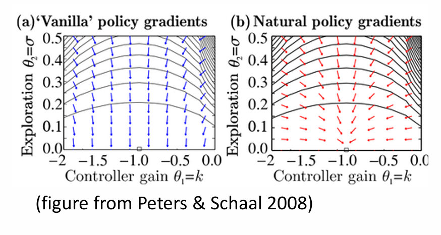
