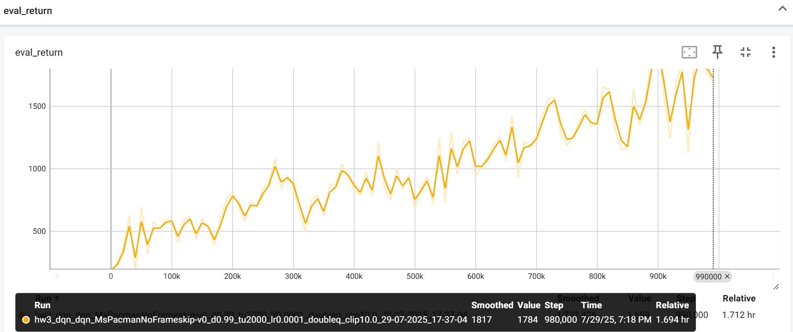
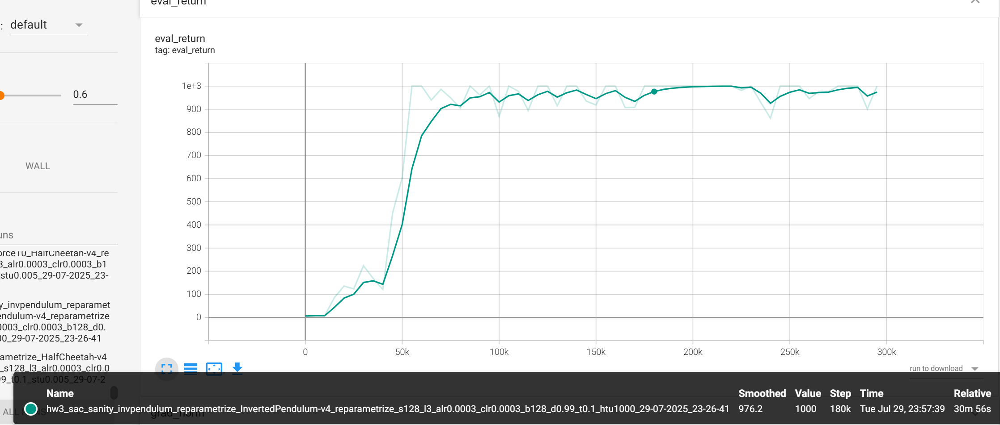

# hw3

## analysis

### Multistep Q-learning


$\mathcal{D}_{k+1}$：表示第 $k$ 次迭代时的 **replay buffer / dataset**；

它包含的是一批轨迹，每条轨迹是：
$$
\tau_j = \left( s_{j,1}, a_{j,1}, r_{j,1}, s_{j,2}, a_{j,2}, r_{j,2}, \dots \right)
$$
每条轨迹都来自策略 $\pi_k$，长度可以是固定时间步或直到终止；

#### TD-Learning Bias  

虽然每个 $\hat{Q}(s', a')$ 是无偏的，但：
$$
\mathbb{E}\left[ \max_{a'} \hat{Q}(s', a') \right] \neq \max_{a'} \mathbb{E}[\hat{Q}(s', a')]
$$
这是 **max 的 Jensen 不等式效应**，因为 max 是一个 **凸函数**。根据 Jensen’s Inequality：
$$
\mathbb{E}[\max X] \geq \max \mathbb{E}[X]
$$
所以即使你对每个动作 a' 的 Q 估计都是无偏的，取 max 之后的整体值是 **带偏的（向上偏）**。

这个偏差在 Q-learning 中非常关键，称为：

> **Maximization bias**

为此，Double Q-learning（双 Q 学习）就是专门设计来缓解这个偏差的！

#### Tabular Learning  

##### **.** $Q_{\phi_{k+1}}$ 是最后一个策略 $\pi_k$ 的 Q 函数的无偏估计

$$
\mathbb{E}[Q_{\phi_{k+1}}(s,a)] = Q^{\pi_k}(s,a)
$$

即：用当前策略的数据拟合得到的 $Q_{\phi}$，是当前策略的 Q 函数的无偏估计。

##### 当 $k \to \infty$，对于固定 batch 大小 $B$，$Q_{\phi_k} \to Q^*$

$$
\lim_{k \to \infty} \mathbb{E}[Q_{\phi_k}(s,a)] = Q^*(s,a)
$$

即：随着策略不断优化，学出来的 Q 会收敛到最优 Q。

这需要满足很多前提（如 on-policy、足够覆盖状态空间、bootstrapping 误差不积累等）。

##### 当 $k \to \infty, B \to \infty$，我们能收敛到 $Q^*$

$$
\lim_{k,B \to \infty} \mathbb{E}[ \| Q_{\phi_k} - Q^* \|_\infty ] = 0
$$

这是最强的收敛性陈述，前提是：**无限迭代 + 无限数据**。

##### 1. **$N=1$**：一步 TD，最经典形式

###### (a) on-policy, tabular

- ✅ Statement I 成立：从当前策略采样数据，估计当前策略的 Q
- ✅ Statement II 成立：随着策略改进，最终会学到最优 Q（on-policy convergence）
- ✅ Statement III 成立：数据无限、迭代无限，肯定收敛

结论：**I ✅, II ✅, III ✅**

###### (b) off-policy, tabular

- ❌ I 不成立：off-policy 学不到当前策略 Q
- ❌ II 也难以成立：用别的策略学 Q，偏差大，bootstrapping 错误
- ✅ III 成立：在 tabular + 无限数据下，off-policy 也可以收敛（例如 Fitted Q Iteration）

##### 2. **$N > 1$**：多步 bootstrapping，会引入 max bias

###### (a) on-policy, tabular

- ✅ I 成立：on-policy 更新当前策略的 Q
- ❌ II 不总成立：多步回报引入 bias，固定 B 下不能保证每步都覆盖
- ✅ III 成立：无限数据和迭代可消除偏差

结论：**I ✅, II ❌, III ✅**

###### (b) off-policy, tabular

- ❌ I：off-policy 无偏性消失
- ❌ II：off-policy bootstrapping 会持续积累偏差
- ✅ III：tabular + 无限数据下依然有理论收敛保证

结论：**I ❌, II ❌, III ✅**

##### 3. **$N \to \infty$**：纯 Monte Carlo，无 bootstrapping

###### (a) on-policy, tabular

- ✅ I 成立：完全 on-policy MC，无偏估计当前策略的 Q
- ✅ II 成立：MC 中偏差较小，on-policy，策略会改善
- ✅ III 成立：无限数据 + MC 方法，收敛于最优策略

结论：**I ✅, II ✅, III ✅**

###### (b) off-policy, tabular

- ❌ I：仍然不是当前策略采样
- ❌ II：off-policy MC 存在偏差
- ✅ III：无限数据下依然能收敛（如 Importance Sampling 或 weighted MC）

结论：**I ❌, II ❌, III ✅**

#### Variance of Q Estimate  

| N值            | 含义               | 偏差 (bias) | 方差 (variance) |
| -------------- | ------------------ | ----------- | --------------- |
| $N = 1$        | 一步 bootstrapping | 高偏差      | 低方差          |
| $N > 1$        | 多步 TD            | 中等偏差    | 中等方差        |
| $N \to \infty$ | Monte Carlo return | 低偏差      | 高方差          |

#### Function Approximation   

#####  1. When $N = 1$，$Q_{\phi_{k+1}}$ is an **unbiased** estimate of $Q^{\pi_k}$

解释：

- 一步 TD（bootstrapping）时，我们使用：
  $$
  y = r(s,a) + \gamma Q(s', \pi(s'))
  $$

- 在 on-policy 情况下，用当前策略采样、训练当前策略的 Q，是**无偏估计**。

结论： **True**

##### 2. $N = 1$，$B \to \infty$，$k \to \infty$，则 $Q_{\phi_k} \to Q^*$

解释：

- $B \to \infty$：表示数据充分；
- $k \to \infty$：策略不断改善；
- $N = 1$：虽然引入 bootstrapping，但数据充分、函数近似器完美 ⇒ 能学到正确的策略；
- 对每一轮，我们可以准确拟合当前策略的 Q，最终策略优化会带来最优策略。

结论： **True**

##### 3. $N > 1$，有限但大，且 $B \to \infty, k \to \infty$，则 $Q_{\phi_k} \to Q^*$

解释：

- 多步 TD 会引入一定 bias，但我们有：
  - 无限数据（$B \to \infty$）；
  - 无限训练迭代；
  - 函数逼近器足够强 ⇒ 可以弥补多步 bias；
- 最终收敛性仍然存在。

结论： **True**

##### 4. $N \to \infty$（即 Monte Carlo），$B \to \infty$，$k \to \infty$，则 $Q_{\phi_k} \to Q^*$

解释：

- MC 是无偏估计 Q（虽然高方差）；
- 数据无限 ⇒ 方差可以被平均掉；
- 无限轮迭代 ⇒ 策略不断改善；
- 函数逼近器足够强 ⇒ 可以完美拟合任意 Q

结论： **True**

#### Multistep Importance Sampling  

为了修正 off-policy 数据对 $y_{j,t}$ 的估计，需要对每一步的 reward 加上 **importance weight**：

设：
$$
\rho_{j,t'} = \frac{\pi(a_{j,t'}|s_{j,t'})}{\pi'(a_{j,t'}|s_{j,t'})}
$$
则 target 修改为：
$$
y_{j,t}^{\text{IS}} = \left( \sum_{t'=t}^{t+N-1} \left( \prod_{k=t}^{t'} \rho_{j,k} \right) \gamma^{t'-t} r_{j,t'} \right) + \left( \prod_{k=t}^{t+N-1} \rho_{j,k} \right) \gamma^N \max_a Q_\phi(s_{j,t+N}, a)
$$
这个过程是**对每个奖励项及 bootstrapped value 都乘上当前策略与行为策略的似然比**，即 importance ratio。

当 $N = 1$ 时，只使用了当前 state-action 的 reward + 一步的 bootstrap。

Importance sampling 的影响只在一步 transition 上：
$$
y = r(s,a) + \gamma \max_a Q(s', a)
$$
只需加上一步重要性比：
$$
y^{\text{IS}} = \rho \cdot r(s,a) + \gamma \max_a Q(s', a)
$$

- 当 $N \to \infty$ 时，我们使用 **Monte Carlo return**，即全轨迹上的所有 reward；
- 每一步都需要 importance weight；
- 这会导致 variance 急剧增加。

 **仍然需要使用重要性采样，但 variance 更大（甚至不可控）**。

## code

### tips

1. **Exploration Scheduling for ε-greedy actor**

   > 从一个较大的 ε 开始（接近随机探索），然后随着训练逐步减小。

   - ε-greedy 策略中，智能体以概率 ε 选择一个随机动作（探索），以概率 1−ε 选择当前最优动作（利用）。

2. **earning Rate Scheduling**

   > 从较高的学习率开始，逐步降低，便于收敛。

   - 在训练前期，较大的学习率可以快速靠近最优点；
   - 到训练后期，降低学习率可以细化搜索，避免震荡；
   - 一般使用如下形式：
     - `lr = initial_lr * decay_factor^step`
     - 或使用 linear/exponential warmup + cosine decay 等策略

3. **Gradient Clipping**

   > 若梯度范数太大（爆炸），就缩放它使其不超过阈值。

   - **为什么要 clip 梯度？**
     - 在深度网络中，梯度可能会非常大，造成参数更新太剧烈；
     - 会导致 loss 发散、训练不稳定。

4. Atari Wrappers（图像环境支持）

   针对 Atari 等图像输入环境，有三个重要预处理方法（封装器）：

   1. **Frame-skip**

      > 保持当前动作 4 步，即重复同一个动作 4 次。

      - 减少计算，提高效率；
      - 实际上相当于减少每秒钟的控制频率；
      - 更贴近人类游戏策略（人类不会每一帧都改变操作）。

   2.  **Frame-stack**

      > 将最近的 4 帧图像堆叠在一起作为输入。

      - 解决单帧图像中缺乏速度、方向信息的问题；
      - 给智能体提供“短期记忆”，可感知动作对环境的动态影响。

   3. **Grayscale**

      > 将 RGB 彩色图像转换成灰度图像。

      - 降低输入维度；
      - 通常对策略学习影响不大；
      - 加快训练速度。

### basic Q-learning

```python
python cs285/scripts/run_hw3_dqn.py -cfg experiments/dqn/lunarlander.yaml --seed 1
python cs285/scripts/run_hw3_dqn.py -cfg experiments/dqn/lunarlander.yaml --seed 2
python cs285/scripts/run_hw3_dqn.py -cfg experiments/dqn/lunarlander.yaml --seed 3
```


#### scripts

##### run_hw3_dqn

```python
# Replay buffer
if len(env.observation_space.shape) == 3:#三维张量表示是图像
    stacked_frames = True
    frame_history_len = env.observation_space.shape[0]
    assert frame_history_len == 4, "only support 4 stacked frames"
    replay_buffer = MemoryEfficientReplayBuffer(
        frame_history_len=frame_history_len
    )
elif len(env.observation_space.shape) == 1:
    stacked_frames = False
    replay_buffer = ReplayBuffer()
else:
    raise ValueError(
        f"Unsupported observation space shape: {env.observation_space.shape}"
    )

```

1. `stacked_frames = True` 这行的作用是：**设置一个标志（flag），表示当前使用的环境 observation 是“帧堆叠”（frame-stacked）形式的图像输入**。
2. 这段 Replay Buffer 初始化代码的作用是：
   - 自动识别环境输入是图像还是状态向量；
   - 针对不同输入类型使用合适的 ReplayBuffer；
   - 提供了内存优化和计算效率之间的平衡。

```python
truncated = info.get("TimeLimit.truncated", False)

# TODO(student): Add the data to the replay buffer
if isinstance(replay_buffer, MemoryEfficientReplayBuffer):
    # We're using the memory-efficient replay buffer,
    # so we only insert next_observation (not observation)
    replay_buffer.insert(action,rew,next_observation[-1,...],done and not truncated)
else:
    # We're using the regular replay buffer
    replay_buffer.insert(action,rew,next_observation,done and not truncated)
```

1. `[-1, ...]` 表示取最后一帧（最新一帧）的图像，shape 变为 `(84, 84)`。
2. `done and not truncated`：只在真正终止（例如死亡、目标达成）时为 True；否则视作 episode 可以继续。

#### infrastructure

##### replay_buffer

###### class MemoryEfficientReplayBuffer

```python
    def __init__(self, frame_history_len: int, capacity=1000000):
        self.max_size = capacity

        # Technically we need max_size*2 to support both obs and next_obs.
        # Otherwise we'll end up overwriting old observations' frames, but the
        # corresponding next_observation_framebuffer_idcs will still point to the old frames.
        # (It's okay though because the unused data will be paged out)
        self.max_framebuffer_size = 2 * capacity

        self.frame_history_len = frame_history_len
        self.size = 0
        self.actions = None
        self.rewards = None
        self.dones = None

        self.observation_framebuffer_idcs = None
        self.next_observation_framebuffer_idcs = None
        self.framebuffer = None
        self.observation_shape = None

        self.current_trajectory_begin = None
        self.current_trajectory_framebuffer_begin = None
        self.framebuffer_idx = None

        self.recent_observation_framebuffer_idcs = None
```

1. `max_framebuffer_size = 2 * capacity` 是为了确保即使 next_obs 写入了很多帧也不会冲掉旧 obs 的帧；

2. Atari 常用 `frame_history_len=4`，表示一个状态是 `[frame_t-3, t-2, t-1, t]`

3. 因为在 `MemoryEfficientReplayBuffer` 中，我们每次只存一个 **单帧图像**（而不是整段堆叠帧），所以：

   - 当我们调用 `.insert()` 插入一个 transition 时，需要告诉 buffer：

     > “当前这个 obs（state）是由哪些帧组成的？”

   这个信息在前一帧 `obs` 到当前帧之间已经提前准备好了，就缓存在 `self.recent_observation_framebuffer_idcs` 里。

4. | 变量名                                 | 含义                            | 何时赋值              | 举例说明                |
   | -------------------------------------- | ------------------------------- | --------------------- | ----------------------- |
   | `max_size`                             | 最大 transition 数              | init                  | 1000000                 |
   | `max_framebuffer_size`                 | 最大帧存储数                    | init                  | 2000000                 |
   | `framebuffer`                          | 图像帧数据                      | `on_reset`            | (2000000, 84, 84)       |
   | `observation_framebuffer_idcs`         | 当前 obs 的帧索引列表           | `on_reset` + `insert` | [993, 994, 995, 996]    |
   | `next_observation_framebuffer_idcs`    | 下一 obs 的帧索引               | 同上                  | [994, 995, 996, 997]    |
   | `actions/rewards/dones`                | 标准 RL 数据                    | `insert`              | 每条 transition 一个    |
   | `current_trajectory_begin`             | 当前 episode 的 transition 起点 | `on_reset`            | 为防止跨 episode 堆叠帧 |
   | `current_trajectory_framebuffer_begin` | 当前 episode 的帧起点           | `on_reset`            | 同上                    |
   | `recent_observation_framebuffer_idcs`  | 缓存上一个 obs 的帧 ID          | `on_reset` + `insert` | 下一步要用的堆叠帧索引  |

```python
    def sample(self, batch_size):
        rand_indices = (
            np.random.randint(0, self.size, size=(batch_size,)) % self.max_size
        )

        observation_framebuffer_idcs = (
            self.observation_framebuffer_idcs[rand_indices] % self.max_framebuffer_size
        )
        next_observation_framebuffer_idcs = (
            self.next_observation_framebuffer_idcs[rand_indices]
            % self.max_framebuffer_size
        )

        return {
            "observations": self.framebuffer[observation_framebuffer_idcs],
            "actions": self.actions[rand_indices],
            "rewards": self.rewards[rand_indices],
            "next_observations": self.framebuffer[next_observation_framebuffer_idcs],
            "dones": self.dones[rand_indices],
        }
```

1. 从 `[0, self.size)` 中随机选择 `batch_size` 个索引，表示从 buffer 中采样哪些 transition。

   使用 `% self.max_size` 是为了确保索引永远在环形缓冲区的有效范围内。

2. 从 `MemoryEfficientReplayBuffer` 中随机采样一批 transition，供 DQN 训练使用。
    **它将从帧索引中恢复出完整的 observation / next_observation（堆叠帧）数据。**

```python
    def _insert_frame(self, frame: np.ndarray) -> int:
        """
        Insert a single frame into the replay buffer.

        Returns the index of the frame in the replay buffer.
        """
        assert (
            frame.ndim == 2
        ), "Single-frame observation should have dimensions (H, W)"
        assert frame.dtype == np.uint8, "Observation should be uint8 (0-255)"

        self.framebuffer[self.framebuffer_idx] = frame
        frame_idx = self.framebuffer_idx
        self.framebuffer_idx = self.framebuffer_idx + 1

        return frame_idx
```

1. 将一张单帧图像插入到帧缓冲区（`self.framebuffer`）中，并返回它的索引。

```python
    def _compute_frame_history_idcs(
        self, latest_framebuffer_idx: int, trajectory_begin_framebuffer_idx: int
    ) -> np.ndarray:
        """
        Get the indices of the frames in the replay buffer corresponding to the
        frame history for the given latest frame index and trajectory begin index.

        Indices are into the observation buffer, not the regular buffers.
        """
        return np.maximum(
            np.arange(-self.frame_history_len + 1, 1) + latest_framebuffer_idx,
            trajectory_begin_framebuffer_idx,
        )
```

> 根据当前帧的位置 `latest_framebuffer_idx`，生成一个长度为 `frame_history_len` 的帧堆叠索引数组，表示这个 observation 是由哪几张帧图像组成的。

**并保证这些帧不会跨越 episode 的起点（trajectory_begin_framebuffer_idx）**。

1. 生成历史帧偏移量，加上当前帧索引

2. 防止跨越 episode 起点：

3. 如果当前 episode 是从 `1233` 开始的（即 `trajectory_begin_framebuffer_idx = 1233`），那么上述堆叠帧中 `1231` 和 `1232` 是上一个 episode 的帧，**不能使用！**

   所以我们执行 `np.maximum`，把所有小于起点的帧索引提升到起点：

```python
    def on_reset(
        self,
        /,
        observation: np.ndarray,
    ):
        """
        Call this with the first observation of a new episode.
        """
        assert (
            observation.ndim == 2
        ), "Single-frame observation should have dimensions (H, W)"
        assert observation.dtype == np.uint8, "Observation should be uint8 (0-255)"

        if self.observation_shape is None:
            self.observation_shape = observation.shape
        else:
            assert self.observation_shape == observation.shape

        if self.observation_framebuffer_idcs is None:
            self.observation_framebuffer_idcs = np.empty(
                (self.max_size, self.frame_history_len), dtype=np.int64
            )
            self.next_observation_framebuffer_idcs = np.empty(
                (self.max_size, self.frame_history_len), dtype=np.int64
            )
            self.framebuffer = np.empty(
                (self.max_framebuffer_size, *observation.shape), dtype=observation.dtype
            )
            self.framebuffer_idx = 0
            self.current_trajectory_begin = 0
            self.current_trajectory_framebuffer_begin = 0

        self.current_trajectory_begin = self.size

        # Insert the observation.
        self.current_trajectory_framebuffer_begin = self._insert_frame(observation)
        # Compute, but don't store until we have a next observation.
        self.recent_observation_framebuffer_idcs = self._compute_frame_history_idcs(
            self.current_trajectory_framebuffer_begin,
            self.current_trajectory_framebuffer_begin,
        )

```

1. `/` 之前的参数 **只能通过位置（positional）传递，不能通过关键字（keyword）传递。**
2. 这段 `on_reset()` 方法是 `MemoryEfficientReplayBuffer` 的核心之一，它在 **每一个新 episode 开始时被调用**，用于准备帧堆叠（frame stacking）所需的内部状态。

```python
    def insert(
        self,
        /,
        action: np.ndarray,
        reward: np.ndarray,
        next_observation: np.ndarray,
        done: np.ndarray,
    ):
        """
        Insert a single transition into the replay buffer.

        Use like:
            replay_buffer.insert(
                observation=observation,
                action=action,
                reward=reward,
                next_observation=next_observation,
                done=done,
            )
        """
        if isinstance(reward, (float, int)):
            reward = np.array(reward)
        if isinstance(done, bool):
            done = np.array(done)
        if isinstance(action, int):
            action = np.array(action, dtype=np.int64)

        assert (
            next_observation.ndim == 2
        ), "Single-frame observation should have dimensions (H, W)"
        assert next_observation.dtype == np.uint8, "Observation should be uint8 (0-255)"

        if self.actions is None:
            self.actions = np.empty((self.max_size, *action.shape), dtype=action.dtype)
            self.rewards = np.empty((self.max_size, *reward.shape), dtype=reward.dtype)
            self.dones = np.empty((self.max_size, *done.shape), dtype=done.dtype)

        assert action.shape == self.actions.shape[1:]
        assert reward.shape == ()
        assert next_observation.shape == self.observation_shape
        assert done.shape == ()

        self.observation_framebuffer_idcs[
            self.size % self.max_size
        ] = self.recent_observation_framebuffer_idcs
        self.actions[self.size % self.max_size] = action
        self.rewards[self.size % self.max_size] = reward
        self.dones[self.size % self.max_size] = done

        next_frame_idx = self._insert_frame(next_observation)

        # Compute indices for the next observation.
        next_framebuffer_idcs = self._compute_frame_history_idcs(
            next_frame_idx, self.current_trajectory_framebuffer_begin
        )
        self.next_observation_framebuffer_idcs[
            self.size % self.max_size
        ] = next_framebuffer_idcs

        self.size += 1

        # Set up the observation for the next step.
        # This won't be sampled yet, and it will be overwritten if we start a new episode.
        self.recent_observation_framebuffer_idcs = next_framebuffer_idcs

```

1. 用于**插入一条完整的 transition（状态转移）**，即：(observation, action, reward, next_observation, done)

2. 在 `MemoryEfficientReplayBuffer` 中，我们并**不直接存储原始的 observation 和 next_observation 图像帧**，而是：

   - 把图像帧放到一个帧缓冲区 `framebuffer`；
   - 然后用 `observation_framebuffer_idcs` 和 `next_observation_framebuffer_idcs` 来**记录某个 transition 的帧组成**（通常是 4 张图像）；

   而当前 observation 的帧索引已经在 `on_reset()` 或前一次 `insert()` 中计算好，保存在：`self.recent_observation_framebuffer_idcs`

#### agents

##### dqn_agent

```python
┌────────────────────────────────────────────┐
│              TRAINING LOOP                 │
└────────────────────────────────────────────┘
                     │
              Sample (s,a,r,s',done) from ReplayBuffer
                     │
                     ↓
       ┌──────────────────────────────┐
       │   DQNAgent.update()          │
       └──────────────────────────────┘
                     │
                     ↓
       ┌──────────────────────────────┐
       │   update_critic()            │
       └──────────────────────────────┘
         │  1. 目标值构造（TD Target）
         │  2. 当前Q值计算
         │  3. 计算Loss
         │  4. 反向传播，优化器优化
                     ↓
       ┌──────────────────────────────┐
       │  update_target_critic()      │ ← 每 N 步同步一次
       └──────────────────────────────┘

```

关键的理解在于通过critic预测动作，通过target_critic进行价值评估，其中价值评估每n次与critic同步一次

###### get_action

```python
    def get_action(self, observation: np.ndarray, epsilon: float = 0.02) -> int:
        """
        Used for evaluation.
        """
        observation = ptu.from_numpy(np.asarray(observation))[None]

        # TODO(student): get the action from the critic using an epsilon-greedy strategy
        values=self.critic(observation)#这里面的critic是在env_configs里面已经指定好了的
        max_action=torch.argmax(values,-1)#从这以后的运行全部是torch
        n,m=values.shape
        probs=torch.ones(n,m)*epsilon/(m-1)
        probs[torch.arrange(n),max_action]=1-epsilon
        dist=torch.distributions.Categorical(probs=probs)

        action = dist.sample

        return ptu.to_numpy(action).squeeze(0).item()
```

用于从当前 Q 网络中选择动作，既允许 **贪婪选择最优动作**，又保留一定的 **探索性**。

1. `max_action = torch.argmax(values, -1)`对每个样本（每一行），找出 Q 值最大的动作。
2. 在return的时候去掉batch的维度
3. **记得给m-1加括号**

###### update_critic

```python
    def update_critic(
        self,
        obs: torch.Tensor,
        action: torch.Tensor,#action是作为输入的
        reward: torch.Tensor,
        next_obs: torch.Tensor,
        done: torch.Tensor,
    ) -> dict:
        """Update the DQN critic, and return stats for logging."""
        (batch_size,) = reward.shape

        # Compute target values
        with torch.no_grad():
            # TODO(student): compute target values
            

            if self.use_double_q:
                raise NotImplementedError
            else:
                next_q_values =torch.max(self.target_critic(next_obs),-1)[0]
            
            
            target_values =reward+(1-done)*self.discount*next_q_values

        # TODO(student): train the critic with the target values
        qa_values = self.critic(obs)
        q_values = torch.gather(qa_values,-1,action.unsqueeze(1)).squeeze() # Compute from the data actions; see torch.gather
        loss = self.critic_loss(q_values,target_values)


        self.critic_optimizer.zero_grad()
        loss.backward()
        grad_norm = torch.nn.utils.clip_grad.clip_grad_norm_(
            self.critic.parameters(), self.clip_grad_norm or float("inf")
        )
        self.critic_optimizer.step()

        self.lr_scheduler.step()

        return {
            "critic_loss": loss.item(),
            "q_values": q_values.mean().item(),
            "target_values": target_values.mean().item(),
            "grad_norm": grad_norm.item(),
        }

```

1. `torch.max(..., dim=-1)` 返回的是 `(values, indices)`

2. `[0]` 表示我们只取出最大值 `values`，即：
   $$
   \text{next\_q\_values} = \max_a Q_{\text{target}}(s', a)
   $$
   
3. `target_values =reward+(1-done)*self.discount*next_q_values`计算时不要遗漏1-done

4. `torch.gather(input, dim, index)` 会从 `input` 的第 `dim` 维度上按照 `index` 提供的索引取出数据。

5. **MSE 损失**：
   $$
   \mathcal{L} = \frac{1}{N} \sum_{i=1}^{N} \left( Q(s_i, a_i) - y_i \right)^2
   $$

6. 在 PyTorch 中，每次调用 `.backward()` 计算出的梯度，**会加到已有的梯度上**，而不是覆盖原来的值。

7. `clip_grad_norm_()` 是 PyTorch 中用于 **原地（in-place）裁剪**梯度的函数。

   `self.critic.parameters()`：传入的是 DQN 中 critic 网络的所有参数。

   `self.clip_grad_norm`：这是用户设置的超参数，表示允许的最大梯度范数。

   如果 `clip_grad_norm` 为 `None`，就用 `float("inf")`，表示**不裁剪**。

   返回值 `grad_norm` 是裁剪前的总梯度范数，用于日志记录（logger log）。这是深度强化学习中非常常见的一种训练稳定化技巧。是否启用由 `self.clip_grad_norm` 决定。常见设定为 `1.0`、`5.0`、`10.0` 等。

###### update_target_critic

```python
    def update_target_critic(self):
        self.target_critic.load_state_dict(self.critic.state_dict())
```

这行代码的作用是 **把当前 Q 网络（即 `critic`）的参数，完整复制给目标 Q 网络**

###### update

```python
    def update(
        self,
        obs: torch.Tensor,
        action: torch.Tensor,
        reward: torch.Tensor,
        next_obs: torch.Tensor,
        done: torch.Tensor,
        step: int,
    ) -> dict:
        """
        Update the DQN agent, including both the critic and target.
        """
        # TODO(student): update the critic, and the target if needed
        critic_stats=self.update_critic(obs,action,reward,next_obs,done)
        if step%self.target_update_period==0:
            self.update_target_critic()
        return critic_stats

```

**更新 critic 网络（Q 网络）**,**每隔 `target_update_period` 步更新一次目标网络**

### Double Q-learning

```python
python cs285/scripts/run_hw3_dqn.py -cfg experiments/dqn/lunarlander.yaml --seed 1
python cs285/scripts/run_hw3_dqn.py -cfg experiments/dqn/lunarlander.yaml --seed 2
python cs285/scripts/run_hw3_dqn.py -cfg experiments/dqn/lunarlander.yaml --seed 3
```

#### agents/dqn_agents


| 步骤          | 操作                           | 使用的网络           |
| ------------- | ------------------------------ | -------------------- |
| 选择动作 $a'$ | $\arg\max_{a'} Q_\phi(s', a')$ | 在线网络 $Q_\phi$    |
| 估计 Q 值     | $Q_{\phi'}(s', a')$            | 目标网络 $Q_{\phi'}$ |

```python
if self.use_double_q:
    values=self.critic(next_obs)
    best_acion=torch.argmax(values,-1,keepdim=True)
    t_values=self.target_critic(next_obs)
    next_q_values=torch.gather(t_values,-1,best_acion).squeeze()

else:
    next_q_values =torch.max(self.target_critic(next_obs),-1)[0]
```


### soft_actor_critic

**目标 Q 值计算中**：
$$
Q^{\text{target}}(s,a) = r + \gamma \cdot \mathbb{E}_{a' \sim \pi(\cdot|s')} \left[ Q(s',a') - \alpha \log \pi(a'|s') \right]
$$
这就是所谓的 **Soft Bellman Backup**。与传统 Q-learning 不同，SAC 在目标值中减去 $\alpha \cdot \log \pi$，形成了一种熵正则目标。

#### scripts

##### run_hw3_sac

```python
for step in tqdm.trange(config["total_steps"], dynamic_ncols=True):
    if step < config["random_steps"]:
        action = env.action_space.sample()
    else:
        # TODO(student): Select an action
        action = agent.get_action(observation)
```

| 目的                          | 原因                                                |
| ----------------------------- | --------------------------------------------------- |
| 初始化 replay buffer          | SAC 训练依赖经验池                                  |
| 保证 early exploration 多样性 | 防止策略提前收敛到 suboptimal                       |
| 稳定训练启动                  | 避免 actor 一开始输出无效动作导致 critic 学不到东西 |

```python
if step >= config["training_starts"]:
    # TODO(student): Sample a batch of config["batch_size"] transitions from the replay buffer
    batch = replay_buffer.sample(config["batch_size"])
    batch=ptu.from_numpy(batch)
    #update_info = agent.update(batch["observations"],batch['actions'],batch['rewards'],batch['next_observations'],batch['dones'],step)
    update_info=agent.update(**batch,step=step)
    # Logging
    update_info["actor_lr"] = agent.actor_lr_scheduler.get_last_lr()[0]
    update_info["critic_lr"] = agent.critic_lr_scheduler.get_last_lr()[0]

    if step % args.log_interval == 0:
        for k, v in update_info.items():
            logger.log_scalar(v, k, step)
            logger.log_scalars
            logger.flush()
```

1. `batch`：将一个字典“拆开”，以关键字参数形式传递。

#### agents

##### soft_actor_critic

###### reinforcement

在强化学习中，我们希望通过采样动作并观察其对应的 Q 值来更新策略网络（actor）。
 REINFORCE 使用：
$$
\mathcal{L} = - \mathbb{E}_{a \sim \pi(a|s)} \left[ \log \pi(a|s) \cdot Q(s, a) \right]
$$

```python
def actor_loss_reinforce(self, obs: torch.Tensor):
    batch_size = obs.shape[0]

    # TODO(student): Generate an action distribution
    action_distribution: torch.distributions.Distribution = self.actor(obs)

    with torch.no_grad():
        # TODO(student): draw num_actor_samples samples from the action distribution for each batch element
        action = action_distribution.sample((self.num_actor_samples,))
        assert action.shape == (
            self.num_actor_samples,
            batch_size,
            self.action_dim,
        ), action.shape

        # TODO(student): Compute Q-values for the current state-action pair
        q_values = self.critic(obs.expand(self.num_actor_samples,*obs.shape),action)
        assert q_values.shape == (
            self.num_critic_networks,
            self.num_actor_samples,
            batch_size,
        ), q_values.shape

        # Our best guess of the Q-values is the mean of the ensemble
        q_values = torch.mean(q_values, axis=0)
        advantage = q_values-q_values.mean(dim=1,keepdim=True)
        advantage/=q_values.std(dim=1,keepdim=True)+1e-8

        # Do REINFORCE: calculate log-probs and use the Q-values
        # TODO(student)
        log_probs = action_distribution.log_prob(action)
        loss = -(log_probs*advantage).mean()

        return loss, torch.mean(self.entropy(action_distribution))
```

1. actor 网络输出一个概率分布对象（如 `Normal(mean, std)`）

2. `action = action_distribution.sample((self.num_actor_samples,))`注意（self.num_actor_samples，）

3. `obs.expand(self.num_actor_samples, *obs.shape)`其中`obs.shape`

   这是 Python 中的“解包”语法，`obs.shape` 是一个 `torch.Size([batch_size, obs_dim])`，
    `*obs.shape` 相当于把这两个值传入 `expand()` 中作为多个参数。

   `expand` **不复制数据**，只是**返回一个新的视图**。因此效率很高，但不能用于后续 inplace 修改

###### reparameterize

强化学习中，策略 $\pi_\theta(a|s)$ 输出的是一个 **随机动作**，但如果你想对策略进行优化（比如梯度下降），你需要能对动作的分布做**反向传播**。

然而，直接从 $\pi_\theta(a|s)$ 中 sample 是不可导的 —— **因为随机采样操作不可导**。

你可以将动作 $a$ 用一个 **可导的变换** 表达为：
$$
a = \mu_\theta(s) + \sigma_\theta(s) \cdot \epsilon,\quad \epsilon \sim \mathcal{N}(0, I)
$$
也就是说：

- $\mu_\theta(s)$ 是策略输出的均值
- $\sigma_\theta(s)$ 是输出的标准差
- $\epsilon$ 是从标准正态分布中采样的 noise

于是原来不可以求导的 sample 操作变成了一个**确定性函数 + noise** —— 这样就可以使用链式法则对 $\theta$ 求导了。

原始的目标是最大化期望 Q 值：
$$
\nabla_\theta \mathbb{E}_{s \sim \mathcal{D},\, a \sim \pi_\theta(a|s)} \left[ Q(s, a) \right]
$$
使用重参数化后，等价于：
$$
\nabla_\theta \mathbb{E}_{s \sim \mathcal{D},\, \epsilon \sim \mathcal{N}} \left[ Q(s, \mu_\theta(s) + \sigma_\theta(s) \epsilon) \right]
$$
再往里推：
$$
= \mathbb{E}_{s \sim \mathcal{D},\, \epsilon \sim \mathcal{N}} \left[ \nabla_\theta Q(s, \mu_\theta(s) + \sigma_\theta(s) \epsilon) \right]
$$
这意味着你可以将 **梯度操作放在 Q 函数里面进行反向传播**，从而获得稳定且低方差的梯度估计。

```python
def actor_loss_reparametrize(self, obs: torch.Tensor):
    batch_size = obs.shape[0]

    # Sample from the actor
    action_distribution: torch.distributions.Distribution = self.actor(obs)

    # TODO(student): Sample actions
    # Note: Think about whether to use .rsample() or .sample() here...
    action = action_distribution.rsample()

    # TODO(student): Compute Q-values for the sampled state-action pair
    q_values = self.critic(obs,action)

    # TODO(student): Compute the actor loss
    loss = -q_values.mean()

    return loss, torch.mean(self.entropy(action_distribution))
```

1. `.rsample()` 会使用 **重参数化技巧**，即 `a = μ + σ * ε`，这样可以让动作对 actor 网络参数 **可导**，从而实现 backpropagation。
2. `self.entropy(action_distribution)` 应该返回 shape 为 `(batch_size,)` 的张量。

###### q_backup_strategy


```python
def q_backup_strategy(self, next_qs: torch.Tensor) -> torch.Tensor:
    """
        Handle Q-values from multiple different target critic networks to produce target values.

        For example:
         - for "vanilla", we can just leave the Q-values as-is (we only have one critic).
         - for double-Q, swap the critics' predictions (so each uses the other as the target).
         - for clip-Q, clip to the minimum of the two critics' predictions.

        Parameters:
            next_qs (torch.Tensor): Q-values of shape (num_critics, batch_size). 
                Leading dimension corresponds to target values FROM the different critics.
        Returns:
            torch.Tensor: Target values of shape (num_critics, batch_size). 
                Leading dimension corresponds to target values FOR the different critics.
        """

    assert (
        next_qs.ndim == 2
    ), f"next_qs should have shape (num_critics, batch_size) but got {next_qs.shape}"
    num_critic_networks, batch_size = next_qs.shape
    assert num_critic_networks == self.num_critic_networks

    # TODO(student): Implement the different backup strategies.
    if self.target_critic_backup_type == "doubleq":
        next_qs=torch.stack([next_qs[i] for i in range(num_critic_networks-1,-1,-1)])
    elif self.target_critic_backup_type == "min":
        next_qs=torch.min(next_qs,dim=0)[0]
    elif self.target_critic_backup_type == "mean":
        next_qs=torch.mean(next_qs,dim=0)
    elif self.target_critic_backup_type=="redq":
        M=self.redq_m
        #print(self.redq_m)
        assert M<=self.num_critic_networks,"M cannot exceed total number of critics"
        # Randomly sample M indices
        indices = random.sample(range(num_critic_networks), M)
        selected_qs = next_qs[indices]  # shape (M, batch_size)

        # REDQ uses the minimum Q value among M
        next_qs = torch.min(selected_qs, dim=0)[0]  # shape (batch_size,)


    else:
        # Default, we don't need to do anything.
        pass


    # If our backup strategy removed a dimension, add it back in explicitly
    # (assume the target for each critic will be the same)
    if next_qs.shape == (batch_size,):
        next_qs = next_qs[None].expand((self.num_critic_networks, batch_size)).contiguous()

        assert next_qs.shape == (
            self.num_critic_networks,
            batch_size,
        ), next_qs.shape
        return next_qs
```

| 策略      | 含义                                            |
| --------- | ----------------------------------------------- |
| `vanilla` | 只用一个 Q 网络（比如第一个）                   |
| `doubleq` | 每个 critic 互相用对方估计（交叉 bootstrap）    |
| `min`     | TD3 使用的策略，取多个 Q 网络的最小值，避免高估 |
| `mean`    | 平均值，用于减少方差                            |

## experiments

> ```python
> pip install -e .
> ```
>
> 安装当前目录为一个 **开发模式的 Python 包**，代码修改会自动生效

### basic Q vs double Q

seed1


seed2


seed3


### DQN implementation on the MsPacman-v0  



#### batchsize32（绿色） vs batchsize 1024（粉色）


### reinforcement

sanity_invertedpendulum_reinforce.yaml  


### REPARAMETRIZE  

#### sanity_invertedpendulum_reparametrize.yaml  

得到和上述用reinforcement跑出来差不多的效果，但更好一些

##### eval_return



##### 对比图

actorloss在reinforcement中下降的很慢


#### HalfCheetah-v4  （reinforcement1、10和reparameterized)


### Stabilizing Target Values 

#### Hopper-v4  


#### redq

##### 未正常使用，num_critic_updates: 1

虽然未正常设置num_critic_updates，但是当reqq_m=4(灰色)时，效果都显著好于clipq


##### 正常使用

redq_m=2,num_critic_networks: 10,num_critic_updates: 20

效果得到显著提升


##### redq_m=2 vs redq_m=4

redq_m=4更为平稳，但效果并没有2的时候好


### humanoid

#### 使用min


返回的values差不多有4000+，训练效果还行

但是在源文件上直接修改为使用redq效果很差，参数如下

```python
base_config: sac
env_name: Humanoid-v4
exp_name: sac_humanoid_redqm2

num_critic_networks: 10
target_critic_backup_type: redq

total_steps: 5000000
random_steps: 5000
training_starts: 10000

batch_size: 256
replay_buffer_capacity: 1000000

hidden_size: 256
num_layers: 3

discount: 0.99
use_soft_target_update: true
soft_target_update_rate: 0.005

actor_gradient_type: reparametrize
num_critic_updates: 20
redq_m: 2

use_entropy_bonus: true
temperature: 0.05
```

于是对比redq论文呢代码中的hiddensize，发现他们是256，2两层，于是换着尝试一下


在跑了55k左右后，观察


qvalue太低和actor loss，critic loss都很低，怀疑是redqm取太少了

尝试4和10

但是实践中改善redqm效果并不显著


于是考虑在修改batchsize和hiddensize

```python
base_config: sac
env_name: Humanoid-v4
exp_name: sac_humanoid_redqmv1

num_critic_networks: 10
target_critic_backup_type: redq

total_steps: 5000000
random_steps: 5000
training_starts: 10000

batch_size: 1024
replay_buffer_capacity: 1000000

hidden_size: 512
num_layers: 2

discount: 0.99
use_soft_target_update: true
soft_target_update_rate: 0.005

actor_gradient_type: reparametrize
num_critic_updates: 20
redq_m: 4

use_entropy_bonus: true
temperature: 0.2
```

在修改后仍然发现actor_loss在训练一段时间后发生剧烈回升，从以下方面怀疑问题

1. critic 被过度训练
2. replay_buffer过小
3. 


```python
base_config: sac
env_name: Humanoid-v4
exp_name: sac_humanoid_redqmv2

num_critic_networks: 10
target_critic_backup_type: redq

total_steps: 5000000
random_steps: 5000
training_starts: 10000

batch_size: 1024
replay_buffer_capacity: 1000000

hidden_size: 512
num_layers: 2

discount: 0.99
use_soft_target_update: true
soft_target_update_rate: 0.005

actor_gradient_type: reparametrize
num_critic_updates: 1
redq_m: 4

use_entropy_bonus: true
temperature: 0.2
```


```python
base_config: sac
env_name: Humanoid-v4
exp_name: sac_humanoid_redqmv3

num_critic_networks: 10
target_critic_backup_type: redq

total_steps: 5000000
random_steps: 5000
training_starts: 10000

batch_size: 1024
replay_buffer_capacity: 1000000

hidden_size: 512
num_layers: 2

discount: 0.99
use_soft_target_update: true
soft_target_update_rate: 0.005

actor_gradient_type: reparametrize
num_critic_updates: 10
redq_m: 4

use_entropy_bonus: true
temperature: 0.2
```

