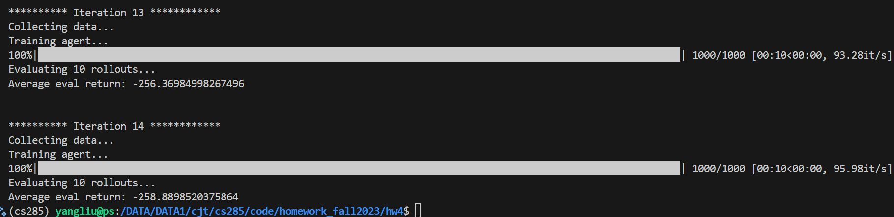
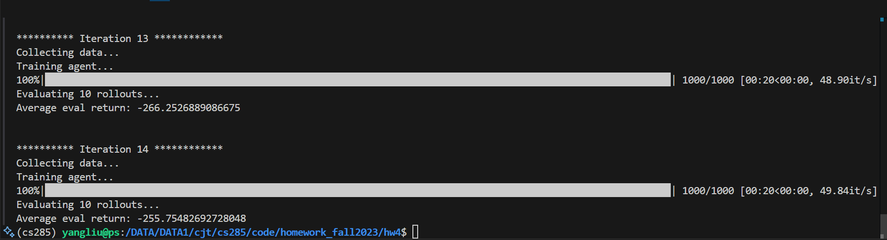
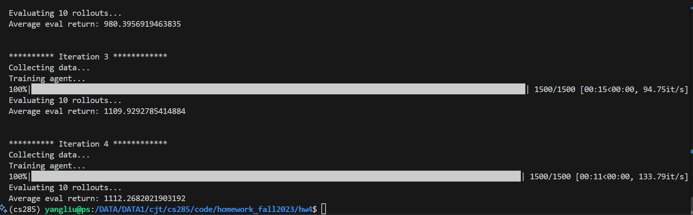
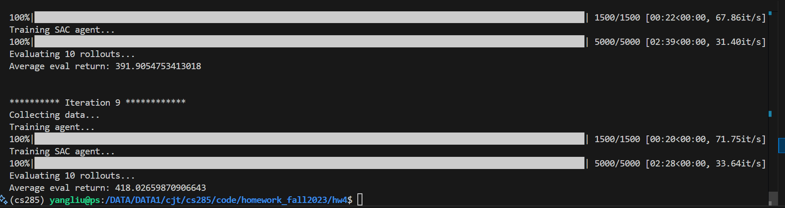

# hw4

## code

### agents

#### model_based_agent

##### `update_statistics()`: 更新归一化用的均值与方差

```python
@torch.no_grad()
def update_statistics(self, obs: np.ndarray, acs: np.ndarray, next_obs: np.ndarray):
    """
        Update the statistics used to normalize the inputs and outputs of the dynamics models.

        Args:
            obs: (n, ob_dim)
            acs: (n, ac_dim)
            next_obs: (n, ob_dim)
        """
    obs = ptu.from_numpy(obs)
    acs = ptu.from_numpy(acs)
    next_obs = ptu.from_numpy(next_obs)
    # TODO(student): update the statistics
    obs_acs = torch.cat([obs, acs], dim=-1)
    obs_delta = next_obs - obs

    self.obs_acs_mean = torch.mean(obs_acs, dim=0,keepdim=True)
    self.obs_acs_std = torch.std(obs_acs, dim=0, keepdim=True) #在update已经做了处理
    delta=next_obs - obs
    self.obs_delta_mean = torch.mean(delta, dim=0, keepdim=True)
    self.obs_delta_std = torch.std(delta, dim=0, keepdim=True)
```


##### update--训练第 `i` 个 dynamics model（动力学模型）

```python
def update(self, i: int, obs: np.ndarray, acs: np.ndarray, next_obs: np.ndarray):
    """
        Update self.dynamics_models[i] using the given batch of data.

        Args:
            i: index of the dynamics model to update
            obs: (batch_size, ob_dim)
            acs: (batch_size, ac_dim)
            next_obs: (batch_size, ob_dim)
        """
    obs = ptu.from_numpy(obs)
    acs = ptu.from_numpy(acs)
    next_obs = ptu.from_numpy(next_obs)
    # TODO(student): update self.dynamics_models[i] using the given batch of data
    # HINT: make sure to normalize the NN input (observations and actions)
    # *and* train it with normalized outputs (observation deltas) 
    # HINT 2: make sure to train it with observation *deltas*, not next_obs
    # directly
    # HINT 3: make sure to avoid any risk of dividing by zero when
    # normalizing vectors by adding a small number to the denominator!
    target=(next_obs-obs-self.obs_delta_mean)/(self.obs_delta_std + 1e-8)
    obs_acs = (torch.cat([obs, acs], dim=-1) - self.obs_acs_mean) / (self.obs_acs_std + 1e-8)
    prediction= self.dynamics_models[i](obs_acs)
    loss = self.loss_fn(prediction, target)
    self.optimizer.zero_grad()
    loss.backward()
    self.optimizer.step()

    return ptu.to_numpy(loss)
```

1. 强调：**训练的是 `delta = next_obs - obs`，而不是直接预测 `next_obs`**

   然后对 delta 进行归一化（standardization），避免不同维度间量纲不一致，训练不稳定

2. `torch.cat((obs, acs), dim=1)`

   - 表示将 `obs` 和 `acs` **按列拼接**。

   将一批 `[obs, acs]` 拼接后的张量做 **标准化** 处理，即转为：
   $$
   \frac{[obs, acs] - \mu}{\sigma + \varepsilon}
   $$

3. 

##### get_dynamics_predictions**预测下一时刻状态**（`next_obs`）

```python
@torch.no_grad()
def get_dynamics_predictions(
    self, i: int, obs: np.ndarray, acs: np.ndarray
) -> np.ndarray:
    """
        Takes a batch of each current observation and action and outputs the
        predicted next observations from self.dynamics_models[i].

        Args:
            obs: (batch_size, ob_dim)
            acs: (batch_size, ac_dim)
        Returns: (batch_size, ob_dim)
        """
    obs = ptu.from_numpy(obs)
    acs = ptu.from_numpy(acs)
    # TODO(student): get the model's predicted `next_obs`
    # HINT: make sure to *unnormalize* the NN outputs (observation deltas)
    # Same hints as `update` above, avoid nasty divide-by-zero errors when
    # normalizing inputs!
    obs_acs=(torch.cat((obs,acs),dim=1)-self.obs_acs_mean)/(self.obs_acs_std+1e-8)
    delta=self.dynamics_models[i](obs_acs)
    pred_next_obs=(delta*self.obs_acs_std)+self.obs_acs_mean+obs#在反阶段处理的时候不加上一个极小量是合理的
    return ptu.to_numpy(pred_next_obs)
```


##### evaluate_action_sequences评估一批 **候选动作序列（action_sequences）**

```python
def evaluate_action_sequences(self, obs: np.ndarray, action_sequences: np.ndarray):
    """
        Evaluate a batch of action sequences using the ensemble of dynamics models.

        Args:
            obs: starting observation, shape (ob_dim,)
            action_sequences: shape (mpc_num_action_sequences, horizon, ac_dim)
        Returns:
            sum_of_rewards: shape (mpc_num_action_sequences,)
        """
    # We are going to predict (ensemble_size * mpc_num_action_sequences)
    # distinct rollouts, and then average over the ensemble dimension to get
    # the reward for each action sequence.

    # We start by initializing an array to keep track of the reward for each
    # of these rollouts.
    sum_of_rewards = np.zeros(
        (self.ensemble_size, self.mpc_num_action_sequences), dtype=np.float32
    )
    # We need to repeat our starting obs for each of the rollouts.
    obs = np.tile(obs, (self.ensemble_size, self.mpc_num_action_sequences, 1))


    # TODO(student): for each batch of actions in in the horizon...
    for acs in action_sequences.transpose(1,0,2):
        assert acs.shape == (self.mpc_num_action_sequences, self.ac_dim)
        assert obs.shape == (
            self.ensemble_size,
            self.mpc_num_action_sequences,
            self.ob_dim,
        )

        # TODO(student): predict the next_obs for each rollout
        # HINT: use self.get_dynamics_predictions
        next_obs = np.stack([self.get_dynamics_predictions(i,obs[i],acs) for i in range(self.ensemble_size)])
        assert next_obs.shape == (
            self.ensemble_size,
            self.mpc_num_action_sequences,
            self.ob_dim,
        )
        acs=np.tile(acs,(self.ensemble_size,1,1)).reshape(-1,self.ac_dim)
        # TODO(student): get the reward for the current step in each rollout
        # HINT: use `self.env.get_reward`. `get_reward` takes 2 arguments:
        # `next_obs` and `acs` with shape (n, ob_dim) and (n, ac_dim),
        # respectively, and returns a tuple of `(rewards, dones)`. You can 
        # ignore `dones`. You might want to do some reshaping to make
        # `next_obs` and `acs` 2-dimensional.
        rewards = self.env.get_reward(next_obs.reshape(-1,self.ob_dim),acs)[0].squeeze()
        rewards=rewards.reshape(self.ensemble_size,-1)
        assert rewards.shape == (self.ensemble_size, self.mpc_num_action_sequences)

        sum_of_rewards += rewards

        obs = next_obs

        # now we average over the ensemble dimension
        return sum_of_rewards.mean(axis=0)
```

1. 这是 **NumPy** 中 `np.tile` 的用法，表示对数组在各维度上**重复（复制）**指定的次数。

   这就生成了一个大小为 `(ensemble_size, num_sequences, ob_dim)` 的大矩阵，每个元素都复制自原始的 `obs`。

2. `for acs in action_sequences.transpose(1, 0, 2):`

   `action_sequences` shape 是 `(num_sequences, horizon, ac_dim)`；

   transpose → `(horizon, num_sequences, ac_dim)`，表示沿时间维度循环；

3. `acs = np.tile(acs, (self.ensemble_size, 1, 1)).reshape(-1, self.ac_dim)`

   你要将这组动作 **复制 ensemble_size 次**，因为每个模型都要对每个动作序列做预测。

   然后你需要 reshape 成扁平形式以用于 reward 函数 `self.env.get_reward`，它的输入要求是：

   - `(batch_size, ob_dim)` 和 `(batch_size, ac_dim)`。

4. `rewards = self.env.get_reward(next_obs.reshape(-1, self.ob_dim), acs)[0].squeeze()`

   `[0]`

   - 取出返回值中的第一个，也就是 **`rewards`**；
   - 忽略 `dones`。

    `.squeeze()`

   - 移除 reward 中所有维度为 1 的轴；

##### get_action(cem)

通过多次迭代地：

1. **采样**大量动作序列；
2. **评估**每个动作序列的回报（用 dynamics model）；
3. **选择**表现最好的 top-k（称为 elites）；
4. **用这些 elites 来拟合新的高斯分布**（即更新均值和方差）；
5. **用这个新的分布再次采样**，直到达到设定的迭代次数。

最终的输出就是 **最优动作序列的均值**，你从中取第一个动作作为当前时间步的执行动作。

```python

```

1. 如果不是第一次迭代：使用当前精英分布（均值+方差）生成新的动作序列。

   第一次迭代的 `action_sequences` 是外面提前初始化好的（通常是均匀分布或标准正态），所以这里不重新采样。

2. `np.argpartition(rewards, -k)`

   这个函数的作用是：

   > 返回一个数组，使得第 `k` 大的元素在它最终排序的位置上，左边的元素都 ≤ 它，右边的元素都 ≥ 它，但**左右两边不一定有序**（比 `argsort` 更快，适合只找 top-k）。

   `[-self.cem_num_elites:]`

   这部分是取出 **后 `cem_num_elites` 个索引**，也就是 top-k 的 reward 的索引。

3. **在 CEM 的第 2 次迭代及之后**，对 elite 动作序列的均值和方差做 **平滑更新**，避免参数剧烈跳动。

   公式对应的是：
   $$
   \mu_{\text{new}} = (1 - \alpha) \cdot \mu_{\text{old}} + \alpha \cdot \mu_{\text{elite}}
   $$
   其中：

   | 符号                      | 含义                                     |
   | ------------------------- | ---------------------------------------- |
   | `elite_mean`              | 当前迭代使用的动作分布的均值             |
   | `elite_var`               | 当前迭代使用的动作分布的方差             |
   | `np.mean(elites, axis=0)` | 本轮 top-k 精英序列的均值                |
   | `np.var(elites, axis=0)`  | 本轮 top-k 精英序列的方差                |
   | `cem_alpha`               | 平滑系数（常设为 0.1~0.5），越小越“保守” |

### scripts

#### run_hw4

##### collect_mbpo_rollout

```python
def collect_mbpo_rollout(
    env: gym.Env,
    mb_agent: ModelBasedAgent,
    sac_agent: SoftActorCritic,
    ob: np.ndarray,
    rollout_len: int = 1,
):
    obs, acs, rewards, next_obs, dones = [], [], [], [], []
    for _ in range(rollout_len):
        # TODO(student): collect a rollout using the learned dynamics models
        # HINT: get actions from `sac_agent` and `next_ob` predictions from `mb_agent`.
        # Average the ensemble predictions directly to get the next observation.
        # Get the reward using `env.get_reward`.
        ac=sac_agent.get_action(ob)[None]
        ob=ob[None]
        next_ob=np.stack([mb_agent.get_dynamics_predictions(i,ob,ac) for i in range(mb_agent.ensemble_size)])
        next_ob=np.mean(next_ob,axis=0)
        rew,done=env.get_reward(next_ob,ac)
        ob, ac, rew, next_ob, done = map(np.squeeze, (ob, ac, rew, next_ob, done))
        obs.append(ob)
        acs.append(ac)
        rewards.append(rew)
        next_obs.append(next_ob)
        dones.append(False)

        ob = next_ob

    return {
        "observation": np.array(obs),
        "action": np.array(acs),
        "reward": np.array(rewards),
        "next_observation": np.array(next_obs),
        "done": np.array(dones),
    }
```


##### 训练 dynamics model 的集成（ensemble）

```python
print("Training agent...")
all_losses = []
for _ in tqdm.trange(
    config["num_agent_train_steps_per_iter"], dynamic_ncols=True
):
    step_losses = []
    # TODO(student): train the dynamics models
    # HINT: train each dynamics model in the ensemble with a *different* batch of transitions!
    # Use `replay_buffer.sample` with config["train_batch_size"].
    for i in range(mb_agent.ensemble_size):
        batch = replay_buffer.sample(config["train_batch_size"])
        loss=mb_agent.update(i, batch["observations"], batch["actions"], batch["next_observations"])
        step_losses.append(loss)

        all_losses.append(np.mean(step_losses))
```

1. `ensemble_size` 的意义是：**你构建了多少个独立的 dynamics model（动力学模型）来一起预测环境的转移**。

## experiments

### problem1（halfcheetah_0_iter.yaml  ）

#### numlayers和hidden_size

| 任务 / 环境                 | 推荐 hidden_size                     |
| --------------------------- | ------------------------------------ |
| CartPole, Pendulum 等小任务 | (64, 64) ~ (128, 128)                |
| Hopper, HalfCheetah 等中等  | (256, 256)（SAC 默认）               |
| Ant, Humanoid 等复杂环境    | (256, 256) ~ (512, 512)              |
| 高维图像输入                | (512, 512) 起步（通常加 CNN 先处理） |

```python
env_name: cheetah-cs285-v0
exp_name: cheetah_0iter

base_config: mpc
num_layers: 1
hidden_size: 32

num_iters: 1
initial_batch_size: 20000
num_agent_train_steps_per_iter: 500
num_eval_trajectories: 0
```


```python
env_name: cheetah-cs285-v0
exp_name: cheetah_0iter_1

base_config: mpc
num_layers: 2
hidden_size: 32

num_iters: 1
initial_batch_size: 20000
num_agent_train_steps_per_iter: 500
num_eval_trajectories: 0
```


```python
env_name: cheetah-cs285-v0
exp_name: cheetah_0iter_2

base_config: mpc
num_layers: 1
hidden_size: 64

num_iters: 1
initial_batch_size: 20000
num_agent_train_steps_per_iter: 500
num_eval_trajectories: 0
```


```python
env_name: cheetah-cs285-v0
exp_name: cheetah_0iter_3

base_config: mpc
num_layers: 1
hidden_size: 128

num_iters: 1
initial_batch_size: 20000
num_agent_train_steps_per_iter: 500
num_eval_trajectories: 0
```


```python
env_name: cheetah-cs285-v0
exp_name: cheetah_0iter_4

base_config: mpc
num_layers: 1
hidden_size: 256

num_iters: 1
initial_batch_size: 20000
num_agent_train_steps_per_iter: 500
num_eval_trajectories: 0
```


```python
env_name: cheetah-cs285-v0
exp_name: cheetah_0iter_5

base_config: mpc
num_layers: 1
hidden_size: 512

num_iters: 1
initial_batch_size: 20000
num_agent_train_steps_per_iter: 500
num_eval_trajectories: 0
```


```python
env_name: cheetah-cs285-v0
exp_name: cheetah_0iter_6

base_config: mpc
num_layers: 2
hidden_size: 512

num_iters: 1
initial_batch_size: 20000
num_agent_train_steps_per_iter: 500
num_eval_trajectories: 0
```


### problem2


### problem3

```python
python cs285/scripts/run_hw4.py -cfg experiments/mpc/obstacles_multi_iter.yaml
python cs285/scripts/run_hw4.py -cfg experiments/mpc/reacher_multi_iter.yaml
python cs285/scripts/run_hw4.py -cfg experiments/mpc/halfcheetah_multi_iter.yaml
```

#### obstacles_multi_iter.yaml


#### reacher_multi_iter.yaml  


### problem4


#### 原始



```python
env_name: reacher-cs285-v0
exp_name: reacher_ablation_v1

base_config: mpc
num_layers: 2
hidden_size: 250

num_iters: 15
initial_batch_size: 5000
batch_size: 800
num_agent_train_steps_per_iter: 1000
num_eval_trajectories: 10
mpc_strategy: random

# change these!
mpc_num_action_sequences: 2000
mpc_horizon: 10
ensemble_size: 3
```


```python
env_name: reacher-cs285-v0
exp_name: reacher_ablation_v2

base_config: mpc
num_layers: 2
hidden_size: 250

num_iters: 15
initial_batch_size: 5000
batch_size: 800
num_agent_train_steps_per_iter: 1000
num_eval_trajectories: 10
mpc_strategy: random

# change these!
mpc_num_action_sequences: 500
mpc_horizon: 10
ensemble_size: 3
```


```python
env_name: reacher-cs285-v0
exp_name: reacher_ablation_v3

base_config: mpc
num_layers: 2
hidden_size: 250

num_iters: 15
initial_batch_size: 5000
batch_size: 800
num_agent_train_steps_per_iter: 1000
num_eval_trajectories: 10
mpc_strategy: random

# change these!
mpc_num_action_sequences: 1000
mpc_horizon: 5
ensemble_size: 3
```


```python
env_name: reacher-cs285-v0
exp_name: reacher_ablation_v4

base_config: mpc
num_layers: 2
hidden_size: 250

num_iters: 15
initial_batch_size: 5000
batch_size: 800
num_agent_train_steps_per_iter: 1000
num_eval_trajectories: 10
mpc_strategy: random

# change these!
mpc_num_action_sequences: 1000
mpc_horizon: 15
ensemble_size: 3
```



```python
env_name: reacher-cs285-v0
exp_name: reacher_ablation_v5

base_config: mpc
num_layers: 2
hidden_size: 250

num_iters: 15
initial_batch_size: 5000
batch_size: 800
num_agent_train_steps_per_iter: 1000
num_eval_trajectories: 10
mpc_strategy: random

# change these!
mpc_num_action_sequences: 1000
mpc_horizon: 10
ensemble_size: 5
```


```python
env_name: reacher-cs285-v0
exp_name: reacher_ablation_v6

base_config: mpc
num_layers: 2
hidden_size: 250

num_iters: 15
initial_batch_size: 5000
batch_size: 800
num_agent_train_steps_per_iter: 1000
num_eval_trajectories: 10
mpc_strategy: random

# change these!
mpc_num_action_sequences: 1000
mpc_horizon: 10
ensemble_size: 2
```


### problem5


```python
env_name: cheetah-cs285-v0
exp_name: cheetah_cem

base_config: mpc
num_layers: 2
hidden_size: 250

num_iters: 5
initial_batch_size: 5000
batch_size: 5000
num_agent_train_steps_per_iter: 1500
num_eval_trajectories: 10
mpc_horizon: 15
mpc_strategy: cem
cem_num_iters: 4
cem_num_elites: 5
cem_alpha: 1
```



```python
env_name: cheetah-cs285-v0
exp_name: cheetah_cem_v1

base_config: mpc
num_layers: 2
hidden_size: 250

num_iters: 5
initial_batch_size: 5000
batch_size: 5000
num_agent_train_steps_per_iter: 1500
num_eval_trajectories: 10
mpc_horizon: 15
mpc_strategy: cem
cem_num_iters: 2
cem_num_elites: 5
cem_alpha: 1
```


### problem6


#### sac


#### dyna



#### mbpo

