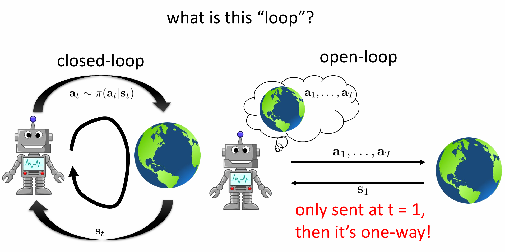
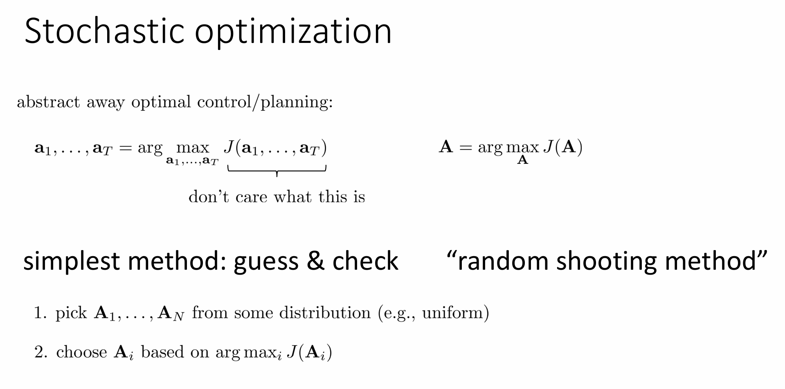
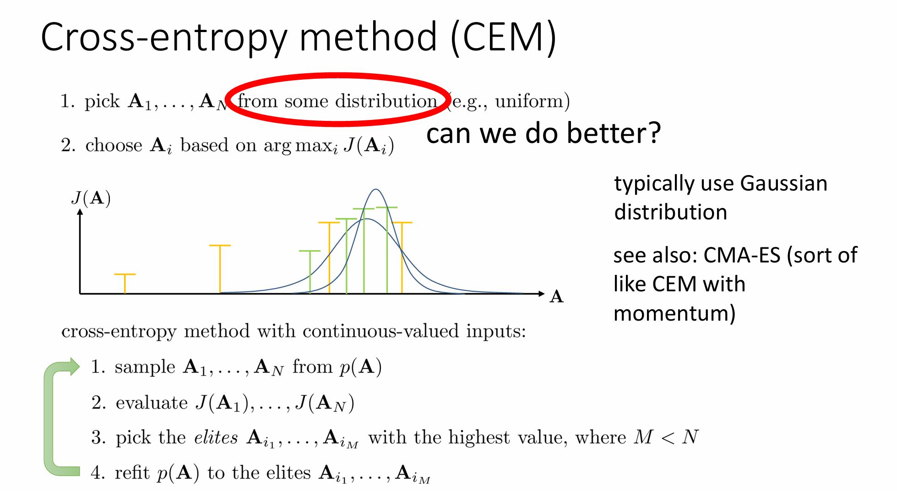
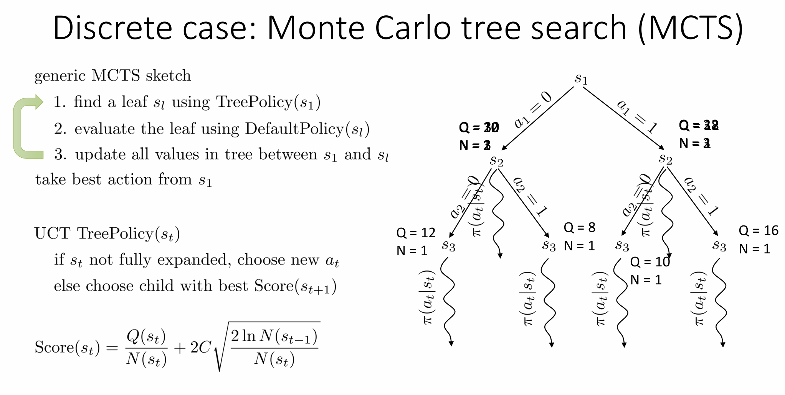
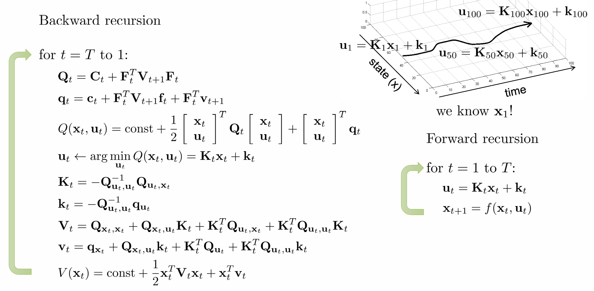
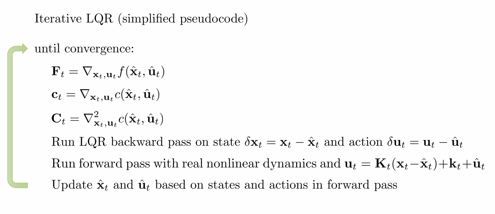
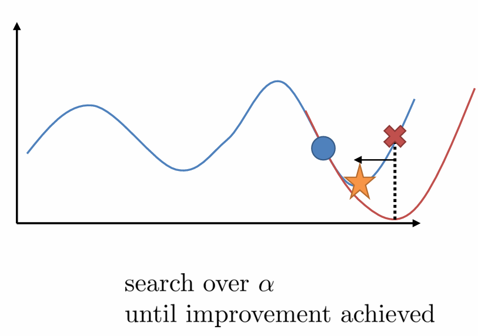

# lecture10

## part1

### Model‑Based RL 大框架

> **三步**
>
> 1. **学模型**（或已知）
> 2. **用模型做规划 / 控制** → 选动作
> 3. 若模型未知，则“学模型 + 用模型”循环

### 规划问题的数学形式

**Deterministic dynamics（确定性）**
$$
\begin{aligned}
\min_{a_{1:T}}\; &\sum_{t=1}^T c(s_t,a_t) \\
\text{s.t. } &s_{t+1}=f(s_t,a_t),\;\; s_1 = s_\text{init}
\end{aligned}
$$
**Stochastic dynamics（随机）**
$$
\max_{a_{1:T}} \mathbb{E}\bigl[\sum_{t=1}^T r(s_t,a_t)\bigr],\quad
s_{t+1}\sim P(\cdot\,|s_t,a_t)
$$
 **open‑loop vs. closed‑loop**



| 概念                              | 说明                              | 例子                 |
| --------------------------------- | --------------------------------- | -------------------- |
| **Open‑loop plan**                | 先定好 `a₁…a_T`，执行时不看新状态 | 烤面包机定时开关     |
| **Closed‑loop (feedback) policy** | 每步观察 `s_t` 再选 `a_t=π(s_t)`  | 自动驾驶需要持续反馈 |

 在随机环境中 open‑loop 往往次优，因为不能利用新信息。

> 在连续控制里常用 **线性反馈**（例如 LQR 得到增益矩阵 `K`，用 `u = K(s - s_ref)`）。

####  意思：

- **连续控制**：指的是动作空间是连续值的（例如[-1, 1]之间任意实数），典型如机械臂控制、车辆转向等；
- **线性反馈控制（Linear Feedback Control）**：使用一种简单但高效的方式根据状态来计算控制动作；
- **LQR（Linear Quadratic Regulator）**：一种经典控制算法，用于优化线性系统的性能；
- **增益矩阵 K**：LQR 求解出一个矩阵 `K`，你可以理解为它是一个控制器的“策略”；
- **公式 u = K(s - s_ref)**：代表当前状态 `s` 与目标状态 `s_ref` 的差距乘以 `K`，得到一个控制动作 `u`，这就是所谓的“状态误差反馈控制”。

####  举个例子：

假如你要控制一个小车从当前状态 `s = [位置, 速度]` 到目标状态 `s_ref = [0, 0]`，LQR 会告诉你一个矩阵 `K`，然后：

```ini
u = K * (s - s_ref)
```

就能得到最佳控制 `u`，比如加速度或者舵机角度。

------

###  原文：

> 只需在轨迹附近生效，不必是一张覆盖全空间的全局策略网络。

####  意思：

- LQR 这种线性反馈策略 **只能在目标轨迹附近生效**，因为它依赖的是线性近似；
- 现实世界是非线性的，全局范围使用 `u = K(s - s_ref)` 会失效；
- 所以我们只用它来控制“接近目标轨迹”的那一部分系统状态；
- 不像强化学习中的 policy network，它试图覆盖**整个状态空间**并给出动作，这在高维空间非常困难；
- LQR 是一种 **局部策略**（local policy），不需要全局泛化能力。

## part2

Black-box Optimization

- 当环境模型是一个黑盒（Black-box model）时，无法显式地使用梯度，只能通过“试错”来搜索最优动作序列。

- 这时候需要使用**black-box optimization algorithms**，例如：

  - Random shooting（随机采样），这种算法的好处应用起来很简单，在某些简单的问题里面效果还不错

  - **Cross-Entropy Method (CEM)**

### Cross-Entropy Method (CEM)



CEM是一种在高维空间中寻找最优动作序列的迭代方法，关键步骤如下：

1. 从一个参数化的分布（如高斯分布）中采样一批 action sequences；
2. 评估这些 sequences 在模型中的 predicted return；
3. 选择 top-k 表现最好的（称为 elite set）；
4. 用这些 elite 的均值和方差更新动作分布；
5. 重复这个过程多次，直到收敛。

 优点：

- 不需要梯度；
- 可以处理任意 reward landscape；
- 易于并行计算。

### MCTS 的基本流程 (Generic MCTS Sketch)discreet



MCTS 是一种基于模拟的树搜索算法，核心过程如下：

 Step 1: 使用 TreePolicy 找到一个叶节点 `s_l`

即不断沿着树往下走，直到走到一个还没有被完全扩展（还可以探索新动作）或者是终止的状态节点。

 Step 2: 使用 DefaultPolicy 对叶子节点进行评估

从 `s_l` 开始，使用一个默认策略（可以是随机策略）跑一个 rollout，到达终止状态并获取 cumulative reward。

 Step 3: 将 reward 向上传播更新整棵树

更新从 `s_1` 到 `s_l` 路径上每个节点的信息（包括 visit count `N` 和 value `Q`），最后根据根节点 `s_1` 选择最优的动作。

------

####  UCT TreePolicy 策略

UCT 是 MCTS 中最常见的选择子节点的方法，其目标是在**探索（exploration）** 和 **利用（exploitation）** 之间取得平衡。

Score 公式 (UCT):
$$
\text{Score}(s_t) = \frac{Q(s_t)}{N(s_t)} + 2C \sqrt{ \frac{2 \ln N(s_{t-1})}{N(s_t)} }
$$
含义如下：

| 项           | 解释                                       |
| ------------ | ------------------------------------------ |
| $Q(s_t)$     | 当前节点的累计 reward（或平均 reward）     |
| $N(s_t)$     | 当前节点被访问的次数                       |
| $N(s_{t-1})$ | 父节点的访问次数                           |
| $C$          | 控制探索强度的常数（调节探索与利用的权重） |


- 第一项 $\frac{Q}{N}$ → 表示 **当前节点的平均价值**，偏向于 exploitation。
- 第二项 → 是 **探索因子**，偏向选择被访问较少的节点。

## part3

我们希望通过选择一系列控制变量（动作）$\mathbf{u}_1, \mathbf{u}_2, ..., \mathbf{u}_T$，让系统的总代价最小：
$$
\min_{\mathbf{u}_1, ..., \mathbf{u}_T} \sum_{t=1}^{T} c(\mathbf{x}_t, \mathbf{u}_t)
$$
其中：

- $\mathbf{x}_t$：表示时刻 $t$ 的状态；

- $\mathbf{u}_t$：表示时刻 $t$ 的动作；

- $c(\mathbf{x}_t, \mathbf{u}_t)$：当前状态和动作下的代价；

- 状态是由系统动力学函数递归生成的：
  $$
  \mathbf{x}_t = f(\mathbf{x}_{t-1}, \mathbf{u}_{t-1})
  $$

展开来看：损失函数是递归嵌套的

我们实际优化的目标就是下面这个形式：
$$
\min_{\mathbf{u}_1, ..., \mathbf{u}_T} \quad c(\mathbf{x}_1, \mathbf{u}_1) + c(f(\mathbf{x}_1, \mathbf{u}_1), \mathbf{u}_2) + \cdots + c(f(f(\dots), \mathbf{u}_T))
$$
它表达了一个**逐步推进的系统**，每一步的状态由上一步的状态和控制决定，最后代价函数层层嵌套，形成一个链式结构。

是的！这就像训练神经网络一样，我们可以：

> **利用链式法则 + 反向传播**，对所有控制变量 $\mathbf{u}_t$ 求导。

为此我们需要如下梯度信息：

- $\frac{df}{d\mathbf{x}_t}$：动力学函数对状态的导数；
- $\frac{df}{d\mathbf{u}_t}$：动力学函数对动作的导数；
- $\frac{dc}{d\mathbf{x}_t}$：代价函数对状态的导数；
- $\frac{dc}{d\mathbf{u}_t}$：代价函数对动作的导数。

使用 **二阶信息**（如 Hessian 或近似的二阶导）的方法，比如：

- LQR（线性二次调节器）；
- iLQR（迭代LQR）；
- Newton 法；
- DDP（Differential Dynamic Programming）；
- 或者 Adam、LBFGS 这类近似二阶优化器。

因为轨迹优化常常是非线性且有多个局部最优的，二阶信息可以更快、更稳定地收敛。

### shooting methods

**Shooting method** 是在运动控制（trajectory optimization）中一种常用的方法，**只优化控制量/动作（actions）**，让系统状态由动力学函数自然演化。也叫作「前向模拟优化」。

优化目标为：
$$
\min_{\mathbf{u}_1, \dots, \mathbf{u}_T} \quad c(\mathbf{x}_1, \mathbf{u}_1) + c(f(\mathbf{x}_1, \mathbf{u}_1), \mathbf{u}_2) + \cdots + c(f(f(\cdots), \mathbf{u}_T))
$$
**意思是：**

- 我们从已知的初始状态 $\mathbf{x}_1$ 出发；
- 每一步通过系统动力学函数 $f(\cdot)$ 推出下一个状态；
- 所有状态都是由前一个状态 + 当前动作递推出来的；
- 然后我们累计每一步的 cost 函数 $c(x_t, u_t)$ 作为目标；
- **优化变量只包括动作序列 $\mathbf{u}_1, \dots, \mathbf{u}_T$**

| 优点                        | 缺点                       |
| --------------------------- | -------------------------- |
| 简单直接（forward rollout） | 容易不稳定（误差积累）     |
| 易于使用自动微分、反向传播  | 对初始动作非常敏感         |
| 可和策略梯度方法结合        | 有些问题容易发散，不易收敛 |

### collection method

**优化变量不仅包括动作序列 $\mathbf{u}_1, \dots, \mathbf{u}_T$，还包括状态序列 $\mathbf{x}_1, \dots, \mathbf{x}_T$**；

**动态约束** $\mathbf{x}_t = f(\mathbf{x}_{t-1}, \mathbf{u}_{t-1})$ 被显式作为优化问题的一部分；

优化器可以「违反」动力学在中间步骤，但通过引入约束，使最终解满足动力学。
$$
\min_{\mathbf{u}_1, \dots, \mathbf{u}_T, \mathbf{x}_1, \dots, \mathbf{x}_T} \sum_{t=1}^T c(\mathbf{x}_t, \mathbf{u}_t) \quad \text{s.t.} \quad \mathbf{x}_t = f(\mathbf{x}_{t-1}, \mathbf{u}_{t-1})
$$

- 总目标是最小化所有时间步的 cost；
- **状态变量 $\mathbf{x}_t$** 和 **动作变量 $\mathbf{u}_t$** 都是要优化的；
- 但在优化过程中，必须满足 **动力学一致性**：状态必须由前一状态和动作通过系统动力学函数 $f$ 演化得到。

| 特点                 | 描述                               |
| -------------------- | ---------------------------------- |
| 优化变量多           | 不仅动作 $u_t$，还包含状态 $x_t$   |
| 稳定性强             | 可以显式控制动力学误差（通过约束） |
| 解的质量更好         | 尤其适用于高维系统、刚性系统等     |
| 可用于非顺序时间采样 | 可以对任意时间点进行插值、约束     |

### LQR

我们要解决的问题是一个 **轨迹优化（trajectory optimization）** 问题：
$$
\min_{\mathbf{u}_1, \dots, \mathbf{u}_T} \quad c(\mathbf{x}_1, \mathbf{u}_1) + c(f(\mathbf{x}_1, \mathbf{u}_1), \mathbf{u}_2) + \cdots + c(f(f(\cdots), \mathbf{u}_T))
$$
也可以看成 Shooting Method 中的结构：我们只优化动作序列 $\mathbf{u}_1 \dots \mathbf{u}_T$，状态 $\mathbf{x}_t$ 是通过递推得到的。

动态系统（系统的演化）：线性
$$
f(\mathbf{x}_t, \mathbf{u}_t) = \mathbf{F}_t
\begin{bmatrix}
\mathbf{x}_t \\
\mathbf{u}_t
\end{bmatrix}
+ \mathbf{f}_t
$$

- **线性动态系统**：
  - $\mathbf{F}_t$：系统矩阵；
  - $\mathbf{f}_t$：偏置项；
  - 整个状态的更新是线性函数。

 成本函数（Cost Function）：二次
$$
c(\mathbf{x}_t, \mathbf{u}_t) = \frac{1}{2}
\begin{bmatrix}
\mathbf{x}_t \\
\mathbf{u}_t
\end{bmatrix}^T
\mathbf{C}_t
\begin{bmatrix}
\mathbf{x}_t \\
\mathbf{u}_t
\end{bmatrix}
+
\begin{bmatrix}
\mathbf{x}_t \\
\mathbf{u}_t
\end{bmatrix}^T
\mathbf{c}_t
$$

- **Quadratic cost（二次型代价）**，这是 LQR 的经典形式：
  - 第一项：代价是关于状态和动作的二次函数；
  - 第二项：线性项用于偏移/非对称代价。

由于这是一个 **动态规划问题（DP）**，所以从 **最后一个动作 $\mathbf{u}_T$** 开始求解。

此时唯一依赖 $\mathbf{u}_T$ 的是：
$$
c(\mathbf{x}_T, \mathbf{u}_T) = \frac{1}{2}
\begin{bmatrix}
\mathbf{x}_T \\
\mathbf{u}_T
\end{bmatrix}^T
\mathbf{C}_T
\begin{bmatrix}
\mathbf{x}_T \\
\mathbf{u}_T
\end{bmatrix}
+
\begin{bmatrix}
\mathbf{x}_T \\
\mathbf{u}_T
\end{bmatrix}^T
\mathbf{c}_T
$$
我们定义：
$$
\mathbf{C}_T =
\begin{bmatrix}
\mathbf{C}_{x_T, x_T} & \mathbf{C}_{x_T, u_T} \\
\mathbf{C}_{u_T, x_T} & \mathbf{C}_{u_T, u_T}
\end{bmatrix}, \quad
\mathbf{c}_T =
\begin{bmatrix}
\mathbf{c}_{x_T} \\
\mathbf{c}_{u_T}
\end{bmatrix}
$$
目标函数记为：
$$
Q(\mathbf{x}_T, \mathbf{u}_T) = \text{const} + \frac{1}{2}
\begin{bmatrix}
\mathbf{x}_T \\
\mathbf{u}_T
\end{bmatrix}^T
\mathbf{C}_T
\begin{bmatrix}
\mathbf{x}_T \\
\mathbf{u}_T
\end{bmatrix}
+
\begin{bmatrix}
\mathbf{x}_T \\
\mathbf{u}_T
\end{bmatrix}^T
\mathbf{c}_T
$$
对 $\mathbf{u}_T$ 求梯度：
$$
\nabla_{\mathbf{u}_T} Q(\mathbf{x}_T, \mathbf{u}_T)
= \mathbf{C}_{u_T, x_T} \mathbf{x}_T + \mathbf{C}_{u_T, u_T} \mathbf{u}_T + \mathbf{c}_{u_T}^T
= 0
$$
解出最优 $\mathbf{u}_T$：
$$
\boxed{
\mathbf{u}_T = - \mathbf{C}_{u_T, u_T}^{-1} (\mathbf{C}_{u_T, x_T} \mathbf{x}_T + \mathbf{c}_{u_T})
}
$$
把上式拆成两项：

- 状态相关项：$\mathbf{K}_T = - \mathbf{C}_{u_T, u_T}^{-1} \mathbf{C}_{u_T, x_T}$
- 偏置项：$\mathbf{k}_T = - \mathbf{C}_{u_T, u_T}^{-1} \mathbf{c}_{u_T}$

则最终控制律为：
$$
\boxed{
\mathbf{u}_T = \mathbf{K}_T \mathbf{x}_T + \mathbf{k}_T
}
$$
这是一个 **线性反馈控制律（Linear Feedback Control Law）**，意味着给定 $\mathbf{x}_T$，我们可以直接线性求得最优动作 $\mathbf{u}_T$。

我们写出 Q 函数（表示代价函数关于 $x_T, u_T$ 的联合表达）：
$$
Q(x_T, u_T) = \text{const} + \frac{1}{2}
\begin{bmatrix}
x_T \\
u_T
\end{bmatrix}^T
C_T
\begin{bmatrix}
x_T \\
u_T
\end{bmatrix}
+
\begin{bmatrix}
x_T \\
u_T
\end{bmatrix}^T
c_T
$$
然后 **代入 $u_T = K_T x_T + k_T$**，我们就可以把整个 Q 函数变成只关于 $x_T$ 的表达，这就是值函数 $V(x_T)$。

我们做的是把：
$$
V(x_T) = Q(x_T, u_T(x_T)) = \text{const} + \frac{1}{2}
\begin{bmatrix}
x_T \\
K_T x_T + k_T
\end{bmatrix}^T
C_T
\begin{bmatrix}
x_T \\
K_T x_T + k_T
\end{bmatrix}
+
\begin{bmatrix}
x_T \\
K_T x_T + k_T
\end{bmatrix}^T c_T
$$
然后我们展开得到如下结果：
$$
V(x_T) = \text{const} + \frac{1}{2} x_T^T V_T x_T + x_T^T v_T
$$
其中：

- $V_T = C_{x_T,x_T} + C_{x_T,u_T} K_T + K_T^T C_{u_T,x_T} + K_T^T C_{u_T,u_T} K_T$
- $v_T = c_{x_T} + C_{x_T,u_T} k_T + K_T^T c_{u_T} + K_T^T C_{u_T,u_T} k_T$

也就是说，值函数 $V(x_T)$ 是一个 **关于状态的二次型函数**，可以用于往前传播做动态规划。

现在，我们希望求得对 $u_{T-1}$ 的最优控制策略，同时将值函数往前递推到 $V(x_{T-1})$。

动态系统模型
$$
x_T = f(x_{T-1}, u_{T-1}) = F_{T-1} \begin{bmatrix} x_{T-1} \\ u_{T-1} \end{bmatrix} + f_{T-1}
$$
即系统是线性的：由状态和控制线性决定下一时刻状态。

构造 Q 函数
$$
Q(x_{T-1}, u_{T-1}) = c(x_{T-1}, u_{T-1}) + V(x_T)
$$
将两个部分展开：

1. $c(x_{T-1}, u_{T-1})$ 是标准二次型代价项：

$$
c(x_{T-1}, u_{T-1}) = \frac{1}{2}
\begin{bmatrix}
x_{T-1} \\
u_{T-1}
\end{bmatrix}^T
C_{T-1}
\begin{bmatrix}
x_{T-1} \\
u_{T-1}
\end{bmatrix}
+
\begin{bmatrix}
x_{T-1} \\
u_{T-1}
\end{bmatrix}^T
c_{T-1}
$$

1. $V(x_T) = \frac{1}{2} x_T^T V_T x_T + x_T^T v_T$，而 $x_T$ 是 $x_{T-1}, u_{T-1}$ 的线性函数：

$$
x_T = F_{T-1} \begin{bmatrix} x_{T-1} \\ u_{T-1} \end{bmatrix} + f_{T-1}
$$

所以我们将这个表达式代入到值函数 $V(x_T)$ 中。

展开 $V(x_T)$

目标是将所有项重新表示为关于 $x_{T-1}$ 和 $u_{T-1}$ 的二次型表达：
$$
V(x_T) = \frac{1}{2}
\left( F_{T-1}
\begin{bmatrix}
x_{T-1} \\
u_{T-1}
\end{bmatrix}
+ f_{T-1}
\right)^T
V_T
\left( F_{T-1}
\begin{bmatrix}
x_{T-1} \\
u_{T-1}
\end{bmatrix}
+ f_{T-1}
\right)
+ \left( F_{T-1}
\begin{bmatrix}
x_{T-1} \\
u_{T-1}
\end{bmatrix}
+ f_{T-1}
\right)^T
v_T
$$
这个式子展开后包含三类项：

1. **二次项（quadratic）**：
   $$
   \frac{1}{2}
   \begin{bmatrix}
   x_{T-1} \\
   u_{T-1}
   \end{bmatrix}^T
   F_{T-1}^T V_T F_{T-1}
   \begin{bmatrix}
   x_{T-1} \\
   u_{T-1}
   \end{bmatrix}
   $$

2. **线性项（linear）**：
    来自两个地方：

   - $\begin{bmatrix} x_{T-1} \\ u_{T-1} \end{bmatrix}^T F_{T-1}^T V_T f_{T-1}$
   - $\begin{bmatrix} x_{T-1} \\ u_{T-1} \end{bmatrix}^T F_{T-1}^T v_T$

3. **常数项（const）**（暂略，在动态规划中并不影响最优策略）

整理成一个二次形式：
$$
Q(x_{T-1}, u_{T-1}) = \text{const} + \frac{1}{2}
\begin{bmatrix} x_{T-1} \\ u_{T-1} \end{bmatrix}^T Q_{T-1}
\begin{bmatrix} x_{T-1} \\ u_{T-1} \end{bmatrix}
+
\begin{bmatrix} x_{T-1} \\ u_{T-1} \end{bmatrix}^T q_{T-1}
$$
其中系数为：

- $Q_{T-1} = C_{T-1} + F_{T-1}^T V_T F_{T-1}$ 是 **二次项系数矩阵**
- $q_{T-1} = c_{T-1} + F_{T-1}^T V_T f_{T-1} + F_{T-1}^T v_T$ 是 **线性项系数**

从 Q 函数中提取与 $\mathbf{u}_{T-1}$ 相关的项：
$$
\nabla_{u_{T-1}} Q(x_{T-1}, u_{T-1}) =
Q_{u_{T-1}, x_{T-1}} x_{T-1}
+ Q_{u_{T-1}, u_{T-1}} u_{T-1}
+ q_{u_{T-1}}^T = 0
$$
解这个方程，得到最优控制策略：
$$
\boxed{
u_{T-1} = K_{T-1} x_{T-1} + k_{T-1}
}
$$
其中：

- $K_{T-1} = -Q_{u_{T-1}, u_{T-1}}^{-1} Q_{u_{T-1}, x_{T-1}}$
- $k_{T-1} = -Q_{u_{T-1}, u_{T-1}}^{-1} q_{u_{T-1}}$



#### Backward Recursion 详解（策略计算阶段）

我们目的是推导出最优策略形式：
$$
\mathbf{u}_t = \mathbf{K}_t \mathbf{x}_t + \mathbf{k}_t
$$
Step-by-step 说明：

1. **Q函数的二次形式组合**：
   $$
   Q_t = C_t + F_t^T V_{t+1} F_t,\quad q_t = c_t + F_t^T V_{t+1} f_t + F_t^T v_{t+1}
   $$

   > 把一步代价函数 `c(xₜ, uₜ)` 和未来的价值函数 `V_{t+1}(x_{t+1})` 合并成一个整体 Q 函数（state+action 的二次函数形式）。

2. **最优控制律推导**：
   $$
   \mathbf{u}_t = \arg \min_{\mathbf{u}_t} Q(\mathbf{x}_t, \mathbf{u}_t)
   \Rightarrow \mathbf{u}_t = \mathbf{K}_t \mathbf{x}_t + \mathbf{k}_t
   $$
   使用梯度为零的条件解出反馈矩阵与偏置项：
   $$
   \mathbf{K}_t = - Q_{u_t,u_t}^{-1} Q_{u_t,x_t}, \quad
   \mathbf{k}_t = - Q_{u_t,u_t}^{-1} q_{u_t}
   $$

3. **更新值函数系数（仍为二次函数）**：
   $$
   \begin{aligned}
   V_t &= Q_{x_t,x_t} + Q_{x_t,u_t} K_t + K_t^T Q_{u_t,x_t} + K_t^T Q_{u_t,u_t} K_t \\
   v_t &= q_{x_t} + Q_{x_t,u_t} k_t + K_t^T q_{u_t} + K_t^T Q_{u_t,u_t} k_t
   \end{aligned}
   $$
   得到 `V_t` 和 `v_t`，即当前时刻 t 的值函数形式：
   $$
   V(x_t) = \frac{1}{2} x_t^T V_t x_t + x_t^T v_t + \text{const}
   $$

#### Forward Recursion 详解（策略执行阶段）

此阶段我们已知初始状态 `x₁`，根据之前计算出的 `Kₜ` 和 `kₜ`，从头向后展开出整个 trajectory：
$$
\begin{aligned}
\mathbf{u}_t &= \mathbf{K}_t \mathbf{x}_t + \mathbf{k}_t \\
\mathbf{x}_{t+1} &= f(\mathbf{x}_t, \mathbf{u}_t) = F_t \begin{bmatrix} x_t \\ u_t \end{bmatrix} + f_t
\end{aligned}
$$

## part4

### LQG	

我们考虑系统存在噪声，即：

 系统动力学变成：
$$
f(\mathbf{x}_t, \mathbf{u}_t) = \mathbf{F}_t
\begin{bmatrix}
\mathbf{x}_t \\
\mathbf{u}_t
\end{bmatrix}
+ \mathbf{f}_t
$$
这仍然是一个**线性映射 + 偏置项**。

系统的下一个状态是一个随机变量：
$$
\mathbf{x}_{t+1} \sim p(\mathbf{x}_{t+1} | \mathbf{x}_t, \mathbf{u}_t)
$$
具体地，这个条件分布是一个高斯分布：
$$
p(\mathbf{x}_{t+1} | \mathbf{x}_t, \mathbf{u}_t) = \mathcal{N}\left(
\mathbf{F}_t
\begin{bmatrix}
\mathbf{x}_t \\
\mathbf{u}_t
\end{bmatrix}
+ \mathbf{f}_t,\ \boldsymbol{\Sigma}_t
\right)
$$

- **均值**是线性系统的输出；
- **协方差矩阵**是 $\Sigma_t$，描述了系统的随机性。

尽管系统变成了随机的，我们的策略仍然保持如下线性形式：
$$
\mathbf{u}_t = \mathbf{K}_t \mathbf{x}_t + \mathbf{k}_t
$$
换句话说，**LQR 的形式没有变化**，只是状态 $\mathbf{x}_t$ 不再是确定的，而是一个高斯分布。

### Nonlinear case

在当前轨迹附近进行线性二次近似（局部线性化）

对系统动力学做一阶泰勒展开：
$$
f(\mathbf{x}_t, \mathbf{u}_t) \approx f(\hat{\mathbf{x}}_t, \hat{\mathbf{u}}_t) + \nabla_{\mathbf{x}_t, \mathbf{u}_t} f(\hat{\mathbf{x}}_t, \hat{\mathbf{u}}_t) \begin{bmatrix} \mathbf{x}_t - \hat{\mathbf{x}}_t \\ \mathbf{u}_t - \hat{\mathbf{u}}_t \end{bmatrix}
$$
这就是系统的**局部线性化**，类似于一阶导数（Jacobian）描述。

------

 对代价函数做二阶泰勒展开：
$$
\begin{aligned}
c(\mathbf{x}_t, \mathbf{u}_t) \approx &\ c(\hat{\mathbf{x}}_t, \hat{\mathbf{u}}_t) + \nabla_{\mathbf{x}_t, \mathbf{u}_t} c(\hat{\mathbf{x}}_t, \hat{\mathbf{u}}_t) \begin{bmatrix} \mathbf{x}_t - \hat{\mathbf{x}}_t \\ \mathbf{u}_t - \hat{\mathbf{u}}_t \end{bmatrix} \\
& + \frac{1}{2} \begin{bmatrix} \mathbf{x}_t - \hat{\mathbf{x}}_t \\ \mathbf{u}_t - \hat{\mathbf{u}}_t \end{bmatrix}^\top \nabla^2_{\mathbf{x}_t, \mathbf{u}_t} c(\hat{\mathbf{x}}_t, \hat{\mathbf{u}}_t) \begin{bmatrix} \mathbf{x}_t - \hat{\mathbf{x}}_t \\ \mathbf{u}_t - \hat{\mathbf{u}}_t \end{bmatrix}
\end{aligned}
$$
这是二阶展开，相当于我们在当前轨迹附近对 cost 做了**二次函数逼近**。

定义增量变量（perturbation）：
$$
\delta \mathbf{x}_t = \mathbf{x}_t - \hat{\mathbf{x}}_t,\quad \delta \mathbf{u}_t = \mathbf{u}_t - \hat{\mathbf{u}}_t
$$
于是动力学线性化表达为：
$$
\bar{f}(\delta \mathbf{x}_t, \delta \mathbf{u}_t) = \mathbf{F}_t \begin{bmatrix} \delta \mathbf{x}_t \\ \delta \mathbf{u}_t \end{bmatrix}
$$
其中：
$$
\mathbf{F}_t = \nabla_{\mathbf{x}_t, \mathbf{u}_t} f(\hat{\mathbf{x}}_t, \hat{\mathbf{u}}_t)
$$
新的二次形式：
$$
\bar{c}(\delta \mathbf{x}_t, \delta \mathbf{u}_t) = \frac{1}{2} \begin{bmatrix} \delta \mathbf{x}_t \\ \delta \mathbf{u}_t \end{bmatrix}^\top \mathbf{C}_t \begin{bmatrix} \delta \mathbf{x}_t \\ \delta \mathbf{u}_t \end{bmatrix} + \begin{bmatrix} \delta \mathbf{x}_t \\ \delta \mathbf{u}_t \end{bmatrix}^\top \mathbf{c}_t
$$
其中：

- $\mathbf{C}_t = \nabla^2_{\mathbf{x}_t, \mathbf{u}_t} c(\hat{\mathbf{x}}_t, \hat{\mathbf{u}}_t)$
- $\mathbf{c}_t = \nabla_{\mathbf{x}_t, \mathbf{u}_t} c(\hat{\mathbf{x}}_t, \hat{\mathbf{u}}_t)$



###### 牛顿法求解非线性优化问题

考虑一个一般的非线性函数最小化问题：
$$
\min_{\mathbf{x}} g(\mathbf{x})
$$
牛顿法的步骤是：

1. 在当前点 $\hat{\mathbf{x}}$ 处计算梯度和 Hessian：
   $$
   \mathbf{g} = \nabla_{\mathbf{x}} g(\hat{\mathbf{x}}), \quad \mathbf{H} = \nabla^2_{\mathbf{x}} g(\hat{\mathbf{x}})
   $$

2. 构造泰勒二阶近似（二次函数）：
   $$
   \hat{\mathbf{x}} \leftarrow \arg \min_{\mathbf{x}} \left[ \frac{1}{2} (\mathbf{x} - \hat{\mathbf{x}})^T \mathbf{H} (\mathbf{x} - \hat{\mathbf{x}}) + \mathbf{g}^T (\mathbf{x} - \hat{\mathbf{x}}) \right]
   $$
   实际上是找到局部的二次函数极小值点，然后更新。

3. 迭代执行直到收敛

##### 类比：iLQR 是多变量控制问题中的“牛顿法”

对于轨迹优化问题：
$$
\min_{\mathbf{u}_1,\dots,\mathbf{u}_T} c(\mathbf{x}_1, \mathbf{u}_1) + c(f(\mathbf{x}_1, \mathbf{u}_1), \mathbf{u}_2) + \dots + c(f(f(\cdots), \mathbf{u}_T))
$$
这是一个复合的、嵌套的非线性最小化问题 —— **每一步动作都会影响下一个状态的值**。

##### DDP

如果我们希望在轨迹优化中 **真正实现“牛顿法”级别的精度**，我们就要对动力学也做**二阶近似**：

对动力学函数 $f(\mathbf{x}_t, \mathbf{u}_t)$ 做二阶泰勒展开：
$$
f(\mathbf{x}_t, \mathbf{u}_t) \approx f(\hat{\mathbf{x}}_t, \hat{\mathbf{u}}_t) 
+ \nabla_{\mathbf{x}_t, \mathbf{u}_t} f(\hat{\mathbf{x}}_t, \hat{\mathbf{u}}_t) 
\begin{bmatrix}
\delta \mathbf{x}_t \\
\delta \mathbf{u}_t
\end{bmatrix}
+ \frac{1}{2}
\begin{bmatrix}
\delta \mathbf{x}_t \\
\delta \mathbf{u}_t
\end{bmatrix}^T
\nabla^2_{\mathbf{x}_t, \mathbf{u}_t} f(\hat{\mathbf{x}}_t, \hat{\mathbf{u}}_t)
\begin{bmatrix}
\delta \mathbf{x}_t \\
\delta \mathbf{u}_t
\end{bmatrix}
$$
其中：

- $\nabla_{\mathbf{x}_t, \mathbf{u}_t} f$：一阶导，Jacobian
- $\nabla^2_{\mathbf{x}_t, \mathbf{u}_t} f$：二阶导，Hessian

为什么下面这个优化公式是“坏主意”？
$$
\hat{\mathbf{x}} \leftarrow \arg\min_{\mathbf{x}} \frac{1}{2}(\mathbf{x} - \hat{\mathbf{x}})^T \mathbf{H} (\mathbf{x} - \hat{\mathbf{x}}) + \mathbf{g}^T (\mathbf{x} - \hat{\mathbf{x}})
$$
这个优化尝试**直接使用二次近似目标函数（local quadratic）进行跳跃更新**，但这是危险的，尤其是在高维轨迹控制问题中。



为了防止“跳太远”，我们使用一个 **α（step size）系数** 来**缩放前馈项**：
$$
\mathbf{u}_t^{\text{new}} = \hat{\mathbf{u}}_t + \alpha \cdot \mathbf{k}_t + \mathbf{K}_t (\mathbf{x}_t - \hat{\mathbf{x}}_t)
$$
然后我们：

 做一件事：尝试不同的 $\alpha \in \{1.0, 0.5, 0.25, \ldots\}$

每次尝试后：

- 用新的动作序列 rollout 得到一条新轨迹；
- 计算新的真实代价（而不是近似代价）；
- 如果 cost 下降，则接受这条轨迹；
- 否则继续减小 $\alpha$，直到找到“有进步的更新”。

这就叫做 **line search**（或 backtracking line search）。

## part5

### 案例论文介绍

>  **论文标题**：Synthesis and Stabilization of Complex Behaviors through Online Trajectory Optimization
>   作者：Yuval Tassa、Tom Erez、Emanuel Todorov

 本文实现的是一个非常标准的 textbook-style 算法：

- 使用 **iLQR（iterative Linear Quadratic Regulator）** 作为内层 loop。
- 外层控制策略采用 **Model Predictive Control (MPC)** 框架。

------

###  什么是 Model Predictive Control (MPC)?

MPC 本质上就是 **每一步都重新规划（Replanning at every timestep）**。

 执行流程如下：

1. **观察当前状态**：获取 $x_t$
2. **计划动作序列**：使用控制器（如 iLQR）从当前状态规划出动作序列 $u_t, u_{t+1}, ..., u_T$
3. **执行第一个动作**：只执行 $u_t$，丢弃后续动作
4. **观察新状态**：获取 $x_{t+1}$，并重新进行第1步

 优势：

- 适应性强，可以处理系统状态的不确定性
- 能够动态修正计划
- 在许多真实机器人系统中广泛使用（包括工业机器人和自动驾驶）