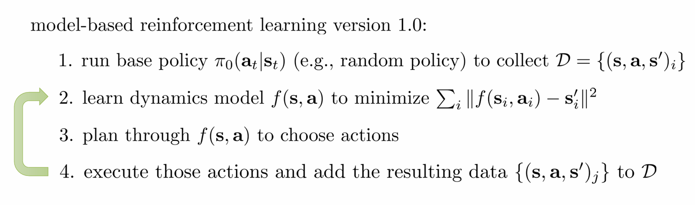

# lecture11

## part1

为什么要学习模型？Why learn a model?

- 假设我们可以学习环境的动态模型：
  - 确定性模型：$f(s_t, a_t) = s_{t+1}$
  - 或者概率模型：$p(s_{t+1} | s_t, a_t)$
- 一旦有了模型，我们就可以**像前几节课学的那样进行规划**（planning），而不必依赖纯粹的 model-free 方法。

### Version 0.5: Naive Model-Based RL（最朴素的模型强化学习方法）

####  Step 1：随机策略收集数据

- 使用 random policy $\pi_0$，得到数据集：
  - 每条数据是一个三元组 $(s, a, s')$

####  Step 2：监督学习训练模型

- 使用 **supervised learning** 训练 $f(s, a) \approx s'$
- 常用损失函数：
  - 连续状态：MSE (Squared Error)
  - 离散状态：Cross Entropy
  - 更一般地：**负对数似然损失**（Negative Log Likelihood Loss）

####  Step 3：使用模型进行 Planning

- 用上节课学的 planning 方法进行控制（例如CEM、MPC）

 **系统辨识（System Identification）** 就是这个思路的特例：

> 给定物理系统结构，通过数据拟合少量参数（如摩擦系数、质量等）

1. 这基本上就是经典机器人学中系统辨识（System Identification）的做法。在经典控制（classical robotics）中，我们经常通过收集状态-动作-结果的数据，来拟合动力学方程（如 $s_{t+1} = f(s_t, a_t)$）。
2. 在设计初始的基础策略（base policy）时需要谨慎。如果初始策略太“蠢”或者太“偏”，收集到的数据将非常有限，导致模型学习不准确。
3. 如果我们能够利用已有的物理知识手动构建动力学模型，并只拟合少量参数时，这种方法尤其有效。这称为 **semi-parametric modeling（半参数建模）**，能大幅降低数据需求，提升性能。

#### Distributional Shift（分布偏移）

示例：山地行走任务（mountain navigation）

- 使用 random policy 在山的一侧探索，并学习模型 f。
- 模型学会“向右爬山 → 越来越高”，这是在已有数据上的合理预测。
- 但是，计划器会利用模型继续往右爬山，**走向从未见过的状态区域**，最终掉下山崖。

 本质问题：

- 训练数据来自 policy $\pi_0$ 的状态分布： $p_{\pi_0}(s)$
- 但使用模型生成的 policy $\pi_f$ 的状态分布： $p_{\pi_f}(s)$ 与之不同
- 模型 **在分布外的区域做出错误预测**
  - 错误的预测 → 错误的 action → 更错误的状态 → 错误积累

> 这个问题在 imitation learning 也出现过，称为 **compounding error / covariate shift**，DAGGER（Dataset Aggregation）就是用来解决这个问题的。
>
> ### DAGGER 的策略：
>
> 1. 一开始使用 expert policy $\pi^*$ 给的数据训练一个 policy $\pi_1$
> 2. 用 $\pi_1$ 在环境中执行，得到新的状态序列
> 3. 让 expert 再次标注这些状态下该采取的动作（即：查询 $\pi^*(s)$）
> 4. 把这些新标注的 $(s, a^*)$ 加入数据集，重复训练
>
> DAGGER 的核心思想是：
>
> > **不断让 learner 在自己“踩坑”的分布上收集 expert 的反馈数据，避免 covariate shift。**

### Model-Based RL version 1.0：更好的策略

**运行基础策略** $\pi_0(a_t|s_t)$，比如随机策略，收集数据集 $D = \{(s, a, s')_i\}$

**学习 dynamics 模型** $f(s, a)$，优化目标是：
$$
\min_f \sum_i \| f(s_i, a_i) - s_i' \|^2
$$
**使用模型做 planning**，即从 $f(s, a)$ 里生成新的动作策略 $\pi_f$

**执行这个规划生成的策略**，即：

- 在真实环境中 roll out 这些 actions，
- 记录新的 $(s, a, s')$ 对，
- **将这些新数据加入数据集 $D$**，用于下一轮训练

### MBRL v1.5 

1. **运行基础策略** $\pi_0(a_t|s_t)$（例如随机策略），收集初始数据集
   $$
   D = \{(s, a, s')_i\}
   $$

2. **训练 dynamics 模型** $f(s, a)$，使得：
   $$
   \sum_i \| f(s_i, a_i) - s'_i \|^2 \quad \text{最小化}
   $$

3. **使用模型做 planning**，基于 $f(s, a)$ 选择最优动作序列（比如 iLQR 或 CEM）

4. **只执行第一个动作**，然后：

   - 观察环境的真实反馈 $s'$
   - 即便后面的动作计划好了也不管了，**下次重新规划**

5. **将观察到的数据 $(s, a, s')$** 添加进数据集 $D$，用于更新模型

并在之后的每 $N$ 步重复这个 loop！

1. 每次规划时可以只用较短的时间窗口（horizon），这减少了模型误差对远期预测的影响。

   例如，不需要预测未来 100 步的结果，而只要预测未 来 10 步即可。

2. 在一些情况下，即使不是通过 gradient-based 优化而是随机采样策略（如 CEM, shooting methods），也可以在短 horizon 上表现良好。

   说明 replanning 的鲁棒性可以降低对 planner 本身的精度要求。

## part2

### Model Bias-Induced Exploitation

模型 $f(s,a)$ 只在训练过的数据附近准确。

规划器（MPC）会在 reward landscape 中寻找最陡的上升方向（黑线最高点）。

这个最优轨迹（如图中箭头指向处）可能在真实环境中是灾难性的，因为：

- 模型在这个区域从未见过数据 → 完全瞎猜 → reward 估计不可靠
- reward 的估计值可能过于乐观（overestimated）
- **结果：规划器被模型骗了**，选择了一个看似好的轨迹，执行时效果却很差

举例：想象你有一个地图模型是基于有限的 GPS 数据构建的，你让它告诉你“最快路径”，它指了一条从没走过的小路，模型说“那里一定非常快”——但现实是你卡在泥地里动不了。

- 不确定性估计考虑的是“我们对 dynamics 的不确定性”而非“动态系统内在的随机性”。
- 我们假设存在多个符合当前观测数据的动态模型 ，这些构成了一个可能世界分布：

- 在这样的不确定性下，对于给定策略 ，我们考虑其期望累积回报：

在 Model-Based RL 的第三步（即在模型中规划）中，我们只考虑那些在当前不确定性下期望回报高的动作序列。

- 效果：
  - 在早期模型不确定性高时避免 planner 去探索“高估但危险”的策略。
  - 随着数据积累，模型变得更 confident，探索将自然靠近 reward 高的区域。
  - 类比走悬崖：开始走远点收集数据 → 模型变好后再靠近悬崖。

**注意事项：期望值 ≠ 悲观值 ≠ 乐观值**

- 当前方法只基于期望值（Expected Value），
  - 非悲观规划（如下界 Lower Confidence Bound）：
  - 也非乐观规划（如上界 Upper Confidence Bound）：
  - 我们当前使用的是：
- 悲观或鲁棒方法可用于安全关键任务。
- 乐观规划适合鼓励探索（将后续课程深入讨论）。

## part3

###  简单但错误的尝试：预测输出分布的熵

- 想法：通过神经网络输出分布（如 softmax 或高斯分布）并使用其熵来衡量不确定性。
  - 离散动作：softmax over next states
  - 连续动作：输出高斯分布（均值 + 协方差）
- **问题：**
  - 网络在训练点拟合很好 → 最优输出方差 = 0（极度自信）
  - 但测试点上仍然预测错误、且过于自信（overconfident）

>  结论：输出熵只能反映 aleatoric 不确定性，输出分布熵无法反映“模型对自身知识的无知” → 不是我们需要的那种 uncertainty

| 类型         | 英文术语  | 含义               | 举例       | 特性               |
| ------------ | --------- | ------------------ | ---------- | ------------------ |
| 内在不确定性 | Aleatoric | 世界本身随机       | 掷骰子     | 再多数据也无法降低 |
| 模型不确定性 | Epistemic | 模型不知道真实函数 | 悬崖边行走 | 数据越多越确定     |

### 参数后验

我们通常训练神经网络的方式是最大化似然：
$$
\hat{\theta} = \arg\max_{\theta} \log p(\mathcal{D}|\theta)
$$
即：我们在整个参数空间中找一个最优参数点（MAP 或 MLE）。

但这会导致我们只拿到一个“点估计”参数——不能表达我们对模型的**不确定性**。

我们真正想要的是后验分布：
$$
p(\theta|\mathcal{D})
$$
这个分布**代表了我们对模型本身的不确定性**。

 并且，它的熵（entropy）就能反映出模型不确定性大小！

我们不能只用一个 $\theta$ 来预测，而是应该使用参数后验的加权平均：
$$
\int p(s_{t+1} \mid s_t, a_t, \theta) \cdot p(\theta \mid \mathcal{D}) \, d\theta
$$
这个积分就表示：考虑不同可能的模型下对 $s_{t+1}$ 的加权预测。

这个积分对神经网络来说是不可解的（高维），因此需要**近似推断技术**。

#### 贝叶斯神经网络（Bayesian Neural Network, BNN）

- 为每个权重 $w_i$ 设定概率分布（如 Gaussian）
- 网络预测时：
  - 从权重分布中采样得到一个网络
  - 用它计算输出
  - 重复采样得到后验预测分布

简化近似：独立边缘高斯
$$
P(\theta \mid \mathcal{D}) \approx \prod_{i=1}^d \mathcal{N}(\mu_i, \sigma_i^2)
$$
每个权重都有：

- 均值 $\mu_i$
- 方差 $\sigma_i^2$

>  推荐阅读：Blundell et al. (2015), "Weight Uncertainty in Neural Networks"；Gal et al., "Concrete Dropout"\n
>   但 BNN 训练复杂、效率低，后续介绍更实用方法。

#### Bootstrap Ensembles

核心思想：

- 训练多个神经网络，每个用不同“数据视角”学习 → 得到多个函数
- 对同一输入，多个模型的预测差异反映模型不确定性

Bootstrap 核心操作：

1. 将原始数据集 $\mathcal{D}$ **重复采样（with replacement）** 形成多个子数据集 $\mathcal{D}_i$；
2. 对每个数据集 $\mathcal{D}_i$ 分别训练一个模型 $\theta_i$；
3. 得到多个“独立”的模型（实际上有些重合）；
4. 用这些模型来对 $p(s_{t+1}|s_t, a_t)$ 进行平均，从而反映模型的不确定性。

>  这其实是 **近似贝叶斯后验** 的方法：用离散的 $\delta(\theta_i)$ 分布去近似连续分布 $p(\theta|\mathcal{D})$。

数学形式：

将参数后验近似为 Dirac Delta 混合分布：
$$
P(\theta \mid \mathcal{D}) \approx \frac{1}{N} \sum_{i=1}^{N} \delta( \theta_i)
$$
预测下一个状态：
$$
P(s_{t+1} \mid s_t, a_t) \approx \frac{1}{N} \sum_{i=1}^{N} P(s_{t+1} \mid s_t, a_t, \theta_i)
$$

>  注意：混合的是 **概率密度**，不是均值！因此不能简单对多个模型的预测取平均。

##### 实践中的简化方法（对深度学习更友好）

> 💡 实验发现：即使所有模型都用同一数据训练，只要有不同随机初始化 + SGD 的随机性，模型预测就足够不同！

因此：

- **无需再执行 resampling with replacement**
- 可直接并行训练多个模型（不同初始化）
- 在 RL 中效果依然良好

## part4

当我们只有一个确定性的模型 $f(s_t, a_t)$ 时，策略评估是简单的：
$$
J(\mathbf{a}_1, \dots, \mathbf{a}_H) = \sum_{t=1}^H r(s_t, a_t), \quad \text{where } s_{t+1} = f(s_t, a_t)
$$
这是 deterministic 模型预测路径上 reward 的总和。

当我们对动力学模型本身也有不确定性时（比如用 bootstrap ensemble 得到多个模型 $f_i$），我们不能只依赖一个模型预测结果，而应该对模型分布 $p(\theta|\mathcal{D})$ 进行采样。

于是我们将 return 变成：
$$
J(\mathbf{a}_1, \dots, \mathbf{a}_H) = \frac{1}{N} \sum_{i=1}^N \sum_{t=1}^H r(s_{t,i}, a_t), \quad \text{where } s_{t+1,i} = f_i(s_{t,i}, a_t)
$$
这意味着我们：

- 使用 $N$ 个不同的模型；
- 每个模型产生一条 rollout；
- 然后对 reward 进行平均。

 这等价于对**模型分布的采样进行 Monte Carlo 近似**。

我们可以从更贝叶斯的角度来描述这个评估过程：

1. **Step 1:** 采样一个模型参数 $\theta \sim p(\theta|\mathcal{D})$

2. **Step 2:** 从初始状态开始，在每个时间步 $t$，使用该模型预测下一状态：
   $$
   s_{t+1} \sim p(s_{t+1} | s_t, a_t, \theta)
   $$
   （可以是 deterministic 的，也可以带 noise）

3. **Step 3:** 累加 reward：
   $$
   R = \sum_t r(s_t, a_t)
   $$

4. **Step 4:** 多次重复上述过程，平均这些回报，得到该 action sequence 的 **expected return**。

这个方法考虑了：

- **模型的不确定性（epistemic uncertainty）**
- **环境动力学的多样性**

来自论文《Deep RL in a Handful of Trials》的实验表明：

- HalfCheetah任务上：
  - 基本 v1.5 算法约可达 reward ≈ 500
  - 加入 epistemic uncertainty 后，reward 可超 6000！

>  在数据稀缺环境中，epistemic uncertainty 的提升尤为显著！

## part5

问题背景：图像作为输入的挑战

我们从强化学习（RL）中的图像输入出发，如：

- Atari 游戏画面；
- 机器人摄像头拍摄的图像；
- 视频流中帧图像。

图像存在三个主要挑战：

1. **维度高**（high-dimensional）：图像像素多，难以预测；
2. **信息冗余**（redundant）：相邻像素变化小；
3. **部分可观测性**（partial observability）：单帧图像信息不足，比如不知道物体速度或方向。

图像（observation）空间 $o_t$：高维但不一定符合马尔科夫性质，抽象状态空间 $s_t$：低维但需要动态建模，是否可以将问题拆解为两部分？

如下所示：
$$
\text{separately learn } \underbrace{p(o_t | s_t)}_{\text{感知模型}} \quad \text{and} \quad \underbrace{p(s_{t+1} | s_t, a_t)}_{\text{动态模型}}
$$
这是一种经典的 **latent state model（潜在状态建模）** 或 **representation learning** 思路。

> **观测模型**（Observation Model）描述的是：
>
> > 给定当前的“真实状态” $s_t$，我们如何“生成”一个观测 $o_t$。
>
> 所以它是：
> $$
> p(o_t \mid s_t)
> $$
> 这是一个**从潜在变量到观测数据的生成过程**，它是生成模型的组成部分。
>
> **推断模型（inference model）或encoder**，表示：
>
> > 给定你看到的观测 $o_t$，你如何“猜测”其背后的隐状态 $s_t$。
>
> 这个是：
> $$
> q_\psi(s_t \mid o_t)
> $$
> 注意这是近似后验，不是生成模型的一部分，它用于反向“解码”观测。
>
> 举个例子：
>
> 想象你要建模一个机器人手臂的状态：
>
> - 真正的状态 $s_t$：可能是 3D 空间中末端执行器的位置、速度
> - 观测 $o_t$：是摄像头拍摄的一张图像
>
> 那么：
>
> - 你知道 $s_t$ 时，用图像渲染器生成图像 $o_t$：这就是 $p(o_t \mid s_t)$
> - 当你看到图像 $o_t$ 时，你只能“估计”它来自哪个状态 $s_t$：这就是 $q(s_t \mid o_t)$

### POMDP（Latent State Models）

处理图像时，RL 问题通常被建模为 POMDP：

- 状态不可见，只观测到图像 $o_t$；
- 希望学习两个模型：
  - 观测模型 $P(o_t | s_t)$
  - 状态转移模型 $P(s_{t+1} | s_t, a_t)$
  - 以及奖励模型 $P(r_t | s_t, a_t)$

这种方式被称为 latent state-space model 或者 embedding-based model。

若能观测状态，我们最大化的是：
$$
\max _\phi \frac{1}{N} \sum_{i=1}^N \sum_{t=1}^T \log p_\phi\left(\mathbf{s}_{t+1, i} \mid \mathbf{s}_{t, i}, \mathbf{a}_{t, i}\right)
$$
但在图像输入下，我们不知道 $s_t$，于是必须改为最大化期望 log-likelihood：
$$
\max _\phi \frac{1}{N} \sum_{i=1}^N \sum_{t=1}^T E\left[\log p_\phi\left(\mathbf{s}_{t+1, i} \mid \mathbf{s}_{t, i}, \mathbf{a}_{t, i}\right)+\log p_\phi\left(\mathbf{o}_{t, i} \mid \mathbf{s}_{t, i}\right)\right]
$$
这里的期望是针对真实轨迹 $(\mathbf{s}_t, \mathbf{s}_{t+1}) \sim p(\mathbf{s}_t, \mathbf{s}_{t+1} | \mathbf{o}_{1:T}, \mathbf{a}_{1:T})$

我们无法直接从 $o_{1:T}$ 精确得到 $s_{1:T}$，所以要学一个近似后验（approximate posterior）：
$$
q_\psi(s_t | o_{1:t}, a_{1:t}) \quad \text{（被称为 encoder）}
$$

#### **Full Smoothing Posterior（全轨迹后验）**

$$
q_\psi(s_t, s_{t+1} | o_{1:T}, a_{1:T})
$$

-  优点：**最准确**
-  缺点：**最复杂**，需考虑整条轨迹，对计算和建模要求高

### **Single-step Encoder（单步编码器）**

$$
q_\psi(s_t | o_t)
$$

-  优点：**最简单**，不依赖过去或未来
-  缺点：**最不准确**，忽略了时序结构，只依赖当前观测

#### 目标函数

$$
\max_{\phi} \frac{1}{N} \sum_{i=1}^{N} \sum_{t=1}^{T} \mathbb{E} \left[\log p_\phi(s_{t+1,i} | s_{t,i}, a_{t,i}) + \log p_\phi(o_{t,i} | s_{t,i}) \right]
$$

- 这个目标是最大化观测轨迹的 log-likelihood。
- 注意这里的状态是隐状态 $s_t$，不是直接观测到的图像 $o_t$。

但我们无法观测 $s_t$，所以需要引入 encoder $q_\psi(s_t|o_t)$ 来进行估计。

近似后验采样方式（从观测中编码状态）：
$$
s_t \sim q_\psi(s_t|o_t)
\quad \text{and} \quad 
s_{t+1} \sim q_\psi(s_{t+1}|o_{t+1})
$$

##### 特殊情况：使用**确定性编码器**

$$
q_\psi(s_t|o_t) = \delta(s_t = g_\psi(o_t)) \Rightarrow s_t = g_\psi(o_t)
$$

这表示 encoder 是一个确定性的神经网络（不再是随机变量的分布），输出就是隐状态：

- $g_\psi$：一个神经网络，将图像 $o_t$ 编码为隐状态 $s_t$
- $\delta$：狄拉克函数，表示概率分布在某个值上是完全确定的

将上述 $q_\psi$ 代入原始目标后，简化为以下确定性函数：
$$
\max_{\phi,\psi} \frac{1}{N} \sum_{i=1}^{N} \sum_{t=1}^{T} \log p_\phi(g_\psi(o_{t+1,i}) \mid g_\psi(o_{t,i}), a_{t,i}) + \log p_\phi(o_{t,i} \mid g_\psi(o_{t,i}))
$$
即，我们直接从观测 $o_t$ 映射到 latent space 中的 $s_t$，再训练：

- **动态模型** $p(s_{t+1} \mid s_t, a_t)$
- **观测模型** $p(o_t \mid s_t)$

加上奖励模型后即可得
$$
\max _{\phi, \psi} \frac{1}{N} \sum_{i=1}^N \sum_{t=1}^T \log p_\phi\left(g_\psi\left(\mathbf{o}_{t+1, i}\right) \mid g_\psi\left(\mathbf{o}_{t, i}\right), \mathbf{a}_{t, i}\right)+\log p_\phi\left(\mathbf{o}_{t, i} \mid g_\psi\left(\mathbf{o}_{t, i}\right)\right)+\log p_\phi\left(r_{t, i} \mid g_\psi\left(\mathbf{o}_{t, i}\right)\right)
$$

完整训练步骤如下：

1. 收集交互数据 $(o_t, a_t, o_{t+1})$
2. 训练 encoder、动态模型、观测模型、奖励模型
3. 利用 learned model 进行 MPC（Model Predictive Control）：
   - 规划动作序列
   - 执行第一个动作
   - 获取新观察，加入数据集
4. 定期重新训练
