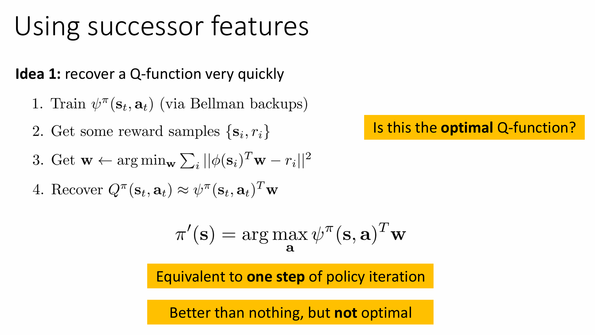

# lecture12

## part1

大多数 planning 方法都是 open-loop：预先决定整条动作序列，不考虑中途反馈。

举例：数学测验问题

- 第一步：你决定是否参加考试；
- 第二步：你看到题目，并决定回答。

奖励结构：

- 答对题得 $2000，答错罚 $1000；
- 放弃考试无收益。

> Open-loop 策略会因为无法预见 replanning 而选择放弃（风险太大）；
>  Closed-loop 策略能等看到题目后再行动，会选择参加考试。

### 奖励对策略的梯度反向传播

**如果我们有一个可微的环境模型 $f(s, a)$**，那我们就可以：

> 使用链式法则，从 reward 开始，通过 dynamics model $f$，一路反向传播，直到 policy network $\pi_\theta$。

这意味着我们可以：

- 用 **梯度下降优化策略网络** $\pi_\theta$
- 而不需要像传统 RL 那样依赖估计值函数或 policy gradient

#### 实现步骤

1. 收集数据

用初始策略 $\pi_0(a_t | s_t)$（比如随机策略）收集数据：
$$
\mathcal{D} = \{(s, a, s')\}_i
$$

2. 学习 dynamics 模型

学习状态转移函数 $f(s, a)$，最小化：
$$
\sum_i \| f(s_i, a_i) - s'_i \|^2
$$

3. 反向传播优化策略

由于 $f(s, a)$、$\pi_\theta(s)$、$r(s, a)$ 都是可微分的，所以可以直接：

- **将 reward 对策略网络 $\pi_\theta$ 的梯度反向传播**
- 如图中红色箭头所示，从 $r(s_t, a_t) \to a_t \to s_{t+1} \to a_{t+1} \to r(s_{t+1}, a_{t+1})$ 一路 backprop

4. 执行优化后的策略

再用更新后的策略 $\pi_\theta$ 生成数据，继续训练。

#### 适用条件

-  环境 dynamics 是已知的或通过模型学习的 $f(s, a)$
-  $f, \pi_\theta, r$ 都是 **可微函数**
-  策略最好是 **确定性的（deterministic）**，否则还要做 reparameterization（重参数化技巧）

#### 问题

梯度传播在长时间步上表现不佳：

- 早期动作影响未来状态剧烈 → 梯度爆炸；
- 后期动作影响较小 → 梯度消失；

类似 shooting method 的结构优化问题：Hessian 条件数差，问题 ill-conditioned；

无法用 LQR 这样的结构优势做反向优化（因为 policy 参数贯穿所有时间步）。

在 RNN 中，我们可以设计网络结构（如 LSTM）来控制梯度传播；

dynamics $f_\phi$ 必须贴近真实物理模型，不能任意设计；

所以不能强制其满足梯度传播的友好结构（例如 Jacobian 的谱半径 ≈ 1）；

#### 解决方向

既然 dynamics 是已知的（通过模型学得），我们可以：

 把它当作“模拟器”！

在模型中 rollout，生成 synthetic transitions，然后使用 model-free 方法训练策略。

这个策略也称为：

> 模型增强的 Model-Free 方法（model-based acceleration of model-free RL）

具体做法：

- 使用模型采样更多的 “伪经验”，比如：
  $$
  (s_t, a_t, r_t, s_{t+1}) \sim f_\phi
  $$

- 把它们加入 replay buffer；

- 用 model-free 方法（如 policy gradient, Q-learning, actor-critic）进行训练。

>  尽管这似乎违背直觉（“为何不直接用模型微分？”），但实践中非常有效。

## part2

### 梯度计算方法

### Policy Gradient（策略梯度）方法：

$$
\nabla_\theta J(\theta) \approx \frac{1}{N} \sum_{i=1}^{N} \sum_{t=1}^{T} \nabla_\theta \log \pi_\theta(a_{i,t} | s_{i,t}) \hat{Q}^{\pi}_{i,t}
$$

**说明：**

- 使用 REINFORCE 风格估计器；
- 依赖于对 action 的 log-probability 求导；
- 不要求环境模型可微；
- **优点**：无需对环境模型进行反向传播（即不需要计算链式 Jacobian）。
- **稳定性高**，尤其是在 sample 数量足够大时。

### Pathwise Derivative（反向传播梯度 / 模型可微路径导数）：

$$
\nabla_\theta J(\theta) = \sum_{t=1}^{T} \frac{d a_t}{d \theta} \frac{d s_{t+1}}{d a_t} \left( \sum_{t'=t+1}^{T} \frac{d r_{t'}}{d s_{t'}} \left( \prod_{t''=t+2}^{t'} \frac{d s_{t''}}{d a_{t''-1}} \frac{d a_{t''-1}}{d s_{t''-1}} + \frac{d s_{t''}}{d s_{t''-1}} \right) \right)
$$

**说明：**

- 通过链式法则将 reward 对 policy 参数的导数全部展开；
- 依赖于模型 $f(s,a)$ 的可导性；
- 每个时间步都要计算多个 Jacobian（导数矩阵）乘积；
- **问题**：长时间步时容易出现梯度爆炸/消失，也被称为“chaos curse”（混沌诅咒）；
- **参考论文**：Parmas et al. 2018 — 讨论为何直接反向传播不稳定。

### Model-Based RL v2.5：

- 步骤：
  1. 使用当前策略收集数据；
  2. 学习 dynamics 模型；
  3. 用模型采样大量轨迹；
  4. 使用策略梯度更新策略（如 REINFORCE, actor-critic）；
  5. 重复多次，再采样真实数据、更新模型；

仍有严重的问题：模型 rollout 越长，误差越大！

这与我们在行为克隆（behavioral cloning）中遇到的问题一致：

- 模型预测小误差 → 进入错误状态；
- 在错误状态上误差更大 → 分布漂移；
- 错误会指数级积累。

理论误差下界：
$$
\text{Expected Error} = \mathcal{O}(\epsilon t^2)
$$
即使模型误差是 ε，t 步之后误差仍然平方增长。

#### 解决思路：短步模型 rollouts

解决思路：

- 不使用长 horizon 模型 rollout；
- 而是从真实轨迹中的任意状态开始 rollout 一小段（例如 1~10 步）；
- 模型误差小，更可靠；
- 用真实数据收集状态分布，用模型继续短步模拟 → 类似 Dyna-style。

#### 这带来什么问题？

你从旧策略收集的状态开始，用新策略 rollout：

- 状态分布 ≠ 当前策略下分布（不是 on-policy）；
- 解决办法：使用 off-policy 强化学习方法（如 Q-learning, SAC, DDPG）；
- 如果坚持使用策略梯度方法，需保证策略更新不要太大。

### Model-Based RL v3.0：短步采样 + 离策略学习

这类方法是目前工业界最常用的 MBRL 实践范式：

算法流程：

1. 使用当前策略收集真实轨迹（如 1000 步）；
2. 从这些轨迹中随机采样中间状态 $s$；
3. 用模型从 $s$ rollout K 步 → 生成 synthetic transitions；
4. 将 synthetic transitions 加入 buffer；
5. 使用 off-policy 方法更新策略（如 Q-learning、actor-critic）；
6. 重复采样与训练，直到收集更多真实数据。

>  Model-Based RL v3.0 最大的特点是：大量使用模型数据 + off-policy 更新策略。

## part3

### Dyna

Dyna 的设计思想：（4，5步骤重复K次）

1. 当前状态下选择动作 $a$（$\epsilon$-greedy exploration）；
2. 执行动作，得到下一状态 $s'$、奖励 $r$；
3. 用这个 transition 来：
   - 更新 Q 函数（standard Q-learning）；
   - 更新模型 $f$、奖励函数 $r$（经典方法使用一步更新）；
4. 使用旧 buffer 中的状态动作，进行模拟 rollout（仅 1 步）；
5. 用模拟 transition 再做 Q-learning update。

>  特点：使用真实数据训练模型，用模型模拟生成数据强化 Q 更新。

### Dyna general

**收集一些真实交互数据 $(s, a, s', r)$**
 初始阶段使用真实环境执行动作，采集状态转移和奖励，放入 replay buffer $\mathcal{B}$。

**学习动力学模型 $\hat{p}(s'|s,a)$**
 用收集的数据训练一个模型，预测给定当前状态和动作下的下一个状态（可选：也学习奖励模型 $\hat{r}(s,a)$）。

**重复 $K$ 次下面的过程：**

1. **从 replay buffer 中采样状态 $s$**
    可以理解为“从以前看过的地方继续探索”。
2. **根据策略或随机方式选择动作 $a$**
    可以使用当前策略 $\pi$、buffer 中已有动作、或者随机策略。
3. **使用模型预测下一个状态 $s' \sim \hat{p}(s'|s,a)$**
    利用模型来“虚拟”一个未来状态，也可以同时预测奖励。
4. **用这些模拟数据 $(s, a, s', r)$ 做 model-free RL 训练**
    就像训练真实数据那样更新策略（比如用 SAC/DDPG/TD3 等算法）。
5. **（可选）执行多步 rollout**
    即：从模型生成一连串的状态-动作-状态序列，提高效率（不过误差会累积）。

为什么这是一个好主意？（绿色）

- **数据效率高**：只需用有限真实数据，就能用模型生成很多额外经验，加速学习。
- **训练更快、更稳定**：尤其是用在 Q-function 上时，能更快估计目标值。
- **状态分布更广泛**：从多个真实状态扩展 rollout，有助于探索。

------

 为什么这是一个坏主意？（红色）

- **模型误差累积（compounding error）**：rollout 越长，预测误差可能越大，影响训练。
- **分布偏移（distribution mismatch）**：模型 rollouts 来自策略分布，而不是真实环境分布，可能导致 Q 函数过拟合虚假数据。
- **策略陷入模型偏见**：训练出的策略可能过度依赖错误模型的“幻觉”。

## part4

### successor representation

我们从策略期望回报 $J(\pi)$ 开始：
$$
J(\pi) = \mathbb{E}_{s_1 \sim p(s_1)} \left[ V^\pi(s_1) \right]
$$
其中 $V^\pi(s_t)$ 是从某个状态开始，在策略 π 下的期望累积奖励。
$$
V^\pi(s_t) = \sum_{t'=t}^{\infty} \gamma^{t'-t} \mathbb{E}_{p(s_{t'}|s_t)} \mathbb{E}_{a_{t'} \sim \pi(a_{t'}|s_{t'})} [ r(s_{t'}, a_{t'}) ]
$$
这是完整的、考虑策略对行为的影响的值函数。

> Let's keep it simple.
>  我们暂时忽略动作对 reward 的影响，假设 reward 只依赖于状态，即：

$$
r(s_{t'}) \text{ 而不是 } r(s_{t'}, a_{t'})
$$

于是化简为：
$$
V^\pi(s_t) = \sum_{t'=t}^{\infty} \gamma^{t'-t} \mathbb{E}_{p(s_{t'}|s_t)} [ r(s_{t'}) ]
$$
接着再进一步写成：
$$
= \sum_{t'=t}^{\infty} \gamma^{t'-t} \sum_{s} p(s_{t'} = s | s_t) \cdot r(s)
$$
最终换个求和顺序：
$$
= \sum_{s} \left( \sum_{t'=t}^{\infty} \gamma^{t'-t} p(s_{t'} = s | s_t) \right) r(s)
$$
这就是：

> **状态s在未来出现的折扣频率 × 该状态的奖励**

定义未来状态的“折扣分布”
$$
p_\pi(s_{\text{future}} = s \mid s_t) = \sum_{t'=t}^\infty \gamma^{t'-t} p(s_{t'} = s \mid s_t)
$$
这就是从当前状态 $s_t$ 出发，未来任意时刻落在某个状态 $s$ 上的“折扣加权概率”。

为了让这个分布**归一化（和为1）**，引入一个缩放因子：
$$
p_\pi(s_{\text{future}} = s \mid s_t) = (1 - \gamma) \sum_{t'=t}^\infty \gamma^{t'-t} p(s_{t'} = s \mid s_t)
$$

>  **这一步是数学技巧，让折扣后的分布变成一个标准的概率分布。**

**把 Value 函数写成这种形式**
$$
V^\pi(s_t) = \sum_s p_\pi(s_{\text{future}} = s \mid s_t) \cdot r(s)
$$
也就是：
$$
V^\pi(s_t) = \mu^\pi(s_t)^T \cdot \vec{r}
$$
其中：

- $\mu^\pi(s_t)$ 是一个向量，称为 **Successor Representation**，第 $i$ 个元素表示：在当前状态 $s_t$ 下，最终访问状态 $s_i$ 的频率加权。
- $\vec{r}$ 是一个状态奖励向量，表示每个状态的奖励。

递推公式（Bellman-like 形式）
$$
\mu_i^\pi(s_t) = (1 - \gamma)\delta(s_t = i) + \gamma \mathbb{E}_{a_t \sim \pi(a_t|s_t), s_{t+1} \sim p(s_{t+1}|s_t, a_t)} \left[ \mu_i^\pi(s_{t+1}) \right]
$$
 解释：

- 第一项：如果 $s_t = i$，就加上一个权重 $1 - \gamma$；
- 第二项：后续状态 $s_{t+1}$ 的 SR 也会贡献一部分折扣（乘上 $\gamma$）；
- 这就是一个类似 Bellman backup 的结构，只不过奖励变成了 $(1 - \gamma)\delta(s_t = i)$。

SR 方法的**挑战**

1. **SR是否比直接学 value 更容易？**
   - 不确定。SR本身也很高维，并不一定训练更快。
   - 它在 reward 变化频繁时有优势（reward transfer）。
2. **如何扩展到大状态空间？**
   - 状态太多时 $\mu(s)$ 向量过大；
   - 可以考虑用 function approximation（e.g., NN）来代替 tabular。
3. **如何扩展到连续状态空间？**
   - 必须近似建模 SR，例如使用 latent embedding 学习；
   - 可结合模型、注意力机制或 kernel 方法进行逼近。

### successor feature

 Value function：
$$
V^\pi(s_t) = \mu^\pi(s_t)^T \vec{r}
$$
也就是说，SR 和 reward 向量内积可以直接得到 value function。

现实中状态数量巨大，我们难以直接学到完整的 $\mu^\pi(s)$。但如果 reward 可以写成：
$$
r(s) = \phi(s)^T \mathbf{w} = \sum_j \phi_j(s) w_j
$$
（即 reward 是状态特征的线性组合），那么：

定义 **继承特征** 为：
$$
\psi_j^\pi(s_t) = \sum_s \mu_s^\pi(s_t) \phi_j(s) = \mu^\pi(s_t)^T \vec{\phi}_j
$$
也就是在 SR 的基础上，对应 reward 中第 $j$ 个特征的折扣累计。

那么 value function 可以变成：
$$
V^\pi(s_t) = \sum_j \psi_j^\pi(s_t) w_j = \psi^\pi(s_t)^T \mathbf{w}
$$
也就是说，**SR × reward → value** 变成了 **SF × weight → value**

Successor Features 的 Bellman 形式
$$
\psi_j^\pi(s_t) = \phi_j(s_t) + \gamma \mathbb{E}_{a_t \sim \pi, s_{t+1} \sim p}[\psi_j^\pi(s_{t+1})]
$$
这相当于是对单个特征 $j$ 的 SF 的 Bellman 形式，完全对应上面一行，只是 reward 是特征值 $\phi_j(s_t)$。

再将 reward 写作 $\phi(s)^T \mathbf{w}$，就得到：
$$
Q^\pi(s_t, a_t) \approx \psi^\pi(s_t, a_t)^T \mathbf{w}
$$

> **Feature 数量之所以远小于状态数量，是因为它是一种可泛化的、压缩的表示法，是对原始状态的“低维抽象”。**

这正是 **Successor Features（SF）方法有效的前提**：将价值函数分解为“结构稳定的 SF × 可变的 reward weights”。

#### one-step policy improvement

**Step 1: 学习 successor feature**

- 用 Bellman backup 的方式学习 $\psi^\pi(s, a)$，即：
  $$
  \psi^\pi(s, a) = \phi(s) + \gamma \mathbb{E}_{s' \sim p(s'|s,a), a' \sim \pi(a'|s')}[\psi^\pi(s', a')]
  $$

- $\phi(s)$：是状态的 reward feature 表示（如 reward 的线性 basis）。

------

**Step 2: 收集一些 reward 样本 $\{(s_i, r_i)\}$**

- 不需要很多。
- 仅需对新的任务或 reward 函数 $r(s)$ 收集少量 reward 样本。

------

**Step 3: 估计 reward weights $\mathbf{w}$**

- 假设 reward 是线性组合：
  $$
  r(s) \approx \phi(s)^T \mathbf{w}
  $$

- 用最小二乘法：
  $$
  \mathbf{w} \leftarrow \arg\min_{\mathbf{w}} \sum_i \| \phi(s_i)^T \mathbf{w} - r_i \|^2
  $$

------

**Step 4: 恢复 $Q^\pi(s, a)$ 值函数**

- 使用：
  $$
  Q^\pi(s, a) \approx \psi^\pi(s, a)^T \mathbf{w}
  $$

- 即在策略 $\pi$ 下的后继特征，与 reward weight 做内积就能得出 Q 值。

------

**Step 5: 执行策略改进（policy improvement）**

- 通过：
  $$
  \pi'(s) = \arg\max_a \psi^\pi(s,a)^T \mathbf{w}
  $$
  得到一个更优策略（greedy w.r.t. Q function）。

##### 问题

因为 $\psi^\pi$ 是基于旧策略 $\pi$ 学的，所以你得到的 $Q^\pi$ 是关于 $\pi$ 的。

虽然你可以改进出一个新策略 $\pi'$，但这个新策略没有被再训练，因此它的 Q 值不是最优的。

#### 多策略组合优化（multi-policy）

主要目标：恢复多个 $Q^{\pi^k}(s,a)$ 并选出最好策略

1.**训练多个策略的后继特征 $\psi^{\pi^k}(s,a)$**

- 对多个不同策略 $\pi^k$（例如贪婪策略、随机策略、旧任务下学到的策略），分别训练其对应的后继特征：
  $$
  \psi^{\pi^k}(s,a)
  $$

- 使用 Bellman backup 学得。

------

**2. 收集一些 reward 样本 $(s_i, r_i)$**

- 和 Idea 1 一样，少量样本足矣。
- 只需要用于拟合 reward 的参数 $\mathbf{w}$。

------

**3. 拟合 reward 参数 $\mathbf{w}$**

- 假设 reward 函数满足：
  $$
  r(s) \approx \phi(s)^T \mathbf{w}
  $$

- 然后最小化误差，估计出 reward 权重 $\mathbf{w}$。

------

**4. 对每个策略 $\pi^k$，恢复其 $Q^{\pi^k}(s,a)$**

- 使用：
  $$
  Q^{\pi^k}(s,a) \approx \psi^{\pi^k}(s,a)^T \mathbf{w}
  $$

- 每个策略都得到自己的 Q 函数。

------

**5. 最终策略改进：**
$$
\pi'(s) = \arg\max_a \max_k \psi^{\pi^k}(s,a)^T \mathbf{w}
$$

- 这步含义是：在每个 state 下，从多个策略中**选择当前 reward 函数下最优的动作**。
- 即使 $\pi^k$ 不是专门为当前 reward 优化的，但有些策略在某些状态下是最优的 → 保留利用。

#### continuous successor

我们回顾一下传统的 successor representation：
$$
\mu_i^{\pi}(s_t) = (1 - \gamma) \delta(s_t = i) + \gamma \mathbb{E}_{a_t \sim \pi(a_t|s_t), s_{t+1} \sim p(s_{t+1}|s_t, a_t)} \left[ \mu_i^{\pi}(s_{t+1}) \right]
$$
但在**连续状态空间**中，$\delta(s_t = i)$ 几乎总是为零，因为状态 $s_t$ 是实数向量，几乎不可能“刚好等于”某个特定值 $i$。

因此，$(1 - \gamma)\delta(s_t = i)$ 恒为 0

想法：学一个分类器，判断某个 future state 是不是从当前 $(s_t, a_t)$ 走出来的

定义：
$$
p^\pi(F = 1 | s_t, a_t, s_{\text{future}}) = \frac{p^\pi(s_{\text{future}} | s_t, a_t)}{p^\pi(s_{\text{future}} | s_t, a_t) + p^\pi(s_{\text{future}})}
$$

- Numerator: 未来状态 $s_{\text{future}}$ 来自 policy rollout。
- Denominator: 对 $s_{\text{future}}$ 来自真实先验和从 $s_t, a_t$ 出发的概率进行归一化。

这正是 **logistic regression** 中的 **posterior probability** 形式：
$$
P(\text{positive class}) = \frac{p_{\text{pos}}(x)}{p_{\text{pos}}(x) + p_{\text{neg}}(x)}
$$
想法：学一个分类器，判断某个 future state 是不是从当前 $(s_t, a_t)$ 走出来的

定义：
$$
p^\pi(F = 1 | s_t, a_t, s_{\text{future}}) = \frac{p^\pi(s_{\text{future}} | s_t, a_t)}{p^\pi(s_{\text{future}} | s_t, a_t) + p^\pi(s_{\text{future}})}
$$

- Numerator: 未来状态 $s_{\text{future}}$ 来自 policy rollout。
- Denominator: 对 $s_{\text{future}}$ 来自真实先验和从 $s_t, a_t$ 出发的概率进行归一化。

这正是 **logistic regression** 中的 **posterior probability** 形式：
$$
P(\text{positive class}) = \frac{p_{\text{pos}}(x)}{p_{\text{pos}}(x) + p_{\text{neg}}(x)}
$$

| 类别            | 说明                                                         |
| --------------- | ------------------------------------------------------------ |
| $\mathcal{D}_+$ | 从 $s_t, a_t$ 出发，通过 policy rollout 得到的 future states |
| $\mathcal{D}_-$ | 从经验池中随机采样的状态 $s$，作为“负例”                     |

然后可以推导

后验概率：
$$
p^\pi(F=1 \mid s_t, a_t, s_{\text{future}}) = \frac{p^\pi(s_{\text{future}} \mid s_t, a_t)}{p^\pi(s_{\text{future}} \mid s_t, a_t) + p^\pi(s_{\text{future}})}
$$
后验比值（Posterior odds）：
$$
\frac{p^\pi(F=1 \mid s_t, a_t, s_{\text{future}})}{p^\pi(F=0 \mid s_t, a_t, s_{\text{future}})} = \frac{p^\pi(s_{\text{future}} \mid s_t, a_t)}{p^\pi(s_{\text{future}})}
$$
这表示：分类器的输出 odds 比值 = **policy rollout 的 future 状态概率与状态先验的比值**。

换元后解出：
$$
\frac{p^\pi(F=1)}{p^\pi(F=0)} \cdot p^\pi(s_{\text{future}}) = p^\pi(s_{\text{future}} \mid s_t, a_t)
$$

- 右下角公式中这一步指出了关键点：

  > $p^\pi(s_{\text{future}})$ 是一个**与 $s_t, a_t$ 无关的常数项**

这意味着：

- 你可以用一个二分类器估计 $\frac{p^\pi(s_{\text{future}} \mid s_t, a_t)}{p^\pi(s_{\text{future}})}$，
- 然后乘一个未知常数（可以不归一化），就得到了目标 successor density。

C-Learning 的训练过程

**1. 采样负样本 $s \sim p^\pi(s)$**

- 从 replay buffer 采样状态，或者直接从轨迹中采样所有状态。
- 这些状态不一定是 successor，所以我们把它当作 **负样本** $F=0$。

**2. 采样正样本 $s_{\text{future}} \sim p^\pi(s_{\text{future}} \mid s_t, a_t)$**

- 给定当前状态 $s_t$，动作 $a_t$，向后 rollout 一个几何分布（Geom(γ)）长度的 trajectory，从中取某个未来状态。
- 这是真正从 $(s_t, a_t)$ 走出来的 successor，我们将其视为 **正样本** $F=1$。

> 几何分布是模拟折扣因子的自然方式（成功率 γ，失败率 1-γ，相当于未来步的采样概率）

**3. 用 Cross-Entropy Loss 训练分类器**

- 用 $s_t, a_t, s$ 三元组作为输入；
- 用 $F \in \{0, 1\}$ 作为标签；
- 优化的是：

$$
\mathcal{L} = -\left[ F \log p^\pi(F=1 \mid s_t, a_t, s) + (1-F) \log p^\pi(F=0 \mid s_t, a_t, s) \right]
$$

这是典型的交叉熵损失。

这个 loss 的意思是：

- 如果 $F = 1$（正样本）：
  $$
  \mathcal{L} = - \log p^\pi(F=1 \mid s_t, a_t, s)
  $$
  希望模型将正样本判为1的概率最大 → log值最大 → loss最小。

- 如果 $F = 0$（负样本）：
  $$
  \mathcal{L} = - \log p^\pi(F=0 \mid s_t, a_t, s)
  $$
  希望模型将负样本判为0的概率最大。