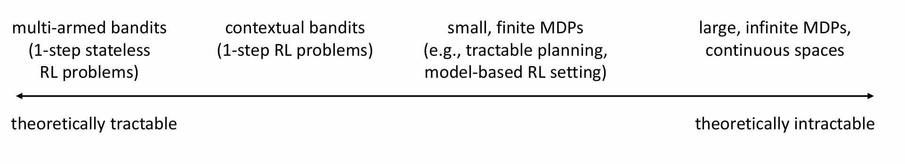
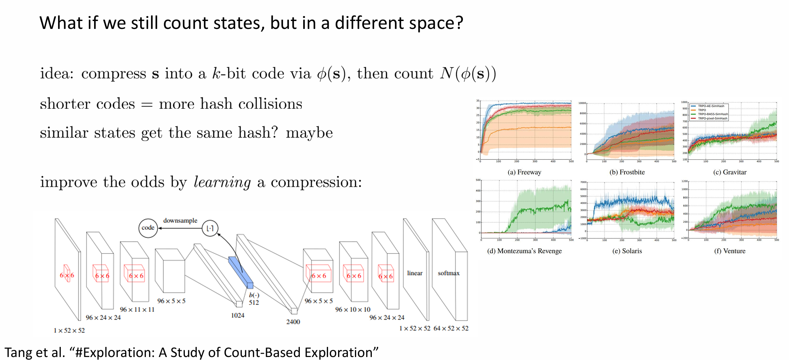
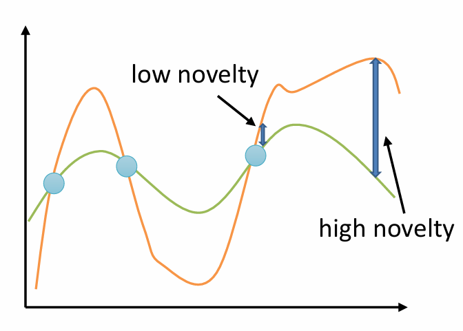

# lecture13

## part1

| 问题类别             | 理论可解性 | 特点                         |
| -------------------- | ---------- | ---------------------------- |
| Multi-Armed Bandits  | 完全可解   | 无状态、单步选择             |
| Contextual Bandits   | 部分可解   | 有状态、单步                 |
| 小规模有限 MDP       | 可分析     | 有状态、有转移               |
| 大规模 MDP / Deep RL | 不可分析   | 图像输入、连续空间等复杂场景 |

### bandit

如何将 bandit 建模为 POMDP？

1. **reward 分布假设**：

   - 假设每个臂 $a_i$ 的 reward 是从一个未知参数的分布中采样出来的：
     $$
     r(a_i) \sim p_{\theta_i}(r_i)
     $$

   - 举例：
     $$
     p(r_i = 1) = \theta_i, \quad p(r_i = 0) = 1 - \theta_i
     $$
     也就是说：每个臂有一个 Bernoulli 分布，成功概率是 $\theta_i$。

2. **不确定性建模**：

   - 每个 $\theta_i$ 来自某个先验分布：$\theta_i \sim p(\theta)$，但我们**不知道**具体值。

3. **这样我们就可以把整个问题建模为一个 POMDP**：

   - 状态（隐藏的）：$\mathbf{s} = [\theta_1, \theta_2, ..., \theta_n]$
   - 观测（即 reward）只能部分透露状态信息。

4. **我们的 belief**（我们对隐藏状态的估计）：$\hat{p}(\theta_1, ..., \theta_n)$

### regret

用 **Regret（懊悔）** 衡量：
$$
\text{Reg}(T) = T \cdot \mathbb{E}[r(a^\star)] - \sum_{t=1}^T r(a_t)
$$

- $\mathbb{E}[r(a^\star)]$：理想情况下，每一步都拿最优臂的期望 reward。
- $r(a_t)$：你实际选择的 action 获得的 reward。
- **Regret 越小，表示你的策略越快逼近最优臂。**

## part2

**大多数探索策略都需要某种“不确定性估计”**：

- 即使是简单或naïve的方法，比如UCB中基于次数计算的置信上界，也是在量化“我不确定这个动作的真实奖励”。

------

 **探索策略通常隐含地赋予“新信息”某种价值**

1. **UCB:**

   > 假设未知的动作很可能是好的（Optimism）
   >  → “没试过的看起来就厉害”

2. **Thompson Sampling:**

   > 假设抽样的后验是“真相”
   >  → “反复模拟世界假设后择优行动”

3. **Information Gain:**

   > 明确追求最有学习价值的动作
   >  → “学到最多知识”就是最好选择

### UCB（Upper Confidence Bound）算法

**乐观估计（Optimism in the Face of Uncertainty）**：
$$
a = \arg\max \hat{\mu}_a + C \cdot \sigma_a
$$

- $\sigma_a$：对动作 $a$ reward 不确定性的估计（比如方差或置信区间）。
- $C$：控制探索程度的超参数。

这种策略尝试去平衡：

- **探索（Exploration）**：选不确定性大的动作；
- **利用（Exploitation）**：选当前看起来最好的动作。

**UCB1公式（Auer et al., 2002）**：
$$
a = \arg\max \hat{\mu}_a + \sqrt{\frac{2 \ln T}{N(a)}}
$$
解释：

- $T$：当前时间步数。
- $N(a)$：动作 $a$ 被选过的次数。
- 第二项是“置信上界”：表示我们对这个动作真实值可能高估的程度。

最终可以证明，这个算法的 regret（懊悔值）：
$$
\text{Reg}(T) = \mathcal{O}(\log T)
$$
这表示你的算法表现得**越来越接近最优策略**，并且是已知方法中**最优阶的 regret 上界**。

### Thompson Sampling（Posterior Sampling）

每一轮选择动作时，做如下操作：

1. **采样一个假设模型**：
   $$
   \theta_1, \dots, \theta_n \sim \hat{p}(\theta_1, \dots, \theta_n)
   $$

2. **假装这是现实**（即这些参数是“真实的”）

3. **选择在这个假设模型下的最优动作**（比如期望 reward 最大的动作）

4. **执行动作并观察 reward，更新后验分布**（即根据观察数据更新 $\hat{p}$）

这就是“**概率匹配**”：

- 你选择动作的概率，等于该动作是最优动作的概率。

如果模型估计正确 → 达成高 reward；

如果估计错了 → 获得反例 → belief 被更新；

不需要精确优化 POMDP，只需基于当前 belief 采取贪婪策略。

### Information Gain-Based Exploration（基于信息增益）

信息增益是探索的基本原理之一：**我们应该选择最能减少不确定性的动作**

1. 当前我们对 $z$ （latent variable）的认识用分布 $\hat{p}(z)$ 表示，这个分布的不确定性用**熵** $\mathcal{H}(\hat{p}(z))$ 衡量。

   熵越高 → 不确定越大，熵越低 → 知识越精确

2. 执行某个动作，得到观测 $y$ 后，我们更新了对 $z$ 的估计

   新的后验分布是 $\hat{p}(z|y)$，其熵是 $\mathcal{H}(\hat{p}(z|y))$

3. 我们想知道观察 $y$ 之后我们对 $z$ 的了解程度提高了多少：
   $$
   \text{IG}(z, y) = \mathbb{E}_y \left[\mathcal{H}(\hat{p}(z)) - \mathcal{H}(\hat{p}(z|y))\right]
   $$
   这个期望是对所有可能的观测 $y$ 求平均，表达我们执行这个动作 **期望提升了多少信息量**。

   - 如果 IG 越大，表示这个动作带来的信息价值越高 → 值得去探索

由于 $y$ 是执行某个动作后得到的观测，所以我们可以写成条件信息增益：
$$
\text{IG}(z, y \mid a)
$$
也就是：**执行动作 $a$ 之后可能获得的关于 $z$ 的信息增益是多少**

#### IDS

我们希望做决策时既：

- **探索**（获取更多信息来减少未来不确定性）
- 又要 **利用**（避免当前选错 suboptimal 的动作）

为此，我们引入两个关键量：

#####  信息增益和次优性定义

- **$g(a)$** 是执行动作 $a$ 后获得的**信息增益（Information Gain）**
  $$
  g(a) = IG(\theta_a, r_a \mid a)
  $$
  → 衡量你执行 $a$ 后能学到多少关于该动作期望回报 $\theta_a$ 的信息。

------

- **$\Delta(a)$** 是动作 $a$ 的期望次优性（Expected Suboptimality）：
  $$
  \Delta(a) = \mathbb{E}[r(a^*) - r(a)]
  $$
  → 表示你预计它比最优动作 $a^*$ 差多少。

**选择动作 $a$ 的规则是：**
$$
a = \arg\min_a \frac{\Delta(a)^2}{g(a)}
$$
这可以理解为：

- 如果某个动作很可能是**次优的**（$\Delta(a)$ 很大）→ 不要选它（numerator 大）。
- 如果一个动作执行后**学不到任何信息**（$g(a) \to 0$）→ 也不要选它（denominator 小）。

因此你选的动作应该是：

- **有可能是最优的**
- **而且还能帮你学到东西**

## part3

### 将 UCB 拓展到 MDP：Count-Based Exploration

我们在 **MDP 的状态或状态-动作对上计数**（而不是只在 bandit 的 action 上）：

- $N(s)$：某个状态 $s$ 被访问的次数
- $N(s, a)$：状态-动作对 $(s, a)$ 被访问的次数

然后我们可以构造一个**探索奖励（exploration bonus）** $\mathcal{B}(N(s))$，随着访问次数增加而减少。

定义“增强版奖励”：
$$
r^+(s, a) = r(s, a) + \mathcal{B}(N(s))
$$

- 即在原始奖励上加一个“**不确定度奖励**”，鼓励 agent 去访问从未访问或访问次数少的状态。

#### 问题

在小型离散 MDP 中可以直接记录访问次数，但在复杂环境（如图像输入）中：

- 状态空间组合爆炸（例如蒙特祖马游戏中，骷髅和主角位置变换无穷）；
- 在连续空间（如机械臂位置）下，状态几乎不可能完全重复；
- 导致访问次数近似永远为 1，无法有效使用 count。

> 因此需要使用“状态相似性”来泛化计数 → 使用 density 模型。

### “伪计数”（pseudo-count）

- 在小型有限 MDP 中，可以精确统计状态访问次数 `N(s)`，计算：
  $$
  P(s) = \frac{N(s)}{n}
  $$
  表示状态 `s` 被访问的频率（概率密度）

- 访问新状态 `s` 之后，更新为：
  $$
  P'(s) = \frac{N(s) + 1}{n + 1}
  $$

于是，我们有

1. **训练密度模型** $p_\theta(s)$ 拟合目前看到的状态 $\mathcal{D}$

2. **遇到一个新状态** $s_i$

3. 用 $\mathcal{D} \cup \{s_i\}$ 重新训练一个新模型 $p_{\theta'}(s)$

4. 记录该状态在两个模型中的概率：
   $$
   p_\theta(s_i),\quad p_{\theta'}(s_i)
   $$

5. 根据这两个概率，**反推出该状态的伪计数 $\hat{N}(s_i)$**，用公式：

   使用两个假设：

   - $p_\theta(s_i) = \frac{\hat{N}(s_i)}{\hat{n}}$
   - $p_{\theta'}(s_i) = \frac{\hat{N}(s_i) + 1}{\hat{n} + 1}$

   解这两个方程可以推出 $\hat{N}(s_i)$ 和 $\hat{n}$
   $$
   \hat{N}(s_i) = \hat{n} \cdot p_\theta(s_i)
   \quad \text{其中}\quad 
   \hat{n} = \frac{1 - p_{\theta'}(s_i)}{p_{\theta'}(s_i) - p_\theta(s_i)} \cdot p_\theta(s_i)
   $$

#### bonus

| 方法名称                                                     | 探索奖励函数 $\mathcal{B}(N(s))$ | 特点/备注                                          |
| ------------------------------------------------------------ | -------------------------------- | -------------------------------------------------- |
| **UCB** (Upper Confidence Bound)                             | $\sqrt{ \frac{2 \ln n}{N(s)} }$  | 来自 bandit 理论，依赖总步数 $n$，偏向近期状态探索 |
| **MBIE-EB** (Strehl & Littman, 2008)                         | $\sqrt{ \frac{1}{N(s)} }$        | 与 UCB 类似但无 $\ln n$，更稳定                    |
| **BEB** (Bayesian Exploration Bonus, Kolter & Ng, 2009)      | $\frac{1}{N(s)}$                 | 非平方根，奖励衰减更快                             |
| **Bellemare et al. (2016)** 使用的是 **MBIE-EB**：$\sqrt{ \frac{1}{N(s)} }$ |                                  |                                                    |

#### 状态密度模型

我们不是为了生成“逼真的状态样本”，而是为了 **估计某个状态出现的概率密度**（即“它有多新奇”）。这与 GANs 等传统生成模型的目标正好相反。

Bellemare 等人提出的 “CTS” 模型：

> "condition each pixel on its top-left neighborhood"

- CTS（Context-Tree Switching）模型用于图像密度建模。
- 假设一个图像是二维数组，对于位置 $(i, j)$，其像素值的概率是基于其 **左上邻域像素的条件概率分布** 建立的。
- 图右下角示意图中红色为当前像素 $x_{ij}$，蓝色是它的“条件集”。

其他可选密度模型

> "stochastic neural networks, compression length, EX2"

- **Stochastic neural networks**：带有噪声的神经网络，用于输出密度分布。
- **Compression length**：信息压缩角度，如果状态能被压缩很多说明“见得多”，密度高。
- **EX2**：Explicit Exploration based on Exponential family density models，是一种用于稀有状态检测的策略。

## part4

### 利用哈希函数进行状态计数（counting with hashes）

使用哈希对状态进行压缩（离散化）

> compress state `s` into a k-bit code via φ(s)，then count N(φ(s))

- 定义一个编码函数 φ(s)：把高维状态映射到一个低维 **k-bit 表示**。
- 再对 φ(s) 的输出做哈希，记录每个 φ(s) 的访问次数：即 `N(φ(s))`。
- 这样可以在 φ(s) 的空间里“计数”。

**短码长度** → 容易发生哈希碰撞，泛化能力强，但容易混淆不同状态。

**长码长度** → 区分能力强，泛化差，计数稀疏。

目标是希望 **相似状态压缩后仍然映射到相同哈希码**，实现“泛化的计数”。

#### 方法流程：

1. 设计编码器 $\phi(s)$，将状态压缩为 $k$ 位编码；
2. 确保状态数量大于 $2^k$，必定存在哈希冲突；
3. 对 hash code 而不是原始状态计数；
4. hash 越短，冲突越多，等价于“相似性更广泛”的泛化；
5. 为避免随机 hash 函数的不稳定性，使用 autoencoder 训练编码器：
   - 压缩瓶颈层作为 hash；
   - 可确保相似状态拥有近似 hash。

优点：

- 简化状态空间，具备局部泛化能力；
- 与经典 count-based bonus 一致，但适用于高维。

### EX2

核心思想：**“新颖性 = 易于被识别出来”**

> A state is **novel** if it is **easy to distinguish** from all previously seen states.

 于是我们用一个分类器来判断：

- 每次观测到一个新状态 `s`，我们训练一个二分类器：
  - 把 `s` 当成正例（positive）
  - 把历史状态集合 `𝒟` 当成负例（negative）
- 然后看这个分类器多容易区分出 `s` 来。

我们定义一个“判别概率”函数 $D_s(s)$，表示分类器预测 `s` 是正样本的概率。

于是“密度”就用如下形式表示：
$$
p_θ(s) = \frac{1 - D_s(s)}{D_s(s)}
$$
含义：

- 若分类器认为 `s` 是正样本的概率 **很高**，说明它**与历史状态不同** → 新颖度高 → `p_θ(s)` 小 → 更高探索奖励。
- 若分类器认为 `s` 是正样本的概率 **很低**，说明它和旧状态分布重合 → 熟悉 → `p_θ(s)` 大 → 低探索奖励。

在真实环境中，状态 `s` 几乎 **从不重复**。

那就意味着：
 如果我们为每个状态都训练一个判别器，会非常不现实 ——
 训练、存储、泛化都难以实现。

解决方法：**Amortized classifier**（摊销式分类器）

> 不要为每个 `s` 都训练一个分类器。
>   训练一个神经网络 `D(s, s⁎)`，输入是新状态 `s` 和历史状态 `s⁎`，输出预测值。

这个网络可以看成一个**通用比较器**，学会判断“一个状态是否与 exemplar 区分开”。

如图所示：

- 两个输入通过 encoder
- 编码结果送入统一网络 `D_{x*}(x)`
- 判别是否相同

这就是 amortized 的核心思想：**用统一网络替代大量“定制分类器”**。

### Heuristic Bonus via Prediction Error

- 我们不需要这个密度模型能生成高质量的样本，也不需要它输出非常准确的密度值。
- 我们**只需要它能区分“熟悉的状态”与“新颖的状态”**！

> 通过误差来启发式估计访问频率（或状态的新颖性）

这是一种用于**探索（exploration）策略**的技术，不直接计算状态的访问次数，而是用一个误差函数来间接衡量状态是否“新颖”。

我们构建一个用于判断新颖性的误差指标：

- 有一个目标函数 $f^*(s, a)$：表示一个“真实”或“目标”输出（比如奖励、下一个状态等）。

- 给定一个经验数据缓冲区（buffer）$\mathcal{D} = \{(s_i, a_i)\}$

- 我们拟合一个模型 $\hat{f}_\theta(s, a)$，对目标函数进行近似。

- 然后我们定义一个**误差项**：
  $$
  \mathcal{E}(s, a) = \|\hat{f}_\theta(s, a) - f^*(s, a)\|^2
  $$

- 这个误差越大，表示这个状态-动作对在训练数据中越“少见”或“新颖”！

上面的图展示了如何用这个误差来判断新颖性：

- 绿色线：目标函数 $f^*(s, a)$
- 橙色线：模型预测 $\hat{f}_\theta(s, a)$
- 蓝色点：当前状态-动作对 $(s, a)$

观察：

- 蓝点如果落在模型预测和目标之间误差小 → 说明模型对它掌握得较好 → **低新颖性**
- 蓝点如果落在误差大的地方 → 模型预测不准确 → **高新颖性**

#### 问题：用什么作为 $f^\star(s, a)$？

 常见做法 1：
$$
f^\star(s, a) = s'
$$
即用“**下一个状态**”作为目标，做**下一状态预测（next state prediction）**。这种做法也跟**信息增益（information gain）**有关（将在下一讲讨论）。

 更简单做法 2（Random Network Distillation 核心）：
$$
f^\star(s, a) = f_\phi(s, a)
$$
其中 $f_\phi$ 是一个**固定、随机初始化的网络**，参数 $\phi$ 不变。

我们只训练 $\hat{f}_\theta(s, a)$ 去拟合它，**误差越小说明模型越熟悉，误差大说明该 (s, a) 对网络来说是“新颖”的**。

## part5

> 形式化解释（贝叶斯公式）：
> $$
> \underbrace{p(\theta \mid \mathcal{D})}_{\text{后验}} = \frac{\underbrace{p(\mathcal{D} \mid \theta)}_{\text{似然}} \cdot \underbrace{p(\theta)}_{\text{先验}}}{\underbrace{p(\mathcal{D})}_{\text{证据（归一化项）}}}
> $$
>
> #### 各个部分解释：
>
> - $\theta$：我们想要推断的参数（例如一个模型的参数）
> - $\mathcal{D}$：观测到的数据
> - **先验** $p(\theta)$：在看数据之前我们对 $\theta$ 的信念
> - **似然** $p(\mathcal{D} \mid \theta)$：在参数是 $\theta$ 时观测到数据 $\mathcal{D}$ 的可能性
> - **后验** $p(\theta \mid \mathcal{D})$：在观测了数据之后对 $\theta$ 的更新信念

在**bandit问题中**，我们采样的是**reward的分布**（p̂(θ) 是对reward模型的后验分布）。

但在强化学习中的MDP设置下，我们更关心的是**Q函数**（状态-动作值函数）的分布。也就是说：

> **MDP中的 analog 是 Q-function!**

我们可以做这样一种 Posterior Sampling：

1. **从 Q 的分布 p(Q) 中采样一个 Q 函数**
2. **根据这个 Q 函数执行一个 episode（完整轨迹）**
3. **用新数据更新 Q 的分布 p(Q)**

这个过程正是：**Bootstrapped DQN（Osband et al.）** 中的核心思想。

### 用 Bootstrap 构建 Q-function 分布

1. **给定一个数据集 `𝒟`**
2. **重复采样（有放回）N 次** → 得到 N 个 bootstrapped 数据集 `𝒟₁, 𝒟₂, ..., 𝒟ₙ`
3. **每个 bootstrapped 数据集 `𝒟ᵢ` 用来训练一个模型 `f_{θᵢ}`**
4. **采样一个模型 `f_{θᵢ}` 就等价于从 `p(Q)` 中采样 Q 函数**

这与贝叶斯的思想相似：我们不直接表示后验分布，而是通过多个模型的集成来隐式表示它。

训练 N 个神经网络代价太高，能否避免？

解法：**共享主干网络 + 多个 Head**

1. Shared Network（共享主干网络）：

- 对输入状态 $s$（例如图像）进行编码成特征向量。
- 通常是卷积层（图像）或 MLP 层（非图像）。
- 所有 head 共用这部分，节省计算。

2. 多个 Heads（Head₁, ..., Head_K）：

- 每个 head 是一个独立的 Q 函数近似器 $Q_i(s, a)$，负责拟合各自的 Bootstrap 数据。
- 结构通常为 MLP，只有几层。
- 各自对应不同的数据采样（实现 bootstrap）。

优点：

- 不需修改 reward；
- 最终训练出的所有 Q-function 都会收敛到好策略；
- 无需设定探索权重参数（如 bonus 系数）；
- 实现简单，不影响原始结构，开销较小。

局限：

- 后验分布非真实贝叶斯（尤其是 multi-head 形式）；
- 多样性有限，探索深度仍受限；
- 在困难探索任务上表现不如 bonus-based 方法；
- 实际使用不如 count-based 或 curiosity 方法普遍。

## part6

所有信息增益（Information Gain）探索方法的核心目标：

> 选择一个动作，使得其预期观测结果对我们关心的某个变量 $z$ 的信息最多。

关键问题：我们想要了解的变量 $z$ 是什么？

信息增益可以关于什么？

1. **关于奖励函数 $r$**
   - 不推荐：若奖励稀疏（如很多 hard exploration 任务），几乎无信息；
2. **关于状态分布 $p(s)$**
   - 稍显奇怪但可以理解：如果 agent 采取能显著改变 $p(s)$ 的行为，那其实是在做“新颖”的探索；
   - 本质类似于 count-based 或 density-based 方法；
3. **关于 dynamics（状态转移函数） $p(s'|s,a)$**
   - 强烈推荐：MDP 中唯一广泛变化的核心因素；
   - 尤其在 reward 稀疏、初始状态固定的情形下，更值得学习的是 dynamics。

> 所以，我们聚焦于对 dynamics 模型参数的学习作为探索的目标。

> “无论我们试图估计哪种信息增益，**精确使用它在实践中几乎都是不可行的**”

为什么？

- 信息增益的定义涉及后验和前验的 KL 散度，需要计算复杂的积分：
  $$
  \text{IG} = D_{KL}\left[ p(z \mid y, a) \,\|\, p(z \mid a) \right]
  $$

- 而这些分布往往没有解析形式，或者无法有效采样。

#### information gain (approximately)

##### Prediction Gain（预测增益）

$$
\text{prediction gain} = \log p_{\theta'}(s) - \log p_\theta(s)
$$

- $p_\theta(s)$：使用当前密度估计器对状态 $s$ 的概率估计；
- $\theta'$：表示在看到 $s$ 之后参数更新过了；
- 所以两个 log likelihood 的差值衡量的是：**模型对状态 $s$ 的信念变化了多少**。

##### Variational Inference（变分推断）

引用的是 VIME 方法（Houthooft et al. 2016）

 背景：

我们想要衡量：

> **某个新观察到的 transition 是否提供了大量关于环境的知识（特别是 transition dynamics）**

 关键表达式：
$$
\text{IG} = D_{KL}(p(z \mid y) \,\|\, p(z))
$$
其中：

- $z = \theta$：表示环境动态模型的参数；
- $y = (s_t, a_t, s_{t+1})$：表示一个 transition；
- 即我们要评估：新观察 $y$ 后，我们对模型参数 $\theta$ 的后验发生了多大变化。

------

展开后的形式：
$$
D_{KL}(p(\theta \mid h, s_t, a_t, s_{t+1}) \,\|\, p(\theta \mid h))
$$

- $h$：历史上所有的 transition；
- 加上新的 transition $(s_t, a_t, s_{t+1})$ 后，对 $\theta$ 的 belief 变化了多少；
- **变化越大 → 信息越多 → exploration bonus 越高**

------

 直觉：

> 如果一个新的 transition 会显著改变我们对环境动力学 $p(s' \mid s, a)$ 的信念，那它就是信息丰富的 → 值得探索。

------

 计算方式（近似）：

- **直接算后验 KL 太难了！** 所以用变分推断：
  $$
  p(\theta \mid h) \approx q(\theta \mid \phi)
  $$
  用一个简单的分布 $q$ 来近似真实后验，用 reparam trick + 采样估算 KL。

使用独立高斯近似（mean-field assumption）：
$$
q(\theta \mid \phi) = \prod_i \mathcal{N}(\theta_i \mid \mu_i, \sigma_i)
$$

- 每个权重参数 $\theta_i$ 都有自己的 $\mu_i, \sigma_i$
- 所以整网的参数分布变成高斯分布的乘积

**如何学习 $q(\theta|\phi)$？**

- 用变分下界（variational lower bound）优化：

$$
\min D_{KL}(q(\theta \mid \phi) \,\|\, p(h|\theta)p(\theta))
$$

- 这是变分贝叶斯中的经典目标，即让 approximate posterior 靠近真实后验

**如何根据新的 transition 更新 belief？**

给定一个新的 transition $(s, a, s')$：

1. 更新 $\phi$ → 得到新的参数 $\phi'$
2. 即：对网络参数的 mean 和 std 再训练一步（比如梯度下降）
3. 得到更新后的后验近似分布 $q(\theta \mid \phi')$

### other methods

#### 方法 1：Stadie et al. 2015 — **Model Error as Exploration Bonus**

这个方法的大致思路如下：

🔹 Step 1: 使用 Auto-Encoder 对状态图像编码

- 原始状态可能是高维图像；
- 用 autoencoder 编码为低维 latent 向量。

🔹 Step 2: 在 latent space 上训练一个 forward dynamics model
$$
\hat{z}_{t+1} = f(z_t, a_t)
$$

- 其中 $z_t$ 是当前状态编码；
- $f$ 是你训练的预测器，用来预测下一个状态的编码。

🔹 Step 3: 使用模型误差作为探索奖励

- 如果模型在某个 transition 上预测误差大 ⇒ 模型还不了解这里 ⇒ 高不确定性

- **奖励 = prediction error**，如：
  $$
  r_t^{\text{bonus}} = \| \hat{z}_{t+1} - z_{t+1} \|^2
  $$

- 非常直接、易实现、不依赖 KL 或变分推断。

#### 方法 2：Schmidhuber et al.（1991起）— Intrinsic Motivation 理论

来自 Schmidhuber 的理论框架（也称 formal theory of curiosity/fun）中，提出很多种激励探索的方式：

 常见的 bonus 类型：

 1. **Model Error Bonus**

- 和 Stadie 的方法一样；
- 如果模型在某个状态上误差大，就奖励 agent 去那里。

 2. **Model Gradient Bonus**

- 如果你观察一个新的 transition 时，模型的权重更新很大（梯度大）：
  $$
  \text{bonus} \propto \|\nabla_\theta \mathcal{L}_{model}\|
  $$

- 说明模型在这个样本上“学到了很多” ⇒ 这个 transition 是有用的。

 3. **其他变体**

- 比如基于记忆访问、压缩率、压缩距离、MDL 等衡量新奇性或学习进展的指标。

### 推荐阅读文献

1. Blundell et al., “Weight Uncertainty in Neural Networks”
2. Pathak et al., “Curiosity-Driven Exploration by Self-Supervised Prediction”
3. Bellemare et al., “Unifying Count-Based Exploration and Intrinsic Motivation”
4. Osband et al., “Deep Exploration via Bootstrapped DQN”
5. Fu et al., “EX²: Exploration with Exemplar Models”
6. Tang et al., “#Exploration: Structuring Exploration Using Count-Based Exploration with Hashing”