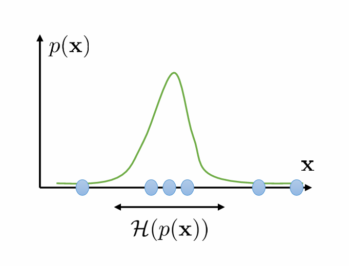
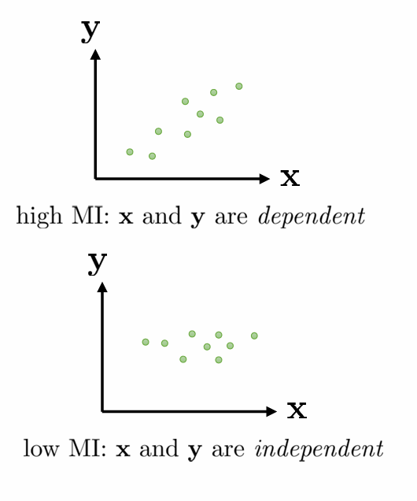

# lecture14

## part1

### 信息论基础

概率分布 $p(x)$

- 在连续空间是密度函数，在离散空间是概率分布。

#### 熵（Entropy）

定义：
$$
H(p(x)) = -\mathbb{E}_{x \sim p(x)}[\log p(x)]
$$
直觉理解：

- 熵衡量分布的不确定性；
- **熵大** → 分布更广泛（如均匀分布）；
- **熵小** → 更集中。

#### 互信息（Mutual Information）

定义：
$$
\begin{aligned}
\mathcal{I}(\mathbf{x} ; \mathbf{y}) & =D_{\mathrm{KL}}(p(\mathbf{x}, \mathbf{y}) \| p(\mathbf{x}) p(\mathbf{y})) \\
& =E_{(\mathbf{x}, \mathbf{y}) \sim p(\mathbf{x}, \mathbf{y})}\left[\log \frac{p(\mathbf{x}, \mathbf{y})}{p(\mathbf{x}) p(\mathbf{y})}\right] \\
& =\mathcal{H}(p(\mathbf{y}))-\mathcal{H}(p(\mathbf{y} \mid \mathbf{x}))
\end{aligned}
$$
衡量 $X$ 和 $Y$ 之间的相关性；

若 $X$ 与 $Y$ 独立，则互信息为 0；

若知道 $X$ 可推测 $Y$，则互信息高。

#### `π(s)`：策略诱导的状态边缘分布（state marginal distribution）

- 指在某个策略 π 下，智能体最终会访问到状态 `s` 的分布。
- 如果策略探索性强，它就可能覆盖更多的状态区域。
- 所以 `π(s)` 衡量的是策略在状态空间中的“**覆盖度 coverage**”

#### `𝓗(π(s))`：状态边缘分布的熵（state marginal entropy）

- 这是 `π(s)` 的熵（Entropy），也叫状态边缘熵。
- 它衡量策略能在状态空间中覆盖多少种状态（越均匀越高）。
- 所以这个量常被用作**探索性**的衡量指标（类似 Intrinsic Motivation）。

#### Empowerment（能力度量）

$$
\mathcal{I}\left(\mathbf{s}_{t+1} ; \mathbf{a}_t\right)=\mathcal{H}\left(\mathbf{s}_{t+1}\right)-\mathcal{H}\left(\mathbf{s}_{t+1} \mid \mathbf{a}_t\right)
$$

`𝓗(s_{t+1})`：下一个状态的不确定性，我们希望这个大

`𝓗(s_{t+1} | a_t)`：给定动作后的不确定性（小于等于前者），我们希望这个小

差值就是：知道动作后，你能减少多少不确定性 —— 即 **动作的控制能力**

## part2

### goal relabeling with latent goals

1. 探索动机：无奖励下的自主学习

- 问题设定：机器人放在厨房整天练技能，晚上你回来给它一个任务（如洗碗）；
- 在你指令任务之前，它能否“自主学习”技能，使得任何未来给定目标都能快速达成？

------

2. 如何指定目标？（Goal Specification）

- 一个具体方案：用户提供一个图像作为目标；
  - 例子：门打开至一定角度的图片；
- 所以目标等价于“想要 agent 达到的状态”；
- 学习目标 → 即训练一个 goal-conditioned policy，输入当前状态和目标状态，输出动作策略。

------

3. 状态比较困难：图像高维，状态唯一性强

- 所有图像状态几乎都独一无二；
- 因此需要某种“状态相似性度量”或压缩。

解决方案：

- 使用生成模型（generative model），如 VAE（Variational Autoencoder）；
- 将图像（状态）编码为 latent vector $z$；
  - 类似状态的 $s$ 会在 latent 空间中彼此靠近。

**Step 1: Propose goal**
$$
z_g \sim p(z),\quad x_g \sim p_\theta(x_g | z_g)
$$

- 从一个**先验分布** `p(z)` 中采样一个潜在目标 `z_g`
- 然后通过 decoder `pθ(x_g | z_g)` 生成一个观测目标图像 `x_g`
- 如右上图所示，机器人在“脑海”中想象出了多个潜在目标 `z_g1`, `z_g2`...

 这一步是**goal imagination（目标想象）**

------

**Step 2: Attempt to reach goal**
$$
\pi(a|x, x_g)
$$

- 给定当前状态 `x` 和目标状态 `x_g`，用条件策略 π 来生成动作，使机器人尽力去达成这个目标（也叫 goal-conditioned policy）

结果状态是：$\bar{x}$（实际到达的位置）

------

**Step 3: Use data to update π**

- 把收集到的轨迹（例如从 $x \rightarrow \bar{x}$）用于训练或强化策略 π。
- 比如用 Hindsight Experience Replay、goal relabeling 等方式。

------

**Step 4: Use data to update the generative model**

- 用收集到的数据反向更新生成模型：
  - $p_\theta(x_g | z_g)$：decoder
  - $q_\phi(z_g | x_g)$：encoder

右下图中：

- $p(z)$：先验潜变量分布（可以是高斯）
- $p_\theta(x|z)$：从潜在目标 z 生成可视目标 x（decoder）
- $q_\phi(z|x)$：将图像编码为 latent goal（encoder）

 这一步属于 **representation learning（表征学习）**

#### Skewed Likelihood Training（偏置学习）

标准 MLE：
$$
\theta, \phi \leftarrow \arg\max_{\theta, \phi} \mathbb{E}[\log p(\bar{x})]
$$
即尽可能拟合当前收集到的状态分布。

加权 MLE（Skew-Fit 的核心创新）：
$$
\theta, \phi \leftarrow \arg\max_{\theta, \phi} \mathbb{E}[w(\bar{x}) \log p(\bar{x})]
$$
其中：
$$
w(\bar{x}) = p_\theta(\bar{x})^{\alpha}, \quad \text{with } \alpha \in [-1, 0)
$$

- 当 $\alpha < 0$，**罕见状态的权重更高**，从而鼓励模型增加这些状态的概率。
- 举个例子：如果一个状态在当前分布下概率很小（很少被访问），它的权重会很高，训练模型去“覆盖”它。

> 回忆第13讲中：
>
> - 伪计数探索奖励为 $\text{bonus}(s) \sim \frac{1}{n(s)}$ 或 $\frac{1}{\sqrt{n(s)}}$；
> - 与本方法类似，均对稀有状态赋予更高价值；
> - 区别在于：
>   - count-based 方法将 bonus 加入 reward；
>   - 本方法将密度惩罚加入生成模型训练，以提出更分散的目标。

Skew-Fit 的学习过程隐含地最大化：
$$
\text{Mutual Information: } I(G; S) = \mathcal{H}(p(G)) - \mathcal{H}(p(G \mid S))
$$
即同时：

- 扩大你能**想到的目标种类**（高熵）
- 增强你能**控制并达成的能力**（低条件熵）

| 项                         | 意义                                                         |
| -------------------------- | ------------------------------------------------------------ |
| $\mathcal{H}(p(G))$        | 提升目标分布的熵，使得探索多样、目标多样（由 Skew-Fit 实现） |
| $\mathcal{H}(p(G \mid S))$ | 给定最终状态，目标应当是可以预测的。意味着策略有效地达到了目标，即更确定性。 |

## part3

### Intrinsic Motivation(SMM)

我们希望学出一个策略 `π(a|s)`，使得它引导智能体遍历的状态分布 `p_π(s)` 与目标状态分布 `p★(s)` 尽可能接近。

这可以形式化为：
$$
\min_\pi D_{KL}(p_\pi(s) \| p^\star(s))
$$
❌ 但这样**并不能实现边际匹配！**

因为你只是在强化当前策略对一些状态的访问频率，而不是全局更新状态分布。

**两阶段优化循环**：

 Step 1: 学习每个探索策略 πᵏ(a|s)

使其最大化：
$$
E_{\pi}[\tilde{r}^k(s)]
$$
其中：

- `π^k` 是第 k 个策略；
- $\tilde{r}^k(s)$ 是针对当前 `p_π(s)` 和目标分布 `p★(s)` 的奖励。

------

 Step 2: 更新当前状态分布 $p_{π^k}(s)$

不是直接拟合目标分布，而是**拟合到到目前为止所有访问过的状态（经历）**，即**累积采样分布**。

这一点和错误做法（红线划掉的那句）不同：不是每一步都强行拟合到 `p★(s)`。

------

 Step 3: 汇总所有策略：

最终策略是平均多个策略的结果：
$$
\pi^\star(a|s) = \sum_k \pi^k(a|s)
$$
这就能实现状态边际匹配：

> 是策略集合 π^k 与当前状态分布 p_π 的**纳什均衡（Nash equilibrium）**。

如果目标状态分布是 **uniform（均匀分布）**，即：
$$
\log p^\star(s) = C
$$
那么：
$$
\tilde{r}(s) = C - \log p_\pi(s)
\Rightarrow \text{maximize entropy: } \mathcal{H}(p_\pi(s))
$$
这就等价于最大熵探索（MaxEnt Exploration）！

#### 为什么使用混合策略？——纳什均衡视角

构造一个二人博弈：

- 玩家 1：策略 $\pi_k$，试图最大化 $r(s)$；
- 玩家 2：密度估计器 $p_{\pi_k}$，拟合当前策略的状态分布；

Nash Equilibrium：

- 若双方都执行“best response”：
  - 策略最优化当前 reward；
  - 密度模型最优化当前策略下的分布；
- 则最终平均策略为 Nash 解。

关键结论：

- 最后一个策略 ≠ Nash 策略；
- 所有策略的历史均值 = Nash 均衡策略；
- 即混合策略实现状态边际匹配目标。

## part4

###  问题动机：如何超越状态覆盖（State Coverage）？

- 之前我们尝试让策略访问所有状态；
- 现在我们希望策略能够掌握多个**可区分的技能（diverse skills）**；
- 每个技能不仅访问不同状态，还执行**不同的行为模式**。

### 多技能策略表示形式

我们引入技能 latent variable $z$，并定义策略为：
$$
\pi(a \mid s, z)
$$

- 其中：
  - $s$：环境状态；
  - $z$：技能变量（可以是 one-hot 编码，代表离散技能 index）；
- 这种结构允许一个共享策略根据 $z$ 表现出不同行为；
- 如果你有每个 $z$ 对应一个独立策略，那是这类结构的特例（special case）；
- 例如：
  - 在 2D 导航中：
    - $z = 0$：向上；
    - $z = 1$：向右；
    - $z = 2$：绕圈；
    - $z = 3$：静止。

### 技能 ≠ goal-reaching

- 到达某个状态（goal-reaching）只是技能空间的子集；
- 某些技能无法被简单描述为“到达某个状态”，例如：
  - “到绿色球但避开红色圈”；
- 原因：
  - goal-conditioned policy 只定义“目标位置”，难以表示复杂约束；
- 所以：
  - 技能学习能力 > goal-reaching；
  - 技能可表示行为风格、动态模式等高阶任务结构。

### 算法流程图示（文字版）

1. 给定一个技能 $z$，policy $\pi(a|s,z)$ 与环境交互；
2. 收集轨迹状态 $s$；
3. 判别器 $\mathcal{C}(z|s)$ 尝试预测 z；
4. 使用判别器 log-probability 作为 reward 训练策略；
5. 每轮同时更新：
   - 判别器（更好预测 z）；
   - 策略（最大化 $\log \mathcal{C}(z|s)$）。

→ 策略和判别器形成自博弈（adversarial learning），逐步分化出不同技能。

虽然方法看似启发式，但其实目标函数明确：

#### 最大化状态与技能之间的 mutual information：

$$
I(s; z) = H(z) - H(z \mid s)
$$

- 第一项 $H(z)$：通过 uniform sampling $z \sim \text{Uniform}(1,\dots,N)$ 轻松最大化；
- 第二项 $H(z \mid s)$：通过优化判别器 $\mathcal{C}(z \mid s)$ 最小化；
  - 即：让状态 $s$ 尽可能明确地揭示技能 z。

所以整套流程目标为：
$$
\max_\pi I(s; z)
$$

- 不仅解释了奖励设计，还提供了优化理论支撑；
- 来自以下关键论文：
  -  Diversity Is All You Need (DIAYN)
  -  Variational Intrinsic Control (VIC)