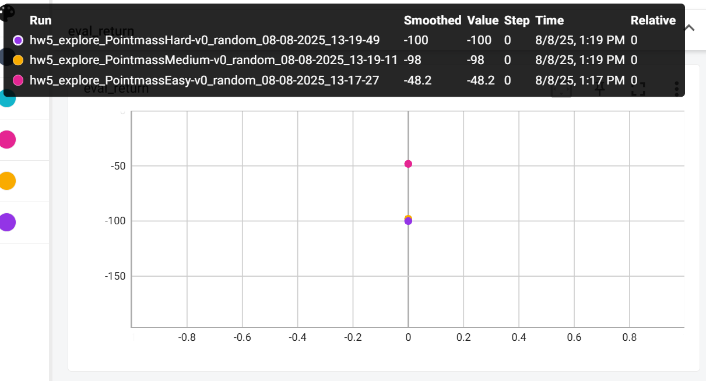
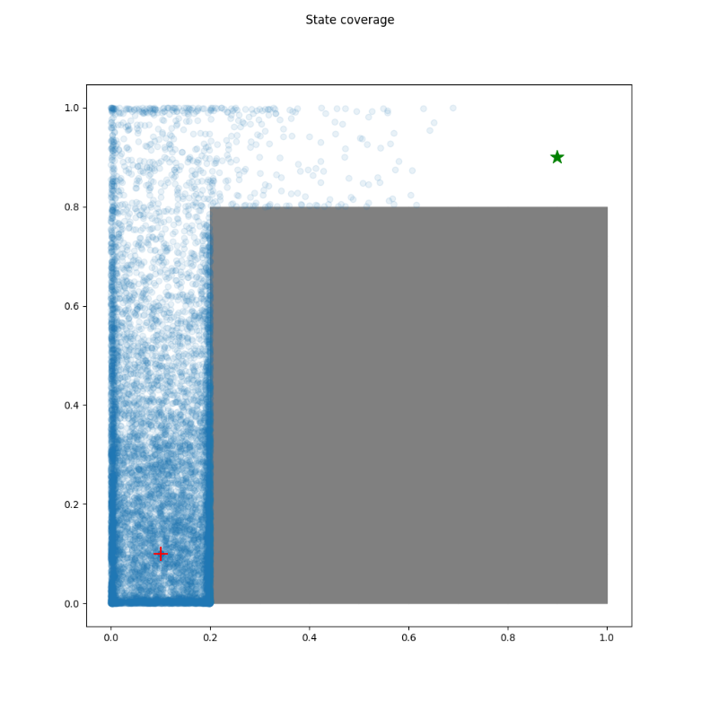
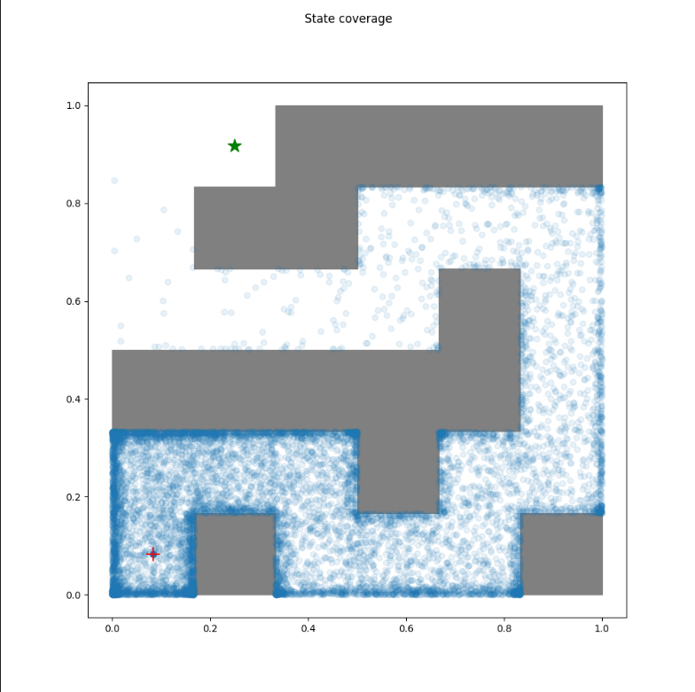
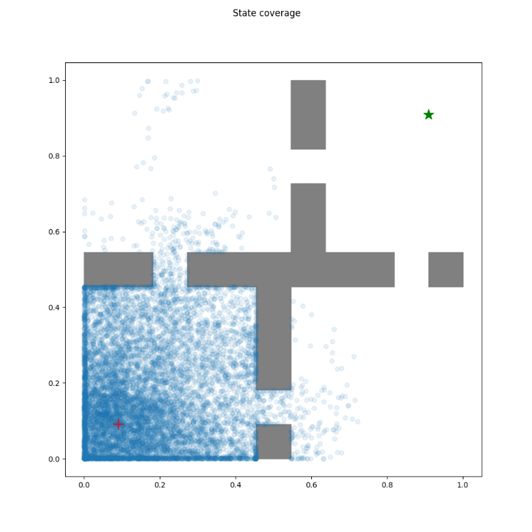
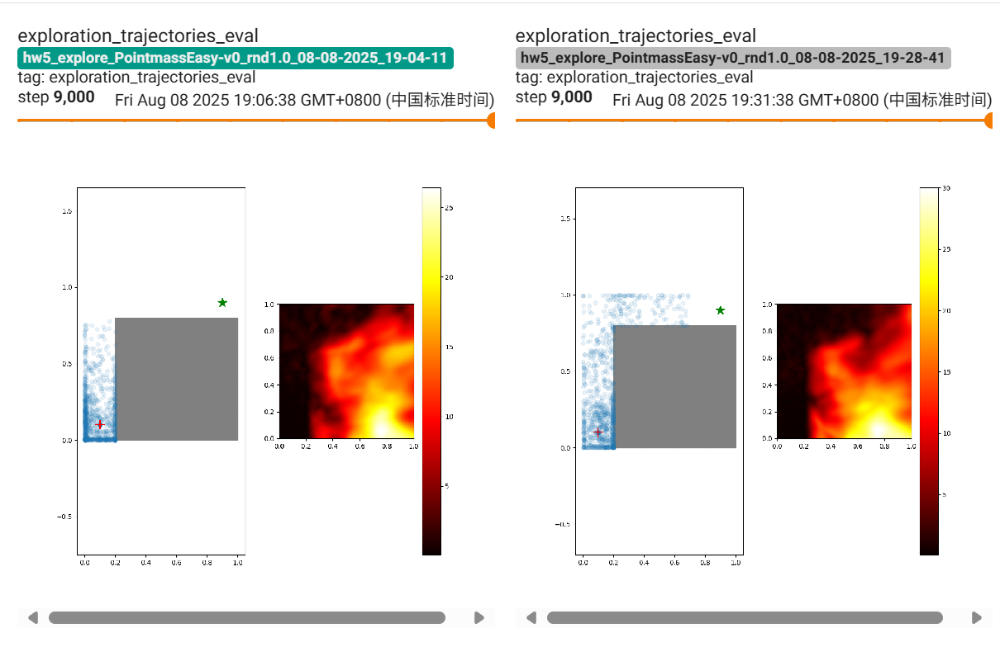
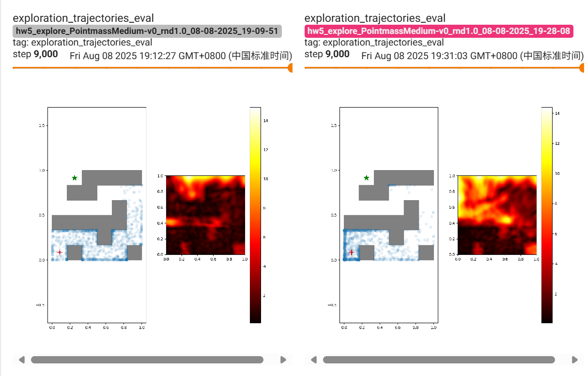
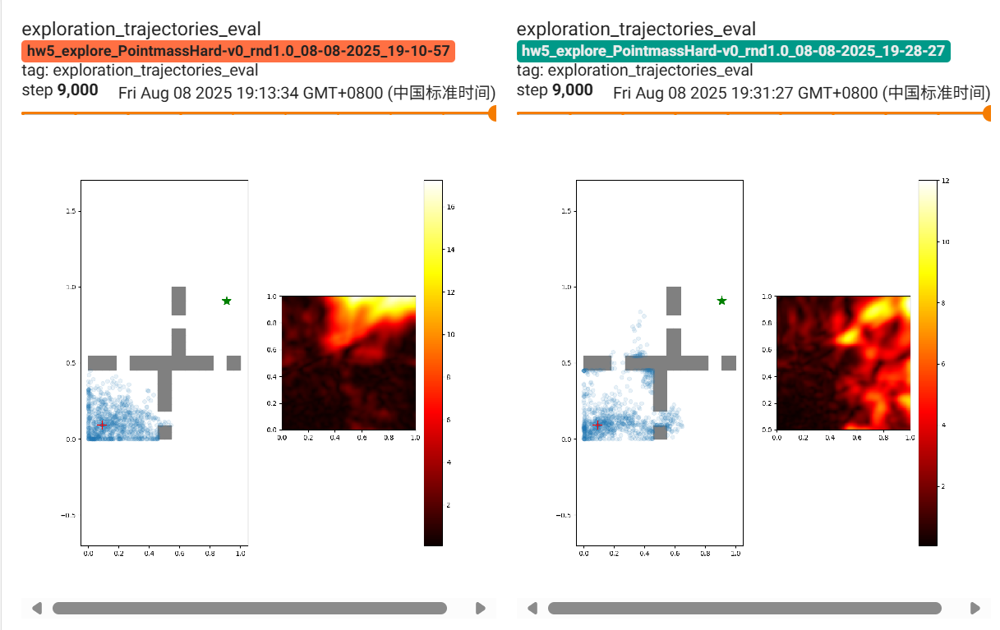

# hw5

## algorithm

### RND（Random Network Distillation ）

传统探索策略比如使用 TD-error、epsilon-greedy 等方法。RND 提出了一种新方法，使用 **随机函数预测误差** 作为探索信号。

$f^*_\theta(s')$：一个随机初始化的神经网络，不参与训练，是目标函数。

$\hat{f}^*_\phi(s')$：另一个神经网络（预测器），目标是模仿 $f^*_\theta(s')$，用训练数据进行训练。

训练 $\hat{f}*\phi$ 使得输出尽可能接近 $f^**\theta$：
$$
\phi^* = \arg\min_{\phi} \mathbb{E}_{s, a, s' \sim \mathcal{D}} \left[ \underbrace{||\hat{f}_\phi(s') - f^*_\theta(s')||}_{\varepsilon_\phi(s')} \right]
$$

- $\mathcal{D}$ 是经验数据 buffer 中的采样分布。
- $\varepsilon_\phi(s')$ 是预测误差。

### Accurately computing running variance

来源：[Accurately computing sample variance online](https://www.johndcook.com/blog/standard_deviation/)

实现库：https://github.com/joschu/modular_rl

计算样本方差的一个常见公式：

$\sigma^2 = \frac{1}{n(n-1)}\left(n \sum x_i^2 - \left(\sum x_i\right)^2\right)$

乍看没问题，但在数据值较大、差异较小时，就可能因“两个大数相减”导致严重的**精度丢失**，甚至出现负的方差结果——数学上显然错误

数值稳定的解决方案：Welford 的在线算法

为避免上述问题，推荐使用 Welford（Knuth 算法）的**在线算法**，它无需保存所有样本即可逐步更新均值和方差，具有更好的数值稳定性 

具体更新公式如下：

- 初始化：
   $  M_1 = x_1,\quad S_1 = 0$
- 对于每一个新的样本 $x_k$：
   $  M_k = M_{k-1} + \frac{x_k - M_{k-1}}{k}$
   $  S_k = S_{k-1} + (x_k - M_{k-1}) \times (x_k - M_k)$

更新后，对样本方差的估计为：
 $s^2 = \frac{S_k}{k - 1}$
 如需使用偏差，$\sigma^2 = \frac{S_k}{k}$ 

该方法之所以可靠，是因为它避免了数值不稳定的两个大数相减，引入的是更小的增量更新，所以能保持精度和非负性。

## code

### infrastructure

#### running_state

##### running_state

```python
class RunningStat(object):
    def __init__(self, shape):
        self._n = 0
        self._M = torch.zeros(*shape).to(ptu.device)  # running mean
        self._S = torch.zeros(*shape).to(ptu.device)  # running std * (self._n - 1) when self._n > 1

    def push(self, x: torch.Tensor):
        x = x.detach()
        assert x.shape == self._M.shape
        self._n += 1
        if self._n == 1:
            self._M[...] = x
        else:
            oldM = self._M.clone()
            self._M[...] = oldM + (x - oldM) / self._n
            self._S[...] = self._S + (x - oldM) * (x - self._M)

    @property
    def n(self):
        return self._n

    @property
    def mean(self):
        return self._M

    @property
    def var(self):
        return self._S / (self._n - 1) if self._n > 1 else torch.square(self._M)

    @property
    def std(self):
        return torch.sqrt(self.var)

    @property
    def shape(self):
        return self._M.shape

```

1. `detach()` 是 PyTorch 张量 (`torch.Tensor`) 的一个方法，其作用是：

   > **返回一个新的张量，这个张量与原张量共享内存，但不会再参与反向传播。**

   这个 `x` 是用来统计均值 / 方差的，不要追踪它的梯度，也不要在反向传播时对它进行计算。

##### ZFilter

```python
class ZFilter:
    """
    y = (x-mean)/std
    using running estimates of mean,std
    """

    def __init__(self, shape, demean=True, destd=True, clip=10.0):
        self.demean = demean
        self.destd = destd
        self.clip = clip

        self.rs = RunningStat(shape)

    def __call__(self, x, update=True):
        if update: self.rs.push(x)
        if self.demean:
            x = x - self.rs.mean
        if self.destd:
            x = x / (self.rs.std + 1e-8)
        if self.clip:
            x = torch.clip(x, -self.clip, self.clip)
        return x

    def output_shape(self, input_space):
        return input_space.shape
```


### agent

#### random_agent

```python
from typing import Tuple
import numpy as np


class RandomAgent:
    def __init__(self, observation_shape: Tuple[int, ...], num_actions: int):
        super().__init__()
        self.num_actions = num_actions#相当于action的空间

    def get_action(self, *args, **kwargs):
        # TODO(student): Return a random action
        return np.random.randint(self.num_actions)
    
    def update(self, *args, **kwargs):
        # Update is a no-op for the random agent
        return {}

```

1. 通过random.randint返回一个 **0 到 `num_actions - 1` 之间的随机整数**。

#### rnd_agent

##### init

```python
def __init__(
    self,
    observation_shape: Tuple[int, ...],
    num_actions: int,
    make_rnd_network: Callable[[Tuple[int, ...]], nn.Module],
    make_rnd_network_optimizer: Callable[[nn.ParameterList], torch.optim.Optimizer],
    make_target_rnd_network: Callable[[Tuple[int, ...]], nn.Module],
    rnd_weight: float,
    **kwargs
):
    super().__init__(
        observation_shape=observation_shape, num_actions=num_actions, **kwargs
    )
    self.rnd_weight = rnd_weight

    self.rnd_net = make_rnd_network(observation_shape)
    self.rnd_target_net = make_target_rnd_network(observation_shape)

    self.rnd_target_net.apply(init_network)

    # Freeze target network
    for p in self.rnd_target_net.parameters():
        p.requires_grad_(False)

        self.rnd_optimizer = make_rnd_network_optimizer(
            self.rnd_net.parameters()
        )
```

1. `rnd_weight`: RND 误差对奖励的影响权重
2. `self.rnd_target_net` 是目标网络，初始化后被冻结

##### update_rnd

```python
def update_rnd(self, obs: torch.Tensor) -> torch.Tensor:
    """
        Update the RND network using the observations.
        """
    # TODO(student): update the RND network
    prediction=self.rnd_net(obs)
    target=self.rnd_target_net(obs)

    loss = torch.square(prediction-target).mean()

    self.rnd_optimizer.zero_grad()
    loss.backward()
    self.rnd_optimizer.step()

    return loss.item()
```

##### update

```python
def update(
    self,
    observations: torch.Tensor,
    actions: torch.Tensor,
    rewards: torch.Tensor,
    next_observations: torch.Tensor,
    dones: torch.Tensor,
    step: int,
):
    with torch.no_grad():
        # TODO(student): Compute RND bonus for batch and modify rewards
        prediction=self.rnd_net(next_observations)
        target=self.rnd_target_net(next_observations)

        rnd_error = torch.square(prediction-target).mean(dim=-1)
        rnd_error=self.rnd_normalizer(rnd_error)
        #rnd_error=(rnd_error-rnd_error.mean())/(rnd_error.std()+1e-8)
        assert rnd_error.shape == rewards.shape
        rewards = rewards+self.rnd_weight*rnd_error

        metrics = super().update(observations, actions, rewards, next_observations, dones, step)

        # Update the RND network.
        rnd_loss = self.update_rnd(observations)
        metrics["rnd_loss"] = rnd_loss

        return metrics
```

1. 每个状态计算 RND 误差作为伪奖励（表示“陌生程度”）。

   与环境奖励叠加，用于增强对未知区域的探索。

2. 调用父类 `DQNAgent.update` 完成主训练。

   然后更新 `self.rnd_net`

##### plot_aux

```python
def plot_aux(
    self,
    axes: List,
) -> dict:
    """
        Plot the RND prediction error for the observations.
        """
    import matplotlib.pyplot as plt
    assert len(axes) == 1
    ax: plt.Axes = axes[0]

    with torch.no_grad():
        # Assume a state space of [0, 1] x [0, 1]
        x = torch.linspace(0, 1, 100)
        y = torch.linspace(0, 1, 100)
        xx, yy = torch.meshgrid(x, y)

        inputs = ptu.from_numpy(np.stack([xx.flatten(), yy.flatten()], axis=1))
        targets = self.rnd_target_net(inputs)
        predictions = self.rnd_net(inputs)

        errors = torch.norm(predictions - targets, dim=-1)
        errors = torch.reshape(errors, xx.shape)

        # Log scale, aligned with normal axes
        from matplotlib import cm
        ax.imshow(ptu.to_numpy(errors).T, extent=[0, 1, 0, 1], origin="lower", cmap="hot")
        plt.colorbar(ax.images[0], ax=ax)
```

1. `torch.linspace(a, b, n)`：在区间 `[a, b]` 上均匀地生成 `n` 个点。

2. `xx, yy = torch.meshgrid(x, y)`

   - 创建一个 **二维网格坐标矩阵**，`xx` 和 `yy` 都是 100×100 的二维 tensor。

3. 在 `[0, 1]^2` 的二维空间中，生成 10000 个位置点

   用 RND target 网络和当前网络分别推理

   计算每个位置点的预测误差

   把误差用热力图的形式可视化出来

### scripts

#### run_hw5_explore

##### visualize

```python
def visualize(env: Pointmass, agent, observations: torch.Tensor):
    import matplotlib.pyplot as plt
    fig = plt.figure(figsize=(10, 10))

    num_subplots = agent.num_aux_plots() + 1 if hasattr(agent, "num_aux_plots") else 1

    axes = fig.subplots(1, num_subplots)
    ax = axes[0] if num_subplots > 1 else axes
    env.plot_walls(ax)
    ax.scatter(
        observations[:, 0],
        observations[:, 1],
        alpha=0.1
    )
    ax.set_xlim(0, 1)
    ax.set_ylim(0, 1)

    env.plot_keypoints(ax)

    ax.axis("equal")

    if hasattr(agent, "plot_aux"):
        agent.plot_aux(axes[1:])

    return fig
```

1. `ax = axes[0] if num_subplots > 1 else axes`

   为了后续统一处理主图（轨迹图）所用的 `ax`，这里做了判断：

   - 多个子图时：取第一个 `axes[0]` 作为主图；
   - 只有一个子图时：直接用 `axes`。

2. `env.plot_walls(ax)`
    调用环境 `env` 的 `plot_walls` 方法，在 `ax` 这个子图上绘制环境的墙体或障碍结构。通常用于表示地图中不可穿越的区域。

3. `ax.scatter(observations[:, 0], observations[:, 1], alpha=0.1)`
    使用 `matplotlib` 的 `scatter` 函数在子图 `ax` 上画出观测值 `observations` 的散点图：`observations[:, 0]` 是 x 坐标，`observations[:, 1]` 是 y 坐标；`alpha=0.1` 表示每个点的透明度设为 0.1，便于观察密集程度（颜色重叠更深）。

4. `ax.set_xlim(0, 1)`
    将 x 轴的显示范围设置为从 0 到 1，假设环境空间是归一化的单位区间。

5. `env.plot_keypoints(ax)`
    在子图 `ax` 上绘制关键点，例如目标位置、起始位置或奖励点。是一个可视化辅助工具，由环境提供。

6. `ax.axis("equal")`
    设置图像的坐标轴比例一致，防止画布拉伸导致路径或形状失真。x 和 y 单位长度等比显示。

7. `if hasattr(agent, "plot_aux"):`
    判断 `agent` 是否实现了 `plot_aux` 方法（即是否定义了该函数）。这是动态属性检查，避免在没有该方法时直接调用导致错误。

8. `agent.plot_aux(axes[1:])`
    如果 `plot_aux` 存在，就调用它并传入 `axes[1:]`，也就是除主图以外的所有子图。这样 agent 可以在这些子图中画出它的内部状态、奖励函数、置信度等“辅助图像”。

##### run_training_loop

```python
def run_training_loop(config: dict, logger: Logger, args: argparse.Namespace):
    # set random seeds
    np.random.seed(args.seed)
    torch.manual_seed(args.seed)
    ptu.init_gpu(use_gpu=not args.no_gpu, gpu_id=args.which_gpu)

    # make the gym environment
    env = config["make_env"]()
    exploration_schedule = config.get("exploration_schedule", None)
    discrete = isinstance(env.action_space, gym.spaces.Discrete)

    assert discrete, "DQN only supports discrete action spaces"

    agent_cls = agent_types[config["agent"]]
    agent = agent_cls(
        env.observation_space.shape,
        env.action_space.n,
        **config["agent_kwargs"],
    )

    ep_len = env.spec.max_episode_steps or env.max_episode_steps

    observation = None

    # Replay buffer
    replay_buffer = ReplayBuffer(capacity=config["total_steps"])

    observation = env.reset()

    recent_observations = []

    for step in tqdm.trange(config["total_steps"], dynamic_ncols=True):
        if exploration_schedule is not None:
            epsilon = exploration_schedule.value(step)
            action = agent.get_action(observation, epsilon)
        else:
            epsilon = None
            action = agent.get_action(observation)

        next_observation, reward, done, info = env.step(action)
        next_observation = np.asarray(next_observation)

        truncated = info.get("TimeLimit.truncated", False)

        replay_buffer.insert(
            observation=observation,
            action=action,
            reward=reward,
            done=done and not truncated,
            next_observation=next_observation,
        )
        recent_observations.append(observation)

        # Handle episode termination
        if done:
            observation = env.reset()

            logger.log_scalar(info["episode"]["r"], "train_return", step)
            logger.log_scalar(info["episode"]["l"], "train_ep_len", step)
        else:
            observation = next_observation

        # Main training loop
        batch = replay_buffer.sample(config["batch_size"])

        # Convert to PyTorch tensors
        batch = ptu.from_numpy(batch)

        update_info = agent.update(
            batch["observations"],
            batch["actions"],
            batch["rewards"] * (1 if config.get("use_reward", False) else 0),
            batch["next_observations"],
            batch["dones"],
            step,
        )

        # Logging code
        if epsilon is not None:
            update_info["epsilon"] = epsilon

        if step % args.log_interval == 0:
            for k, v in update_info.items():
                logger.log_scalar(v, k, step)
            logger.flush()

        if step % args.eval_interval == 0:
            # Evaluate
            trajectories = utils.sample_n_trajectories(
                env,
                agent,
                args.num_eval_trajectories,
                ep_len,
            )
            returns = [t["episode_statistics"]["r"] for t in trajectories]
            ep_lens = [t["episode_statistics"]["l"] for t in trajectories]

            logger.log_scalar(np.mean(returns), "eval_return", step)
            logger.log_scalar(np.mean(ep_lens), "eval_ep_len", step)

            if len(returns) > 1:
                logger.log_scalar(np.std(returns), "eval/return_std", step)
                logger.log_scalar(np.max(returns), "eval/return_max", step)
                logger.log_scalar(np.min(returns), "eval/return_min", step)
                logger.log_scalar(np.std(ep_lens), "eval/ep_len_std", step)
                logger.log_scalar(np.max(ep_lens), "eval/ep_len_max", step)
                logger.log_scalar(np.min(ep_lens), "eval/ep_len_min", step)

        if step % args.visualize_interval == 0:
            env_pointmass: Pointmass = env.unwrapped
            observations = np.stack(recent_observations)
            recent_observations = []
            logger.log_figure(
                visualize(env_pointmass, agent, observations),
                "exploration_trajectories",
                step,
                "eval"
            )


    # Save the final dataset
    dataset_file = os.path.join(args.dataset_dir, f"{config['dataset_name']}.pkl")
    with open(dataset_file, "wb") as f:
        pickle.dump(replay_buffer, f)
        print("Saved dataset to", dataset_file)
    
    # Render final heatmap
    fig = visualize(env_pointmass, agent, replay_buffer.observations[:config["total_steps"]])
    fig.suptitle("State coverage")
    filename = os.path.join("exploration_visualization", f"{config['log_name']}.png")
    fig.savefig(filename)
    print("Saved final heatmap to", filename)
```

1. `exploration_schedule = config.get("exploration_schedule", None)`
    从配置中获取探索率调度器，如果没有定义则设为 None。

2. `if exploration_schedule is not None:`
    如果定义了探索调度器：

   `epsilon = exploration_schedule.value(step)`
    获取当前 step 对应的探索率 epsilon。

3. `update_info = agent.update(...)`
    调用 agent 的 update 方法进行一次参数更新。注意如果未启用 reward，则乘以 0。

4. `env_pointmass: Pointmass = env.unwrapped`
    获取原始环境（去掉 wrapper）。

5. `dataset_file = os.path.join(args.dataset_dir, f"{config['dataset_name']}.pkl")`
    准备保存采样数据的路径。

   `with open(dataset_file, "wb") as f:`
    以二进制写入模式打开文件。

   `pickle.dump(replay_buffer, f)`
    保存 replay buffer 中的数据。

## experiments

### random policy



#### easy



#### medium



#### hard



### RND

时间更早的是用的ZFilter

#### easy



#### medium



#### hard

